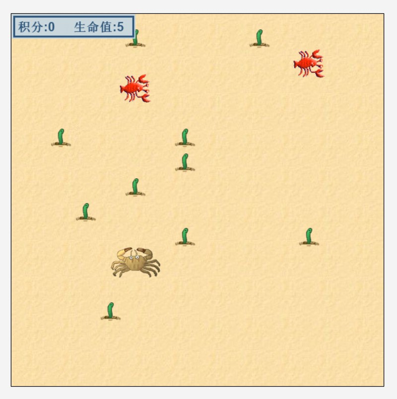
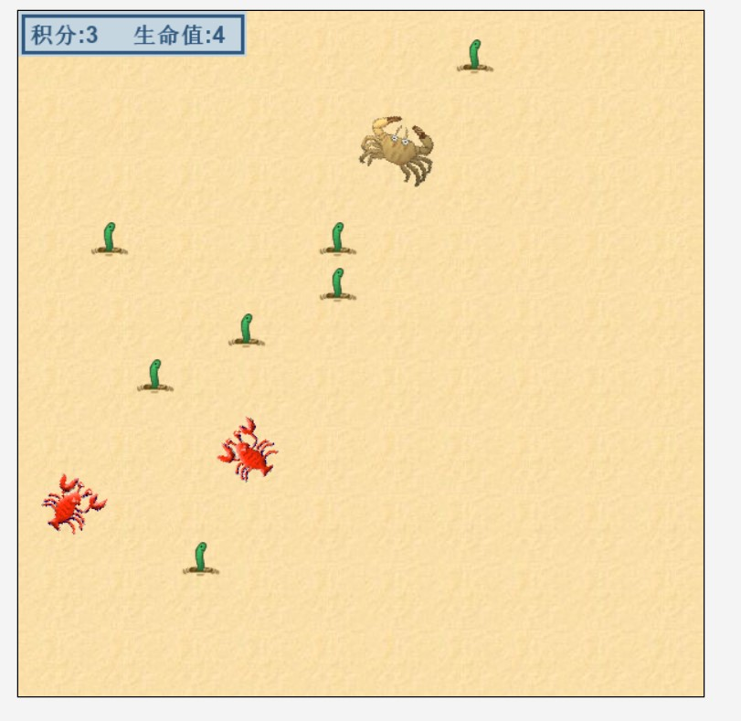
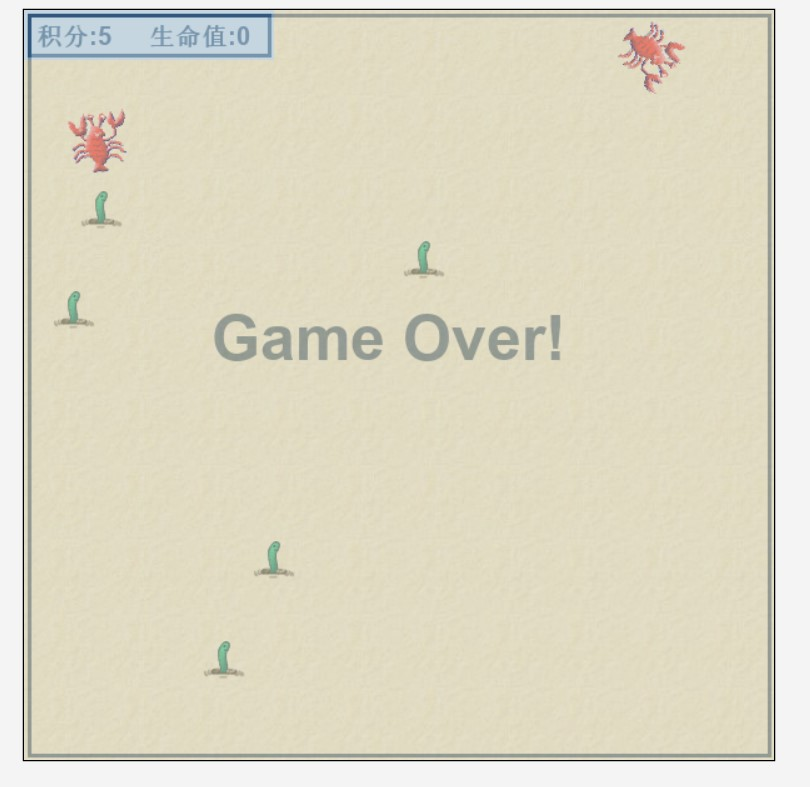

# 工程：螃蟹大逃杀

---

    版本或者日期:
        2020.03.04
    如何启动这个工程：
        使用Greenfoot软件
    作者：
        weew12
    使用指南：
        使用左右方向键操作螃蟹移动
        -> 键 螃蟹顺时针移动
        <- 键 螃蟹逆时针移动
        螃蟹初始5条命 沙虫初始化10条 龙虾两只
    规则：
        螃蟹吃沙虫 当积分到9 游戏胜利
        当螃蟹生命耗 尽游戏结束
    description:
        基于Greenfoot 开发的 第一个java游戏

---

# 游戏截图

## 开始

## 吃沙虫

## 游戏胜利

## 游戏失败

