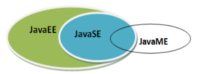
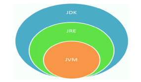

## 第01章 Java语言基础笔记

### 编译与执行环境安装

#### JDK下载

下载地址：[www.oracle.com](www.oracle.com)  

#### 配置Path环境变量
配置目的(以windows为例子)：让操作系统能够在全局找到JDK所需的一些脚本，
执行时直接输入相关程序名字即可，无需使用程序的全部绝对路径  

   

#### 初步开发尝试
开发步骤：    
- 编写程序  
通过代码编辑器编写代码  ``HelloWorld.java``
```java
public class HelloWorld {
    public static void main(String[] args) {
        System.out.println("HelloWorld!");
    }
}
```
- 编译程序  
```shell
javac HelloWorld.java
```
- 运行程序  
```shell
java HelloWorld
```

从编写、编译再到执行的整体流程：  


#### 可能得错误以及注意事项
- 代码拼写错误 
- 编译、运行路径问题
- 语法问题
- 其他  
    - 声明为public的类应该与文件名一致，否则会编译失败
    - 编译失败后注意错误出现的行数，从而定位到具体的错误
    - 注意字符编码问题(中文显示异常)，结合操作系统和程序使用的默认编码
    - 注意代码格式规范，方便维护
    - Java程序的入口是``main``方法
    - 源文件与类名
        - 如果定义的类是public类，那么要求源文件名必须和类名一致，否则编译出错
        - 一个源文件可以有多个类，**编译后会生成多个字节码文件.class**，但是只能有一个public类
    - 代码注释
        - 单行注释
            - ```//```
        - 多行注释
            - ```/* */```
        - 文档注释
            - ```/* @author: weew12 ...*/```

### 相关补充

#### 常用的DOS命令

列出当前目录 ``dir``  
切换目录 ``cd``     
返回上一级 ``cd ..``     
返回到盘符目录 ``cd \ 或 cd /``     

创建目录 ``md 文件目录名``       
删除目录 ``rd 文件目录名``       

清屏 ``cls``      
退出命令行窗口 ``exit``

#### 几个比较重要的JDK版本

Java5.0     
Java8.0 继5.0之后变化最大的版本，是长期支持的版本      
Java11.0 JDK安装包取消独立JRE安装包，是长期支持的版本      
Java17.0 版本号21.9，是长期支持的版本

#### Java SE Java EE Java ME三个的区别

- Java SE(Java Standard Edition)  
支持面向桌面级应用的java平台，包括用户界面接口AWT/SWing    
- Java EE(Java Enterprise Edition)  
为开发企业环境下的应用程序提供的一套解决方案，定位在服务器的Web应用开发
- Java ME(Java Micro Edition)  
支持Java程序运行在移动终端(手机、机顶盒)上的平台，定位在消费性电子产品的应用开发  

       

#### 什么是JDK、JRE  

##### JDK  
JDK(Java Development Kit)是Java程序开发工具包，包含JRE和开发人员使用的工具  


##### JRE
JRE(Java Runtime Environment)是Java程序的运行时环境，包含JVM和运行时所需的核心类库  




#### 总结
``JDK`` = ``JRE`` + 开发工具集(例如：Javac编译工具)  
``JRE`` = ``JVM`` + ``JavaSE``标准类库

#### Java语言的特性
- 优点  
    - 跨平台(基于JVM)
    - 面向对象
    - 健壮
    - 简单

### JVM功能说明

JVM(Java Virtual Machine)即：Java虚拟机，是一个虚拟机的计算机，是Java程序的运行环境。
JVM具有自己的指令集并使用不同的存储区域，它负责执行指令、管理数据、管理内存、寄存器等。


- 实现Java程序的跨平台性  
Java程序都运行在JVM之上，正是有了JVM，才使得Java程序具备了跨平台性。  
  
使用JVM前后对比：  


- 自动内存管理(内存分配、内存回收)  
  - Java程序在运行过程中，涉及到运算的数据的分配、存储等都由JVM来完成  
  - Java消除了程序员回收无用内存空间的职责。提供了一种系统级线程跟踪存储空间的分配情况，在内存空间达到相应阈值时，检查并释放可被释放的存储器空间。  
  - GC的自动回收，提高了内存空间的利用效率，也提高了编程人员的效率，很大程度上减少了因为没有释放空间而导致的内存泄漏。  


