## 第11章 常用类和基础API            

### 1. 不可变字符序列：String         

#### String的特性        

- **java.lang.String 类代表字符串。** Java程序中所有的字符串文字（例如"hello" ）都可以看作是实现此类的实例。
- **字符串是常量，用双引号引起来表示。它们的值在创建之后不能更改。**
- 字符串String类型本身是**final声明的**，意味着我们**不能继承String**。
- String对象的**字符内容是存储在一个字符数组value[]中的**。"abc" 等效于 char[] data={'a','b','c'}。

  
  
  ```java
   //jdk8中的String源码：
   public final class String
       implements java.io.Serializable, Comparable<String>, CharSequence {
      /** The value is used for character storage. */
      private final char value[]; //String对象的字符内容是存储在此数组中
  
      /** Cache the hash code for the string */
      private int hash; // Default to 0
  //  ...
  }
  ```

  - **private**意味着外面无法直接获取字符数组，而且String没有提供value的get和set方法。
  - **final意味着字符数组的引用不可改变**，而且String也没有提供方法来修改value数组某个元素值
  - **因此字符串的字符数组内容也不可变的，即String代表着不可变的字符序列。即，一旦对字符串进行修改，就会产生新对象。**
  - **JDK9只有，底层使用byte[]数组。**

  ```java
   public final class String implements java.io.Serializable, Comparable<String>, CharSequence { 
       @Stable
       private final byte[] value;
   }
   
   //官方说明：... that most String objects contain only Latin-1 characters. Such characters require only one byte of storage, hence half of the space in the internal char arrays of such String objects is going unused.
   
   //细节：... The new String class will store characters encoded either as ISO-8859-1/Latin-1 (one byte per character), or as UTF-16 (two bytes per character), based upon the contents of the string. The encoding flag will indicate which encoding is used.
  
  ```
- **Java 语言提供对字符串串联符号"+"以及将其他对象转换为字符串的特殊支持 toString()方法**

#### 概述       

**因为字符串对象设计为不可变，那么所以字符串有常量池来保存很多常量对象。 JDK6中，字符串常量池在方法区。JDK7开始，就移到堆空间，直到目前JDK17版本。**       
**举例内存结构分配**        

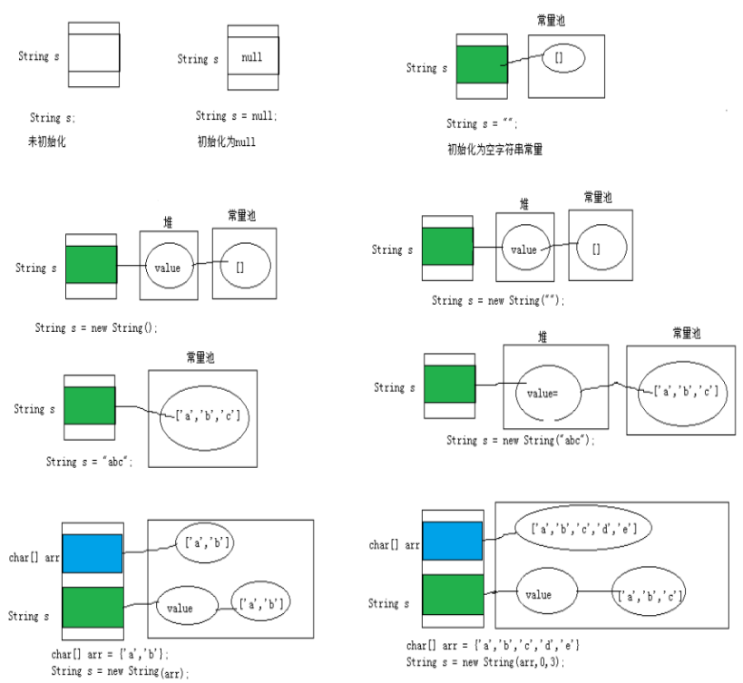

#### 练习类型1：拼接       

```java
String s1 = "hello";
String s2 = "hello";
System.out.println(s1 == s2);
// 内存中只有一个"hello"对象被创建，同时被s1和s2共享。 true
```
对应内存结构为：（以下内存结构以JDK6为例绘制）：


进一步：

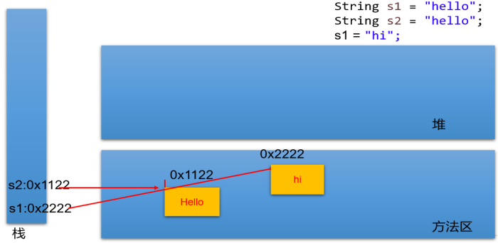

```java
Person p1 = new Person();
p1.name = “Tom";

Person p2 = new Person();
p2.name = “Tom";

System.out.println(p1.name.equals( p2.name)); // true
System.out.println(p1.name == p2.name); // false
System.out.println(p1.name == "Tom"); // false
```
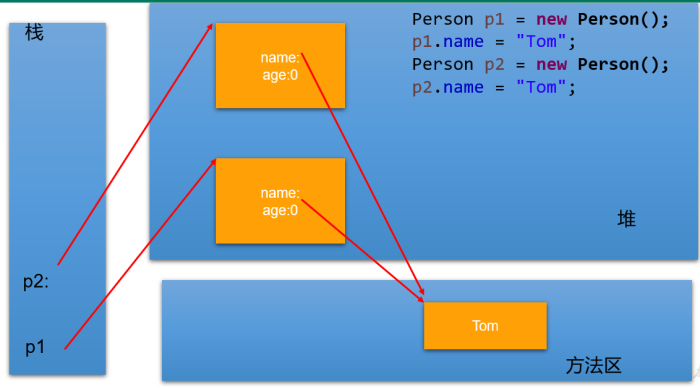

#### 练习类型2：new        
```java
String str1 = “abc”; 与 String str2 = new String(“abc”);的区别？
// str1 == str2 false
```

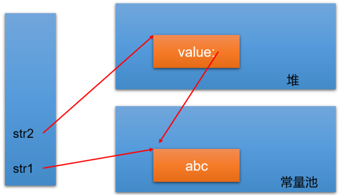

**str2 首先指向堆中的一个字符串对象，然后堆中字符串的value数组指向常量池中常量对象的value数组。**
- **字符串常量存储在字符串常量池，目的是共享。**
- **字符串非常量对象存储在堆中。**

练习：
```java
String s1 = "javaEE";
String s2 = "javaEE";
String s3 = new String("javaEE");
String s4 = new String("javaEE");

System.out.println(s1 == s2);//true
System.out.println(s1 == s3);//false
System.out.println(s1 == s4);//false
System.out.println(s3 == s4);//false
```

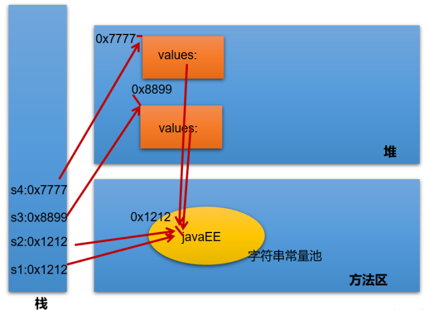

练习：String str2 = new String("hello"); 在内存中创建了几个对象？
两个

#### 练习类型3：intern()       
- String s1 = "a"; 
  - 说明：在字符串常量池中创建了一个字面量为"a"的字符串。
- s1 = s1 + "b"; 
  - 说明：实际上原来的“a”字符串对象已经丢弃了，现在在堆空间中产生了一个字符串s1+"b"（也就是"ab")。如果多次执行这些改变串内容的操作，会导致大量副本字符串对象存留在内存中，降低效率。如果这样的操作放到循环中，会极大影响程序的性能。
- String s2 = "ab";
  - 说明：直接在字符串常量池中创建一个字面量为"ab"的字符串。
- String s3 = "a" + "b";
  - 说明：s3指向字符串常量池中已经创建的"ab"的字符串。
- String s4 = s1.intern(); 

说明：**堆空间的s1对象在调用intern()之后，会将常量池中已经存在的"ab"字符串赋值给s4。**

#### 练习       
```java
String s1 = "hello";
String s2 = "world";
String s3 = "hello" + "world";
String s4 = s1 + "world";
String s5 = s1 + s2;
String s6 = (s1 + s2).intern();

System.out.println(s3 == s4);
System.out.println(s3 == s5);
System.out.println(s4 == s5);
System.out.println(s3 == s6);
```
结论：       
**（1）常量+常量：结果是常量池。且常量池中不会存在相同内容的常量。       
（2）常量与变量 或 变量与变量：结果在堆中        
（3）拼接后调用intern方法：返回值在常量池中**       

#### 练习       
```java
@Test
public void test01(){
	String s1 = "hello";
	String s2 = "world";
	String s3 = "helloworld";
		
	String s4 = s1 + "world";//s4字符串内容也helloworld，s1是变量，"world"常量，变量 + 常量的结果在堆中
	String s5 = s1 + s2;//s5字符串内容也helloworld，s1和s2都是变量，变量 + 变量的结果在堆中
	String s6 = "hello" + "world";//常量+ 常量 结果在常量池中，因为编译期间就可以确定结果
		
	System.out.println(s3 == s4);//false
	System.out.println(s3 == s5);//false
	System.out.println(s3 == s6);//true
}

@Test
public void test02(){
	final String s1 = "hello";
	final String s2 = "world";
	String s3 = "helloworld";
	
	String s4 = s1 + "world";//s4字符串内容也helloworld，s1是常量，"world"常量，常量+常量结果在常量池中
	String s5 = s1 + s2;//s5字符串内容也helloworld，s1和s2都是常量，常量+ 常量 结果在常量池中
	String s6 = "hello" + "world";//常量+ 常量 结果在常量池中，因为编译期间就可以确定结果
		
	System.out.println(s3 == s4);//true
	System.out.println(s3 == s5);//true
	System.out.println(s3 == s6);//true
}

@Test
public void test01(){
	String s1 = "hello";
	String s2 = "world";
	String s3 = "helloworld";
		
	String s4 = (s1 + "world").intern();//把拼接的结果放到常量池中
	String s5 = (s1 + s2).intern();
		
	System.out.println(s3 == s4);//true
	System.out.println(s3 == s5);//true
}
```

#### 练习：下列程序运行的结果       
```java
public class TestString {
	public static void main(String[] args) {
		String str = "hello";
		String str2 = "world";
		String str3 ="helloworld";
		
		String str4 = "hello".concat("world");
		String str5 = "hello"+"world";
		
		System.out.println(str3 == str4);//false
		System.out.println(str3 == str5);//true
	}
}
```
**concat方法拼接，哪怕是两个常量对象拼接，结果也是在堆。**

#### 练习：下列程序运行的结果       
```java
public class StringTest {

    String str = new String("good");
    char[] ch = { 't', 'e', 's', 't' };

    public void change(String str, char ch[]) {
        str = "test ok";
        ch[0] = 'b';
    }
    public static void main(String[] args) {
        StringTest ex = new StringTest();
        ex.change(ex.str, ex.ch);
        System.out.print(ex.str + " and ");// 
        System.out.println(ex.ch); // good And best
    }
}
```

### 2. 可变字符序列：StringBuffer、StringBuilder        

**因为String对象是不可变对象，虽然可以共享常量对象，但是对于频繁字符串的修改和拼接操作，效率极低，空间消耗也比较高。因此，JDK又在java.lang包提供了可变字符序列StringBuffer和StringBuilder类型。**

#### StringBuffer与StringBuilder的理解        

- java.lang.**StringBuffer代表可变的字符序列**，JDK1.0中声明，**可以对字符串内容进行增删，此时不会产生新的对象**。比如：
  ```java
   //情况1:
   String s = new String("我喜欢学习"); 
   //情况2：
   StringBuffer buffer = new StringBuffer("我喜欢学习"); 
   buffer.append("数学"); 
  ```

  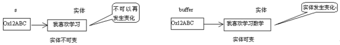

  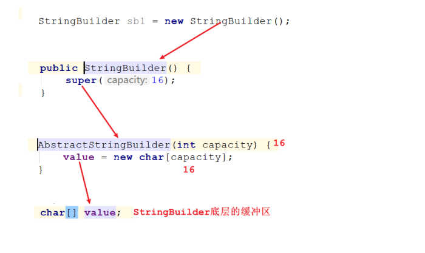

继承结构：

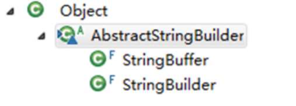

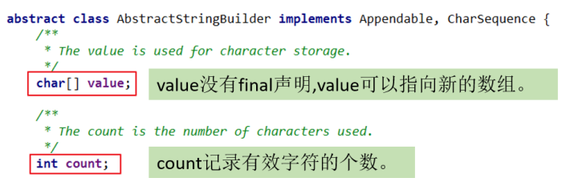

- StringBuilder 和 StringBuffer 非常类似，均代表可变的字符序列，而且提供相关功能的方法也一样。
- 区分String、StringBuffer、StringBuilder
  - String:不可变的字符序列； 底层使用char[]数组存储(JDK8.0中)
  - StringBuffer:可变的字符序列；**线程安全**（方法有synchronized修饰），**效率低**；底层使用char[]数组存储 (JDK8.0中)
  - StringBuilder:可变的字符序列； jdk1.5引入，**线程不安全的**，**效率高**；底层使用char[]数组存储(JDK8.0中)

#### StringBuilder、StringBuffer的API       

StringBuilder、StringBuffer的API是完全一致的，并且很多方法与String相同。

1、常用API

（1）StringBuffer append(xx)：提供了很多的append()方法，用于进行字符串追加的方式拼接        
（2）StringBuffer delete(int start, int end)：删除[start,end)之间字符        
（3）StringBuffer deleteCharAt(int index)：删除[index]位置字符         
（4）StringBuffer replace(int start, int end, String str)：替换[start,end)范围的字符序列为str        
（5）void setCharAt(int index, char c)：替换[index]位置字符        
（6）char charAt(int index)：查找指定index位置上的字符       
（7）StringBuffer insert(int index, xx)：在[index]位置插入xx        
（8）int length()：返回存储的字符数据的长度        
（9）StringBuffer reverse()：反转        

- **当append和insert时，如果原来value数组长度不够，可扩容**。
- 如上(1)(2)(3)(4)(9)这些方法**支持方法链操作**。原理：

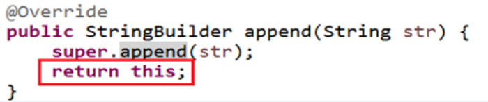

2、其它API

（1）int indexOf(String str)：在当前字符序列中查询str的第一次出现下标        
（2）int indexOf(String str, int fromIndex)：在当前字符序列[fromIndex,最后]中查询str的第一次出现下标         
（3）int lastIndexOf(String str)：在当前字符序列中查询str的最后一次出现下标         
（4）int lastIndexOf(String str, int fromIndex)：在当前字符序列[fromIndex,最后]中查询str的最后一次出现下标        
（5）String substring(int start)：截取当前字符序列[start,最后]         
（6）String substring(int start, int end)：截取当前字符序列[start,end)         
（7）String toString()：返回此序列中数据的字符串表示形式         
（8）void setLength(int newLength) ：设置当前字符序列长度为newLength        

```java
@Test
public void test1(){
    StringBuilder s = new StringBuilder();
    s.append("hello").append(true).append('a').append(12).append("atguigu");
    System.out.println(s);
    System.out.println(s.length());
}

@Test
public void test2(){
    StringBuilder s = new StringBuilder("helloworld");
    s.insert(5, "java");
    s.insert(5, "chailinyan");
    System.out.println(s);
}

@Test
public void test3(){
    StringBuilder s = new StringBuilder("helloworld");
    s.delete(1, 3);
    s.deleteCharAt(4);
    System.out.println(s);
}
@Test
public void test4(){
    StringBuilder s = new StringBuilder("helloworld");
    s.reverse();
    System.out.println(s);
}

@Test
public void test5(){
    StringBuilder s = new StringBuilder("helloworld");
    s.setCharAt(2, 'a');
    System.out.println(s);
}

@Test
public void test6(){
    StringBuilder s = new StringBuilder("helloworld");
    s.setLength(30);
    System.out.println(s);
}
```

#### 效率测试       

```java
//初始设置
long startTime = 0L;
long endTime = 0L;
String text = "";
StringBuffer buffer = new StringBuffer("");
StringBuilder builder = new StringBuilder("");

//开始对比
startTime = System.currentTimeMillis();
for (int i = 0; i < 20000; i++) {
    buffer.append(String.valueOf(i));
}
endTime = System.currentTimeMillis();
System.out.println("StringBuffer的执行时间：" + (endTime - startTime));

startTime = System.currentTimeMillis();
for (int i = 0; i < 20000; i++) {
    builder.append(String.valueOf(i));
}
endTime = System.currentTimeMillis();
System.out.println("StringBuilder的执行时间：" + (endTime - startTime));

startTime = System.currentTimeMillis();
for (int i = 0; i < 20000; i++) {
    text = text + i;
}
endTime = System.currentTimeMillis();
System.out.println("String的执行时间：" + (endTime - startTime));
```

#### 练习       

笔试题：程序输出        
```java
String str = null;
StringBuffer sb = new StringBuffer();
sb.append(str); // 这里内部调用了其父类AbstractStringBuilder的append(),其中对于str为null的处理调用了一个AppendNull()方法，直接添加的“null”

System.out.println(sb.length());// 4 

System.out.println(sb);// null

StringBuffer sb1 = new StringBuffer(str);
System.out.println(sb1);// NullPointerException: Cannot invoke "String.length()" because "str" is null
```

### 3. JDK8之前：日期时间API         

#### java.lang.System类的方法       

- System类提供的public static long **currentTimeMillis**()：用来**返回当前时间与1970年1月1日0时0分0秒之间以毫秒为单位的时间差。**
  - 此方法适于计算时间差。
- 计算世界时间的主要标准有：
  - UTC(Coordinated Universal Time)
  - GMT(Greenwich Mean Time)
  - CST(Central Standard Time)
    - 在国际无线电通信场合，为了统一起见，使用一个统一的时间，称为通用协调时(UTC, Universal Time Coordinated)。UTC与格林尼治平均时(GMT, Greenwich Mean Time)一样，都与英国伦敦的本地时相同。这里，UTC与GMT含义完全相同。

#### java.util.Date       

**表示特定的瞬间，精确到毫秒。**        
- 构造器：
  - Date()：使用无参构造器创建的对象可以**获取本地当前时间**。
  - **Date(long 毫秒数)：把该毫秒值换算成日期时间对象**
- 常用方法
  - getTime(): 返回自 1970 年 1 月 1 日 00:00:00 GMT 以来此 Date 对象表示的毫秒数。
  - toString(): 把此 Date 对象转换为以下形式的 String： dow mon dd hh:mm:ss zzz yyyy 其中： dow 是一周中的某一天 (Sun, Mon, Tue, Wed, Thu, Fri, Sat)，zzz是时间标准。
  - 其它很多方法都过时了。

举例：       

```java
@Test
public void test1(){
    Date d = new Date();
    System.out.println(d);
}

@Test
public void test2(){
    long time = System.currentTimeMillis();
    System.out.println(time);//1559806982971
    //当前系统时间距离1970-1-1 0:0:0 0毫秒的时间差，毫秒为单位
}

@Test
public void test3(){
    Date d = new Date();
    long time = d.getTime();
    System.out.println(time);//1559807047979
}

@Test
public void test4(){
    long time = 1559807047979L;
    Date d = new Date(time);
    System.out.println(d);
}

@Test
public void test5(){
    long time = Long.MAX_VALUE;
    Date d = new Date(time);
    System.out.println(d);
}
```

#### java.text.SimpleDateFormat       

java.text.SimpleDateFormat类是一个不与语言环境有关的方式来格式化和解析日期的具体类。       
可以进行格式化：日期 --> 文本       
可以进行解析：文本 --> 日期          

- 构造器：
  - SimpleDateFormat() ：默认的模式和语言环境创建对象
  - public SimpleDateFormat(String pattern)：该构造方法可以用参数pattern指定的格式创建一个对象
- 格式化：
  - public String format(Date date)：方法格式化时间对象date
- 解析：
  - public Date parse(String source)：从给定字符串的开始解析文本，以生成一个日期。

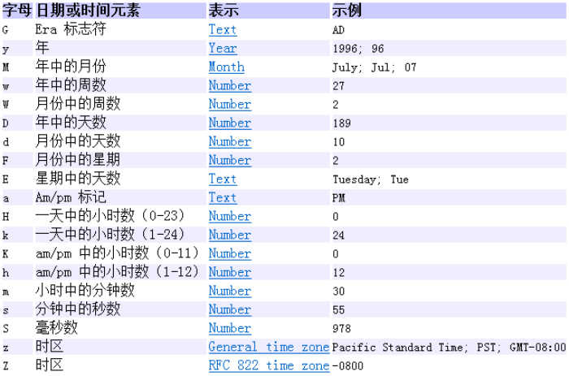

```java
//格式化
@Test
public void test1(){
    Date d = new Date();

    SimpleDateFormat sf = new SimpleDateFormat("yyyy年MM月dd日 HH时mm分ss秒 SSS毫秒  E Z");
    //把Date日期转成字符串，按照指定的格式转
    String str = sf.format(d);
    System.out.println(str);
}
//解析
@Test
public void test2() throws ParseException{
    String str = "2022年06月06日 16时03分14秒 545毫秒  星期四 +0800";
    SimpleDateFormat sf = new SimpleDateFormat("yyyy年MM月dd日 HH时mm分ss秒 SSS毫秒  E Z");
    Date d = sf.parse(str);
    System.out.println(d);
}
```

#### java.util.Calendar(日历)       

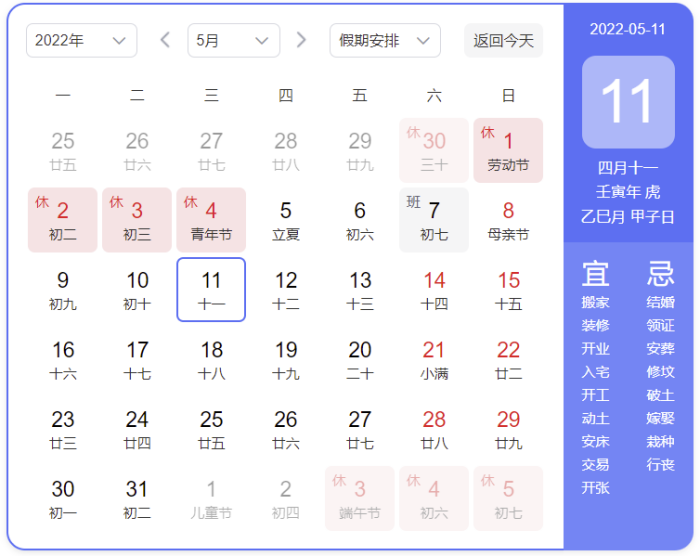

- **Date类的API大部分被废弃了，替换为Calendar。**
- **Calendar 类是一个抽象类，主用用于完成日期字段之间相互操作的功能。**
- 获取Calendar实例的方法
  - **使用Calendar.getInstance()方法**

    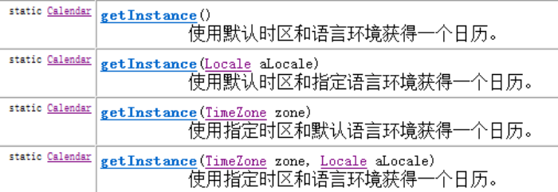

  - 调用它的子类GregorianCalendar（公历）的构造器。

    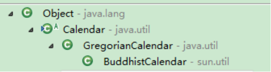

- **一个Calendar的实例是系统时间的抽象表示，可以修改或获取 YEAR、MONTH、DAYOFWEEK、HOUROFDAY 、MINUTE、SECOND等 日历字段对应的时间值。**
  - public int get(int field)：返回给定日历字段的值
  - public void set(int field,int value) ：将给定的日历字段设置为指定的值
  - public void add(int field,int amount)：根据日历的规则，为给定的日历字段添加或者减去指定的时间量
  - public final Date getTime()：将Calendar转成Date对象
  - public final void setTime(Date date)：使用指定的Date对象重置Calendar的时间
- 常用字段

  

- 注意：
  - **获取月份时：一月是0，二月是1，以此类推，12月是11**
  - **获取星期时：周日是1，周二是2 ， 。。。。周六是7**
- 示例代码：
  ```java
  import org.junit.Test;
  
  import java.util.Calendar;
  import java.util.TimeZone;
  
  public class TestCalendar {
      @Test
      public void test1(){
          Calendar c = Calendar.getInstance();
          System.out.println(c);
  
          int year = c.get(Calendar.YEAR);
          int month = c.get(Calendar.MONTH)+1;
          int day = c.get(Calendar.DATE);
          int hour = c.get(Calendar.HOUR_OF_DAY);
          int minute = c.get(Calendar.MINUTE);
  
          System.out.println(year + "-" + month + "-" + day + " " + hour + ":" + minute);
      }
  
      @Test
      public void test2(){
          TimeZone t = TimeZone.getTimeZone("America/Los_Angeles");
          Calendar c = Calendar.getInstance(t);
          int year = c.get(Calendar.YEAR);
          int month = c.get(Calendar.MONTH)+1;
          int day = c.get(Calendar.DATE);
          int hour = c.get(Calendar.HOUR_OF_DAY);
          int minute = c.get(Calendar.MINUTE);
  
          System.out.println(year + "-" + month + "-" + day + " " + hour + ":" + minute);
      }
      
      @Test
      public void test3(){
          Calendar calendar = Calendar.getInstance();
          // 从一个 Calendar 对象中获取 Date 对象
          Date date = calendar.getTime();
          
          // 使用给定的 Date 设置此 Calendar 的时间
          date = new Date(234234235235L);
          calendar.setTime(date);
          calendar.set(Calendar.DAY_OF_MONTH, 8);
          System.out.println("当前时间日设置为8后,时间是:" + calendar.getTime());
          
          calendar.add(Calendar.HOUR, 2);
          System.out.println("当前时间加2小时后,时间是:" + calendar.getTime());
          
          calendar.add(Calendar.MONTH, -2);
          System.out.println("当前日期减2个月后,时间是:" + calendar.getTime());  
      }
  }
  ```
  

### 4. JDK8之后：新的日期时间API         

如果我们可以跟别人说：“我们在1502643933071见面，别晚了！”那么就再简单不过了。但是我们希望时间与昼夜和四季有关，于是事情就变复杂了。JDK 1.0中包含了一个java.util.Date类，但是它的大多数方法已经在JDK 1.1引入Calendar类之后被弃用了。而Calendar并不比Date好多少。它们面临的问题是：
- 可变性：像日期和时间这样的类应该是不可变的。
- 偏移性：Date中的年份是从1900开始的，而月份都从0开始。
- 格式化：格式化只对Date有用，Calendar则不行。
- 此外，它们也不是线程安全的；不能处理闰秒等。

闰秒，是指为保持协调世界时接近于世界时时刻，由国际计量局统一规定在年底或年中（也可能在季末）对协调世界时增加或减少1秒的调整。由于地球自转的不均匀性和长期变慢性（主要由潮汐摩擦引起的），会使世界时（民用时）和原子时之间相差超过到±0.9秒时，就把协调世界时向前拨1秒（负闰秒，最后一分钟为59秒）或向后拨1秒（正闰秒，最后一分钟为61秒）； 闰秒一般加在公历年末或公历六月末。

目前，全球已经进行了27次闰秒，均为正闰秒。

总结：对日期和时间的操作一直是Java程序员最痛苦的地方之一。

**第三次引入的API是成功的，并且Java 8中引入的java.time API 已经纠正了过去的缺陷，将来很长一段时间内它都会为我们服务**。

Java 8 以一个新的开始为 Java 创建优秀的 API。新的日期时间API包含:
- java.time – 包含值对象的基础包
- java.time.chrono – 提供对不同的日历系统的访问。
- java.time.format – 格式化和解析时间和日期
- java.time.temporal – 包括底层框架和扩展特性
- java.time.zone – 包含时区支持的类

说明：新的 java.time 中包含了所有关于时钟（Clock），本地日期（LocalDate）、本地时间（LocalTime）、本地日期时间（LocalDateTime）、时区（ZonedDateTime）和持续时间（Duration）的类。

尽管有68个新的公开类型，但是大多数开发者只会用到基础包和format包，大概占总数的三分之一。

#### 本地日期时间：LocalDate、LocalTime、LocalDateTime       

|                                                                 方法 |                           	描述 |
|-------------------------------------------------------------------:|------------------------------|
|                                            now()/ now(ZoneId zone) |      	静态方法，根据当前时间创建对象/指定时区的对象 |
|                                             of(xx,xx,xx,xx,xx,xxx) |           	静态方法，根据指定日期/时间创建对象 |
|                                     getDayOfMonth()/getDayOfYear() |  	获得月份天数(1-31) /获得年份天数(1-366) |
|                                                     getDayOfWeek() |    	获得星期几(返回一个 DayOfWeek 枚举值) |
|                                                         getMonth() |         	获得月份, 返回一个 Month 枚举值 |
|                                        getMonthValue() / getYear() |             	获得月份(1-12) /获得年份 |
|                                 getHours()/getMinute()/getSecond() |             	获得当前对象对应的小时、分钟、秒 |
|            withDayOfMonth()/withDayOfYear()/withMonth()/withYear() |	将月份天数、年份天数、月份、年份修改为指定的值并返回新的对象 |
|                                           with(TemporalAdjuster t) |         	将当前日期时间设置为校对器指定的日期时间 |
|     plusDays(), plusWeeks(), plusMonths(), plusYears(),plusHours() |      	向当前对象添加几天、几周、几个月、几年、几小时 |
| minusMonths() / minusWeeks()/minusDays()/minusYears()/minusHours() |       	从当前对象减去几月、几周、几天、几年、几小时 |
|                     plus(TemporalAmount t)/minus(TemporalAmount t) |    	添加或减少一个 Duration 或 Period |
|                                               isBefore()/isAfter() |               	比较两个 LocalDate |
|                                                       isLeapYear() |      	判断是否是闰年（在LocalDate类中声明） |
|                                        format(DateTimeFormatter t) |           	格式化本地日期、时间，返回一个字符串 |
|                                           parse(Charsequence text) |            	将指定格式的字符串解析为日期、时间 |

```java
import org.junit.Test;

import java.time.LocalDate;
import java.time.LocalDateTime;
import java.time.LocalTime;

public class TestLocalDateTime {
    @Test
    public void test01(){
        LocalDate now = LocalDate.now();
        System.out.println(now);
    }
    @Test
    public void test02(){
        LocalTime now = LocalTime.now();
        System.out.println(now);
    }
    @Test
    public void test03(){
        LocalDateTime now = LocalDateTime.now();
        System.out.println(now);
    }
    @Test
    public void test04(){
        LocalDate lai = LocalDate.of(2019, 5, 13);
        System.out.println(lai);
    }
	@Test
    public void test05(){
        LocalDate lai = LocalDate.of(2019, 5, 13);
        System.out.println(lai.getDayOfYear());
    }
	@Test
    public void test06(){
        LocalDate lai = LocalDate.of(2019, 5, 13);
        LocalDate go = lai.plusDays(160);
        System.out.println(go);//2019-10-20
    }
    @Test
    public void test7(){
        LocalDate now = LocalDate.now();
        LocalDate before = now.minusDays(100);
        System.out.println(before);//2019-02-26
    }   
}
```

#### 瞬时：Instant       

- Instant：时间线上的一个瞬时点。 这可能被用来记录应用程序中的事件时间戳。
  - 时间戳是指格林威治时间1970年01月01日00时00分00秒(北京时间1970年01月01日08时00分00秒)起至现在的总秒数。
- java.time.Instant表示时间线上的一点，而不需要任何上下文信息，例如，时区。概念上讲，它只是简单的表示自1970年1月1日0时0分0秒（UTC）开始的秒数。


|方法|描述|
|--|--|
|now()|	静态方法，返回默认UTC时区的Instant类的对象|
|ofEpochMilli(long epochMilli)|	静态方法，返回在1970-01-01 00:00:00基础上加上指定毫秒数之后的Instant类的对象|
|atOffset(ZoneOffset offset)|	结合即时的偏移来创建一个 OffsetDateTime|
|toEpochMilli()|	返回1970-01-01 00:00:00到当前时间的毫秒数，即为时间戳|

中国大陆、中国香港、中国澳门、中国台湾、蒙古国、新加坡、马来西亚、菲律宾、西澳大利亚州的时间与UTC的时差均为+8，也就是UTC+8。       
instant.atOffset(ZoneOffset.ofHours(8));        

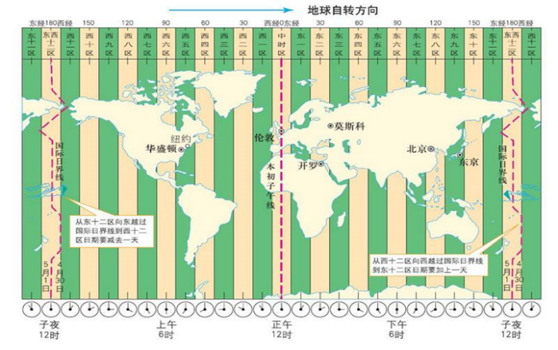

整个地球分为二十四时区，每个时区都有自己的本地时间。北京时区是东八区，领先UTC八个小时，在电子邮件信头的Date域记为+0800。如果在电子邮件的信头中有这么一行：         
Date: Fri, 08 Nov 2002 09:42:22 +0800         
说明信件的发送地的地方时间是二○○二年十一月八号，星期五，早上九点四十二分（二十二秒），这个地方的本地时领先UTC八个小时(+0800， 就是东八区时间)。电子邮件信头的Date域使用二十四小时的时钟，而不使用AM和PM来标记上下午。 

#### 日期时间格式化：DateTimeFormatter        

该类提供了三种格式化方法：
- (了解)预定义的标准格式。如：ISOLOCALDATETIME、ISOLOCALDATE、ISOLOCAL_TIME
- (了解)本地化相关的格式。如：ofLocalizedDate(FormatStyle.LONG)
  ```java
   // 本地化相关的格式。如：ofLocalizedDateTime()
   // FormatStyle.MEDIUM / FormatStyle.SHORT :适用于LocalDateTime
                  
   // 本地化相关的格式。如：ofLocalizedDate()
   // FormatStyle.FULL / FormatStyle.LONG / FormatStyle.MEDIUM / FormatStyle.SHORT : 适用于LocalDate
  ```
- 自定义的格式。如：ofPattern(“yyyy-MM-dd hh:mm:ss”)


|方 法|	描 述|
|--|--|
|ofPattern(String pattern)|	静态方法，返回一个指定字符串格式的DateTimeFormatter|
|format(TemporalAccessor t)|	格式化一个日期、时间，返回字符串|
|parse(CharSequence text)|	将指定格式的字符序列解析为一个日期、时间|

举例：       

```java
import org.junit.Test;

import java.time.LocalDateTime;
import java.time.ZoneId;
import java.time.format.DateTimeFormatter;
import java.time.format.FormatStyle;

public class TestDatetimeFormatter {
    @Test
    public void test1(){
        // 方式一：预定义的标准格式。如：ISO_LOCAL_DATE_TIME;ISO_LOCAL_DATE;ISO_LOCAL_TIME
        DateTimeFormatter formatter = DateTimeFormatter.ISO_LOCAL_DATE_TIME;
        // 格式化:日期-->字符串
        LocalDateTime localDateTime = LocalDateTime.now();
        String str1 = formatter.format(localDateTime);
        System.out.println(localDateTime);
        System.out.println(str1);//2022-12-04T21:02:14.808

        // 解析：字符串 -->日期
        TemporalAccessor parse = formatter.parse("2022-12-04T21:02:14.808");
        LocalDateTime dateTime = LocalDateTime.from(parse);
        System.out.println(dateTime);
    }

    @Test
    public void test2(){
        LocalDateTime localDateTime = LocalDateTime.now();
        // 方式二：
        // 本地化相关的格式。如：ofLocalizedDateTime()
        // FormatStyle.LONG / FormatStyle.MEDIUM / FormatStyle.SHORT :适用于LocalDateTime
        DateTimeFormatter formatter1 = DateTimeFormatter.ofLocalizedDateTime(FormatStyle.LONG);
        
        // 格式化
        String str2 = formatter1.format(localDateTime);
        System.out.println(str2);// 2022年12月4日 下午09时03分55秒

        // 本地化相关的格式。如：ofLocalizedDate()
        // FormatStyle.FULL / FormatStyle.LONG / FormatStyle.MEDIUM / FormatStyle.SHORT : 适用于LocalDate
        DateTimeFormatter formatter2 = DateTimeFormatter.ofLocalizedDate(FormatStyle.FULL);
        // 格式化
        String str3 = formatter2.format(LocalDate.now());
        System.out.println(str3);// 2022年12月4日 星期日
    }

    @Test
    public void test3(){
        //方式三：自定义的方式（关注、重点）
        DateTimeFormatter dateTimeFormatter = DateTimeFormatter.ofPattern("yyyy/MM/dd HH:mm:ss");
        //格式化
        String strDateTime = dateTimeFormatter.format(LocalDateTime.now());
        System.out.println(strDateTime); //2022/12/04 21:05:42
        //解析
        TemporalAccessor accessor = dateTimeFormatter.parse("2022/12/04 21:05:42");
        LocalDateTime localDateTime = LocalDateTime.from(accessor);
        System.out.println(localDateTime); //2022-12-04T21:05:42
    }
}
```

#### 其它API        

1、指定时区日期时间：ZondId和ZonedDateTime       

- ZoneId：该类中包含了所有的时区信息，一个时区的ID，如 Europe/Paris
- ZonedDateTime：一个在ISO-8601日历系统时区的日期时间，如 2007-12-03T10:15:30+01:00 Europe/Paris。
  - 其中每个时区都对应着ID，地区ID都为“{区域}/{城市}”的格式，例如：Asia/Shanghai等
- 常见时区ID：    
  Asia/Shanghai    
  UTC    
  America/New_York    
- 可以通过ZondId获取所有可用的时区ID：
  ```java
  import java.time.ZoneId;
  import java.time.ZonedDateTime;
  import java.util.Set;
  
  public class TestZone {
      @Test
      public void test01() {
          //需要知道一些时区的id
          //Set<String>是一个集合，容器
          Set<String> availableZoneIds = ZoneId.getAvailableZoneIds();
          //快捷模板iter
          for (String availableZoneId : availableZoneIds) {
              System.out.println(availableZoneId);
          }
      }
  
      @Test
      public void test02(){
          ZonedDateTime t1 = ZonedDateTime.now();
          System.out.println(t1);
  
          ZonedDateTime t2 = ZonedDateTime.now(ZoneId.of("America/New_York"));
          System.out.println(t2);
      }
  }
  ```

2、持续日期/时间：Period和Duration       

- 持续时间：Duration，用于计算两个“时间”间隔
- 日期间隔：Period，用于计算两个“日期”间隔
  ```java
  import org.junit.Test;
  
  import java.time.Duration;
  import java.time.LocalDate;
  import java.time.LocalDateTime;
  import java.time.Period;
  
  public class TestPeriodDuration {
      @Test
      public void test01(){
          LocalDate t1 = LocalDate.now();
          LocalDate t2 = LocalDate.of(2018, 12, 31);
          Period between = Period.between(t1, t2);
          System.out.println(between);
  
          System.out.println("相差的年数："+between.getYears());
          System.out.println("相差的月数："+between.getMonths());
          System.out.println("相差的天数："+between.getDays());
          System.out.println("相差的总数："+between.toTotalMonths());
      }
  
      @Test
      public void test02(){
          LocalDateTime t1 = LocalDateTime.now();
          LocalDateTime t2 = LocalDateTime.of(2017, 8, 29, 0, 0, 0, 0);
          Duration between = Duration.between(t1, t2);
          System.out.println(between);
  
          System.out.println("相差的总天数："+between.toDays());
          System.out.println("相差的总小时数："+between.toHours());
          System.out.println("相差的总分钟数："+between.toMinutes());
          System.out.println("相差的总秒数："+between.getSeconds());
          System.out.println("相差的总毫秒数："+between.toMillis());
          System.out.println("相差的总纳秒数："+between.toNanos());
          System.out.println("不够一秒的纳秒数："+between.getNano());
      }
      @Test
      public void test03(){
          //Duration:用于计算两个“时间”间隔，以秒和纳秒为基准
          LocalTime localTime = LocalTime.now();
          LocalTime localTime1 = LocalTime.of(15, 23, 32);
          //between():静态方法，返回Duration对象，表示两个时间的间隔
          Duration duration = Duration.between(localTime1, localTime);
          System.out.println(duration);
  
          System.out.println(duration.getSeconds());
          System.out.println(duration.getNano());
  
          LocalDateTime localDateTime = LocalDateTime.of(2016, 6, 12, 15, 23, 32);
          LocalDateTime localDateTime1 = LocalDateTime.of(2017, 6, 12, 15, 23, 32);
  
          Duration duration1 = Duration.between(localDateTime1, localDateTime);
          System.out.println(duration1.toDays());
      }
      
      @Test
      public void test4(){
          //Period:用于计算两个“日期”间隔，以年、月、日衡量
          LocalDate localDate = LocalDate.now();
          LocalDate localDate1 = LocalDate.of(2028, 3, 18);
  
          Period period = Period.between(localDate, localDate1);
          System.out.println(period);
  
          System.out.println(period.getYears());
          System.out.println(period.getMonths());
          System.out.println(period.getDays());
  
          Period period1 = period.withYears(2);
          System.out.println(period1);
  
      }
  }
  ```

3、Clock：使用时区提供对当前即时、日期和时间的访问的时钟。

4、 TemporalAdjuster : 时间校正器。有时我们可能需要获取例如：将日期调整到“下一个工作日”等操作。 TemporalAdjusters : 该类通过静态方法(firstDayOfXxx()/lastDayOfXxx()/nextXxx())提供了大量的常用 TemporalAdjuster 的实现。
  ```java
  @Test
  public void test1(){
      // TemporalAdjuster:时间校正器
      // 获取当前日期的下一个周日是哪天？
      TemporalAdjuster temporalAdjuster = TemporalAdjusters.next(DayOfWeek.SUNDAY);
      LocalDateTime localDateTime = LocalDateTime.now().with(temporalAdjuster);
      System.out.println(localDateTime);
      // 获取下一个工作日是哪天？
      LocalDate localDate = LocalDate.now().with(new TemporalAdjuster() {
          @Override
          public Temporal adjustInto(Temporal temporal) {
              LocalDate date = (LocalDate) temporal;
              if (date.getDayOfWeek().equals(DayOfWeek.FRIDAY)) {
                  return date.plusDays(3);
              } else if (date.getDayOfWeek().equals(DayOfWeek.SATURDAY)) {
                  return date.plusDays(2);
              } else {
                  return date.plusDays(1);
              }
          }
      });
      System.out.println("下一个工作日是：" + localDate);
  
  }
  ```

#### 与传统日期处理的转换       

|类|	To 遗留类| 	From 遗留类  |
|--|--|------------|
|java.time.Instant与java.util.Date|	Date.from(instant)|	date.toInstant()|
|java.time.Instant与java.sql.Timestamp|	Timestamp.from(instant)|	timestamp.toInstant()|
|java.time.ZonedDateTime与java.util.GregorianCalendar|	GregorianCalendar.from(zonedDateTime)|	cal.toZonedDateTime()|
|java.time.LocalDate与java.sql.Time|	Date.valueOf(localDate)|	date.toLocalDate()|
|java.time.LocalTime与java.sql.Time|	Date.valueOf(localDate)|	date.toLocalTime()|
|java.time.LocalDateTime与java.sql.Timestamp|	Timestamp.valueOf(localDateTime)|	timestamp.toLocalDateTime()|
|java.time.ZoneId与java.util.TimeZone|	Timezone.getTimeZone(id)|	timeZone.toZoneId()|
|java.time.format.DateTimeFormatter与java.text.DateFormat|	formatter.toFormat()|	无|


### 5. Java比较器         

我们知道基本数据类型的数据（除boolean类型外）需要比较大小的话，之间使用比较运算符即可，**但是引用数据类型是不能直接使用比较运算符来比较大小的**。那么，如何解决这个问题呢？

- 在Java中经常会涉及到对象数组的排序问题，那么就涉及到对象之间的比较问题。
- Java实现对象排序的方式有两种：
  - 自然排序：java.lang.Comparable
  - 定制排序：java.util.Comparator

#### 自然排序：java.lang.Comparable        

- **Comparable接口强行对实现它的每个类的对象进行整体排序。这种排序被称为类的自然排序。**
- **实现 Comparable 的类必须实现 compareTo(Object obj)方法，两个对象即通过 compareTo(Object obj) 方法的返回值来比较大小。如果当前对象this大于形参对象obj，则返回正整数，如果当前对象this小于形参对象obj，则返回负整数，如果当前对象this等于形参对象obj，则返回零。**
  ```java
  package java.lang;
  
  public interface Comparable{
      int compareTo(Object obj);
  }
  ```
- **实现Comparable接口的对象列表（和数组）可以通过 Collections.sort 或 Arrays.sort进行自动排序。实现此接口的对象可以用作有序映射中的键或有序集合中的元素，无需指定比较器**。
- **对于类 C 的每一个 e1 和 e2 来说，当且仅当 e1.compareTo(e2) == 0 与 e1.equals(e2) 具有相同的 boolean 值时，类 C 的自然排序才叫做与 equals 一致。建议（虽然不是必需的）最好使自然排序与 equals 一致。**
- Comparable 的典型实现：(默认都是从小到大排列的)
  - String：按照字符串中字符的Unicode值进行比较
  - Character：按照字符的Unicode值来进行比较
  - 数值类型对应的包装类以及BigInteger、BigDecimal：按照它们对应的数值大小进行比较
  - **Boolean：true 对应的包装类实例大于 false 对应的包装类实例**
  - Date、Time等：后面的日期时间比前面的日期时间大
- 代码示例：
  ```java
  package com.atguigu.api;
  
  public class Student implements Comparable {
      private int id;
      private String name;
      private int score;
      private int age;
  
      public Student(int id, String name, int score, int age) {
          this.id = id;
          this.name = name;
          this.score = score;
          this.age = age;
      }
  
      public int getId() {
          return id;
      }
  
      public void setId(int id) {
          this.id = id;
      }
  
      public String getName() {
          return name;
      }
  
      public void setName(String name) {
          this.name = name;
      }
  
      public int getScore() {
          return score;
      }
  
      public void setScore(int score) {
          this.score = score;
      }
  
      public int getAge() {
          return age;
      }
  
      public void setAge(int age) {
          this.age = age;
      }
  
      @Override
      public String toString() {
          return "Student{" +
                  "id=" + id +
                  ", name='" + name + '\'' +
                  ", score=" + score +
                  ", age=" + age +
                  '}';
      }
  
      @Override
      public int compareTo(Object o) {
          //这些需要强制，将o对象向下转型为Student类型的变量，才能调用Student类中的属性
          //默认按照学号比较大小
          Student stu = (Student) o;
          return this.id - stu.id;
      }
  }
  ```

测试类

```java
package com.atguigu.api;

public class TestStudent {
    public static void main(String[] args) {
        Student[] arr = new Student[5];
        arr[0] = new Student(3,"张三",90,23);
        arr[1] = new Student(1,"熊大",100,22);
        arr[2] = new Student(5,"王五",75,25);
        arr[3] = new Student(4,"李四",85,24);
        arr[4] = new Student(2,"熊二",85,18);

        //单独比较两个对象
        System.out.println(arr[0].compareTo(arr[1]));
        System.out.println(arr[1].compareTo(arr[2]));
        System.out.println(arr[2].compareTo(arr[2]));

        System.out.println("所有学生：");
        for (int i = 0; i < arr.length; i++) {
            System.out.println(arr[i]);
        }
        System.out.println("按照学号排序：");
        for (int i = 1; i < arr.length; i++) {
            for (int j = 0; j < arr.length-i; j++) {
                if(arr[j].compareTo(arr[j+1])>0){
                    Student temp = arr[j];
                    arr[j] = arr[j+1];
                    arr[j+1] = temp;
                }
            }
        }
        for (int i = 0; i < arr.length; i++) {
            System.out.println(arr[i]);
        }
    }
}
```

再举例：

```java
public class Student implements Comparable {
    private String name;
    private int score;

    public Student(String name, int score) {
        this.name = name;
        this.score = score;
    }

    public String getName() {
        return name;
    }

    public void setName(String name) {
        this.name = name;
    }

    public int getScore() {
        return score;
    }

    public void setScore(int score) {
        this.score = score;
    }

    @Override
    public String toString() {
        return "Student{" +
                "name='" + name + '\'' +
                ", score=" + score +
                '}';
    }

    @Override
    public int compareTo(Object o) {
        return this.score - ((Student)o).score;
    }
}
```

测试：

```java
@Test
public void test02() {
	Student[] students = new Student[3];
	students[0] = new Student("张三", 96);
	students[1] = new Student("李四", 85);
	students[2] = new Student("王五", 98);

	System.out.println(Arrays.toString(students));
	Arrays.sort(students);
	System.out.println(Arrays.toString(students));
}
```

再举例：

```java
class Goods implements Comparable {
    private String name;
    private double price;

    //按照价格，比较商品的大小
    @Override
    public int compareTo(Object o) {
        if(o instanceof Goods) {
            Goods other = (Goods) o;
            if (this.price > other.price) {
                return 1;
            } else if (this.price < other.price) {
                return -1;
            }
            return 0;
        }
        throw new RuntimeException("输入的数据类型不一致");
    }
    //构造器、getter、setter、toString()方法略
}
```

测试：

```java
public class ComparableTest{
    public static void main(String[] args) {

        Goods[] all = new Goods[4];
        all[0] = new Goods("《红楼梦》", 100);
        all[1] = new Goods("《西游记》", 80);
        all[2] = new Goods("《三国演义》", 140);
        all[3] = new Goods("《水浒传》", 120);

        Arrays.sort(all);

        System.out.println(Arrays.toString(all));

    }

}
```

#### **定制排序：java.util.Comparator**        

- 思考
  - 当元素的类型没有实现java.lang.Comparable接口而又不方便修改代码（例如：一些第三方的类，你只有.class文件，没有源文件）
  - 如果一个类，实现了Comparable接口，也指定了两个对象的比较大小的规则，但是此时此刻我不想按照它预定义的方法比较大小，但是我又不能随意修改，因为会影响其他地方的使用，怎么办？
- JDK在设计类库之初，也考虑到这种情况，所以又增加了一个java.util.Comparator接口。强行对多个对象进行整体排序的比较。
  - 重写compare(Object o1,Object o2)方法，比较o1和o2的大小：如果方法返回正整数，则表示o1大于o2；如果返回0，表示相等；返回负整数，表示o1小于o2。
  - 可以将 Comparator 传递给 sort 方法（如 Collections.sort 或 Arrays.sort），从而允许在排序顺序上实现精确控制。

```java
package java.util;

public interface Comparator{
    int compare(Object o1,Object o2);
}
```

举例：

```java
package com.atguigu.api;

import java.util.Comparator;
//定义定制比较器类
public class StudentScoreComparator implements Comparator { 
    @Override
    public int compare(Object o1, Object o2) {
        Student s1 = (Student) o1;
        Student s2 = (Student) o2;
        int result = s1.getScore() - s2.getScore();
        return result != 0 ? result : s1.getId() - s2.getId();
    }
}
```

测试类

```java
package com.atguigu.api;

public class TestStudent {
    public static void main(String[] args) {
        Student[] arr = new Student[5];
        arr[0] = new Student(3, "张三", 90, 23);
        arr[1] = new Student(1, "熊大", 100, 22);
        arr[2] = new Student(5, "王五", 75, 25);
        arr[3] = new Student(4, "李四", 85, 24);
        arr[4] = new Student(2, "熊二", 85, 18);


        System.out.println("所有学生：");
        for (int i = 0; i < arr.length; i++) {
            System.out.println(arr[i]);
        }

        System.out.println("按照成绩排序");
        StudentScoreComparator sc = new StudentScoreComparator();
        for (int i = 1; i < arr.length; i++) {
            for (int j = 0; j < arr.length - i; j++) {
                if (sc.compare(arr[j], arr[j + 1]) > 0) {
                    Student temp = arr[j];
                    arr[j] = arr[j + 1];
                    arr[j + 1] = temp;
                }
            }
        }
        for (int i = 0; i < arr.length; i++) {
            System.out.println(arr[i]);
        }
    }
}
```

再举例：

```java
@Test
public void test01() {
    Student[] students = new Student[5];
    students[0] = new Student(3, "张三", 90, 23);
    students[1] = new Student(1, "熊大", 100, 22);
    students[2] = new Student(5, "王五", 75, 25);
    students[3] = new Student(4, "李四", 85, 24);
    students[4] = new Student(2, "熊二", 85, 18);

    System.out.println(Arrays.toString(students));
    //定制排序
    StudentScoreComparator sc = new StudentScoreComparator();
    Arrays.sort(students, sc);
    System.out.println("排序之后：");
    System.out.println(Arrays.toString(students));
}
```

再举例：

```java
Goods[] all = new Goods[4];
all[0] = new Goods("War and Peace", 100);
all[1] = new Goods("Childhood", 80);
all[2] = new Goods("Scarlet and Black", 140);
all[3] = new Goods("Notre Dame de Paris", 120);

Arrays.sort(all, new Comparator() {

    @Override
    public int compare(Object o1, Object o2) {
        Goods g1 = (Goods) o1;
        Goods g2 = (Goods) o2;

        return g1.getName().compareTo(g2.getName());
    }
});

System.out.println(Arrays.toString(all));
```

### 6. 系统相关类         

#### java.lang.System类        

- **System类代表系统，系统级的很多属性和控制方法都放置在该类的内部**。该类位于java.lang包。
- 由于该类的构造器是private的，所以**无法创建该类的对象。其内部的成员变量和成员方法都是static的，所以也可以很方便的进行调用**。
- 成员变量 Scanner scan = new Scanner(System.in);
  - **System类内部包含in、out和err三个成员变量，分别代表标准输入流(键盘输入)，标准输出流(显示器)和标准错误输出流(显示器)**。
- 成员方法
  - native long **currentTimeMillis**()： 该方法的作用是**返回当前的计算机时间**，时间的表达格式为**当前计算机时间和GMT时间(格林威治时间)1970年1月1号0时0分0秒所差的毫秒数**。
  - **void exit(int status)： 该方法的作用是退出程序**。其中status的值为0代表正常退出，非零代表异常退出。使用该方法可以在图形界面编程中实现程序的退出功能等。
  - void gc()： 该方法的作用是**请求系统进行垃圾回收**。至于系统是否立刻回收，则取决于系统中垃圾回收算法的实现以及系统执行时的情况。
  - **String getProperty(String key)： 该方法的作用是获得系统中属性名为key的属性对应的值**。系统中常见的属性名以及属性的作用如下表所示：
    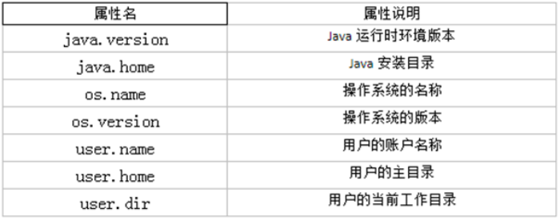

举例        

```java
import org.junit.Test;
public class TestSystem {
    @Test
    public void test01(){
        long time = System.currentTimeMillis();
        System.out.println("现在的系统时间距离1970年1月1日凌晨：" + time + "毫秒");
        System.exit(0);
        System.out.println("over");//不会执行
    }

    @Test
    public void test02(){
        String javaVersion = System.getProperty("java.version");
		System.out.println("java的version:" + javaVersion);

		String javaHome = System.getProperty("java.home");
		System.out.println("java的home:" + javaHome);

		String osName = System.getProperty("os.name");
		System.out.println("os的name:" + osName);

		String osVersion = System.getProperty("os.version");
		System.out.println("os的version:" + osVersion);

		String userName = System.getProperty("user.name");
		System.out.println("user的name:" + userName);

		String userHome = System.getProperty("user.home");
		System.out.println("user的home:" + userHome);

		String userDir = System.getProperty("user.dir");
		System.out.println("user的dir:" + userDir);
    }
    @Test
    public void test03() throws InterruptedException {
        for (int i=1; i <=10; i++){
            MyDemo my = new MyDemo(i);
            //每一次循环my就会指向新的对象，那么上次的对象就没有变量引用它了，就成垃圾对象
        }
        //为了看到垃圾回收器工作，我要加下面的代码，让main方法不那么快结束，因为main结束就会导致JVM退出，GC也会跟着结束。
        System.gc();//如果不调用这句代码，GC可能不工作，因为当前内存很充足，GC就觉得不着急回收垃圾对象。
        			//调用这句代码，会让GC尽快来工作。
        Thread.sleep(5000);
    }
}
class MyDemo{
    private int value;
    public MyDemo(int value) {
        this.value = value;
    }
    @Override
    public String toString() {
        return "MyDemo{" + "value=" + value + '}';
    }
    //重写finalize方法，让大家看一下它的调用效果
    @Override
    protected void finalize() throws Throwable {
//        正常重写，这里是编写清理系统内存的代码
//        这里写输出语句是为了看到finalize()方法被调用的效果
        System.out.println(this+ "轻轻的我走了，不带走一段代码....");
    }
}
```

- static void arraycopy(Object src, int srcPos, Object dest, int destPos, int length)： 从指定源数组中复制一个数组，复制从指定的位置开始，到目标数组的指定位置结束。常用于数组的插入和删除
```java
import org.junit.Test;
import java.util.Arrays;
public class TestSystemArrayCopy {
    @Test
    public void test01(){
        int[] arr1 = {1,2,3,4,5};
        int[] arr2 = new int[10];
        System.arraycopy(arr1,0,arr2,3,arr1.length);
        System.out.println(Arrays.toString(arr1));
        System.out.println(Arrays.toString(arr2));
    }
    @Test
    public void test02(){
        int[] arr = {1,2,3,4,5};
        System.arraycopy(arr,0,arr,1,arr.length-1);
        System.out.println(Arrays.toString(arr));
    }
    @Test
    public void test03(){
        int[] arr = {1,2,3,4,5};
        System.arraycopy(arr,1,arr,0,arr.length-1);
        System.out.println(Arrays.toString(arr));
    }
}
```

#### java.lang.Runtime类       

**每个 Java 应用程序都有一个 Runtime 类实例，使应用程序能够与其运行的环境相连接。**       

public static Runtime getRuntime()： 返回与当前 Java 应用程序相关的运行时对象。应用程序不能创建自己的 Runtime 类实例。        
public long totalMemory()：返回 Java 虚拟机中初始化时的内存总量。此方法返回的值可能随时间的推移而变化，这取决于主机环境。默认为物理电脑内存的1/64。       
public long maxMemory()：返回 Java 虚拟机中最大程度能使用的内存总量。默认为物理电脑内存的1/4。       
public long freeMemory()：回 Java 虚拟机中的空闲内存量。调用 gc 方法可能导致 freeMemory 返回值的增加。        

```java
package com.atguigu.system;
public class TestRuntime {
    public static void main(String[] args) {
        Runtime runtime = Runtime.getRuntime();
        long initialMemory = runtime.totalMemory(); //获取虚拟机初始化时堆内存总量
        long maxMemory = runtime.maxMemory(); //获取虚拟机最大堆内存总量
        String str = "";
        //模拟占用内存
        for (int i = 0; i < 10000; i++) {
            str += i;
        }
        long freeMemory = runtime.freeMemory(); //获取空闲堆内存总量
        System.out.println("总内存：" + initialMemory / 1024 / 1024 * 64 + "MB");
        System.out.println("总内存：" + maxMemory / 1024 / 1024 * 4 + "MB");
        System.out.println("空闲内存：" + freeMemory / 1024 / 1024 + "MB") ;
        System.out.println("已用内存：" + (initialMemory-freeMemory) / 1024 / 1024 + "MB");
    }
}
```

### 7. 数学相关类         

#### java.lang.Math       

java.lang.Math 类包含用于执行基本数学运算的方法，如初等指数、对数、平方根和三角函数。**类似这样的工具类，其所有方法均为静态方法，并且不会创建对象，调用起来非常简单**。

- public static double abs(double a) ：返回 double 值的绝对值。 
  - double d1 = Math.abs(-5); //d1的值为5
  - double d2 = Math.abs(5); //d2的值为5
- public static double ceil(double a) ：返回大于等于参数的最小的整数。
  - double d1 = Math.ceil(3.3); //d1的值为 4.0
  - double d2 = Math.ceil(-3.3); //d2的值为 -3.0
  - double d3 = Math.ceil(5.1); //d3的值为 6.0
- public static double floor(double a) ：返回小于等于参数最大的整数。
  - double d1 = Math.floor(3.3); //d1的值为3.0
  - double d2 = Math.floor(-3.3); //d2的值为-4.0
  - double d3 = Math.floor(5.1); //d3的值为 5.0
- public static long round(double a) ：返回最接近参数的 long。(相当于四舍五入方法) 
  - long d1 = Math.round(5.5); //d1的值为6
  - long d2 = Math.round(5.4); //d2的值为5
  - long d3 = Math.round(-3.3); //d3的值为-3
  - long d4 = Math.round(-3.8); //d4的值为-4
- public static double pow(double a,double b)：返回a的b幂次方法
- public static double sqrt(double a)：返回a的平方根
- public static double random()：返回[0,1)的随机值
- public static final double PI：返回圆周率
- public static double max(double x, double y)：返回x,y中的最大值
- public static double min(double x, double y)：返回x,y中的最小值
- 其它：acos,asin,atan,cos,sin,tan 三角函数
  - double result = Math.pow(2,31);
  - double sqrt = Math.sqrt(256);
  - double rand = Math.random();
  - double pi = Math.PI;

#### java.math包       

**BigInteger**        

- Integer类作为int的包装类，能存储的最大整型值为2^31-1，Long类也是有限的，最大为2^63-1。如果要表示再大的整数，不管是基本数据类型还是他们的包装类都无能为力，更不用说进行运算了。
- java.math包的BigInteger可以表示不可变的任意精度的整数。BigInteger 提供所有 Java 的基本整数操作符的对应物，并提供 java.lang.Math 的所有相关方法。另外，BigInteger 还提供以下运算：模算术、GCD 计算、质数测试、素数生成、位操作以及一些其他操作。 
- 构造器
  - BigInteger(String val)：根据字符串构建BigInteger对象
- 方法
  - public BigInteger abs()：返回此 BigInteger 的绝对值的 BigInteger。
  - BigInteger add(BigInteger val) ：返回其值为 (this + val) 的 BigInteger
  - BigInteger subtract(BigInteger val) ：返回其值为 (this - val) 的 BigInteger
  - BigInteger multiply(BigInteger val) ：返回其值为 (this * val) 的 BigInteger
  - BigInteger divide(BigInteger val) ：返回其值为 (this / val) 的 BigInteger。整数相除只保留整数部分。
  - BigInteger remainder(BigInteger val) ：返回其值为 (this % val) 的 BigInteger。
  - BigInteger[] divideAndRemainder(BigInteger val)：返回包含 (this / val) 后跟 (this % val) 的两个 BigInteger 的数组。
  - BigInteger pow(int exponent) ：返回其值为 (this^exponent) 的 BigInteger。 

```java
@Test
public void test01(){
    //long bigNum = 123456789123456789123456789L;
    BigInteger b1 = new BigInteger("12345678912345678912345678");
    BigInteger b2 = new BigInteger("78923456789123456789123456789");

    //System.out.println("和：" + (b1+b2));//错误的，无法直接使用+进行求和
    System.out.println("和：" + b1.add(b2));
    System.out.println("减：" + b1.subtract(b2));
    System.out.println("乘：" + b1.multiply(b2));
    System.out.println("除：" + b2.divide(b1));
    System.out.println("余：" + b2.remainder(b1));
}
```

**BigDecimal**        

- 一般的Float类和Double类可以用来做科学计算或工程计算，但在商业计算中，要求数字精度比较高，故用到java.math.BigDecimal类。
- BigDecimal类支持不可变的、任意精度的有符号十进制定点数。
- 构造器
  - public BigDecimal(double val)
  - public BigDecimal(String val) --> 推荐
- 常用方法
  - public BigDecimal add(BigDecimal augend)
  - public BigDecimal subtract(BigDecimal subtrahend)
  - public BigDecimal multiply(BigDecimal multiplicand)
  - public BigDecimal divide(BigDecimal divisor, int scale, int roundingMode)：divisor是除数，scale指明保留几位小数，roundingMode指明舍入模式（ROUNDUP :向上加1、ROUNDDOWN :直接舍去、ROUNDHALFUP:四舍五入）

举例        

```java
@Test
public void test03(){
    BigInteger bi = new BigInteger("12433241123");
    BigDecimal bd = new BigDecimal("12435.351");
    BigDecimal bd2 = new BigDecimal("11");
    System.out.println(bi);
    // System.out.println(bd.divide(bd2));
    System.out.println(bd.divide(bd2, BigDecimal.ROUND_HALF_UP));
    System.out.println(bd.divide(bd2, 15, BigDecimal.ROUND_HALF_UP));
}
```

#### java.util.Random       

用于产生随机数       

- boolean nextBoolean():返回下一个伪随机数，它是取自此随机数生成器序列的均匀分布的 boolean 值。 
- void nextBytes(byte[] bytes):生成随机字节并将其置于用户提供的 byte 数组中。 
- double nextDouble():返回下一个伪随机数，它是取自此随机数生成器序列的、在 0.0 和 1.0 之间均匀分布的 double 值。 
- float nextFloat():返回下一个伪随机数，它是取自此随机数生成器序列的、在 0.0 和 1.0 之间均匀分布的 float 值。 
- double nextGaussian():返回下一个伪随机数，它是取自此随机数生成器序列的、呈高斯（“正态”）分布的 double 值，其平均值是 0.0，标准差是 1.0。 
- int nextInt():返回下一个伪随机数，它是此随机数生成器的序列中均匀分布的 int 值。 
- int nextInt(int n):返回一个伪随机数，它是取自此随机数生成器序列的、在 0（包括）和指定值（不包括）之间均匀分布的 int 值。 
- long nextLong():返回下一个伪随机数，它是取自此随机数生成器序列的均匀分布的 long 值。 

```java
@Test
public void test04(){
    Random r = new Random();
    System.out.println("随机整数：" + r.nextInt());
    System.out.println("随机小数：" + r.nextDouble());
    System.out.println("随机布尔值：" + r.nextBoolean());
}
```


