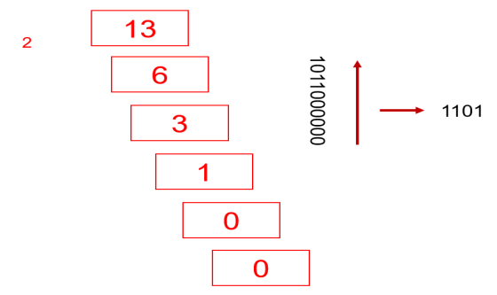
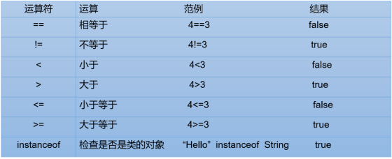
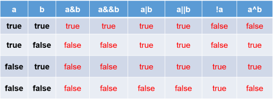
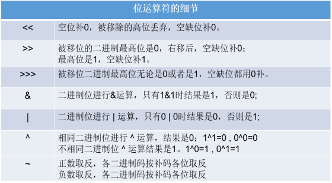
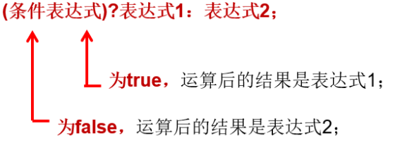

## 第02章 变量与运算符      

### 1. 关键字、保留字与标识符     
关键字与保留字     
**关键字**     
被Java语言赋予了特殊含义，用作专门用途的字符串（或单词），例如：`class`、`public`、`static`、`void`等，
这些单词已经被Java定义好了。       
*补充：*       
- 关键字一共50个，其中`const`、`goto`是保留字
- `true`、`false`、`null`不在其中，看起来是关键字其实是字面量，表示特殊的布尔值和空值。    

     

     

**标识符**     
Java中变量、方法、类名等命名时使用的字符序列。       

*标识符命名规则*       
- 由字母、数字、下划线、`$`组成
- 不可数字开头
- 不可使用关键字和保留字，但可以包括，例如：`testvoid`
- 严格区分大小写，无长度限制
- 不能包含空格
        
**标识符命名规则、规范**      
- 包名：多单词组成时所有字母都小写
- 类名、接口名：多单词组成时，所有单词都首字母大写
- 变量名、方法名：多单词组成时，首个单词小写，其后的单词都首字母大写
- 常量名：所有字母大写，多单词时每个单词都用下划线连接，例如：`MAX_VALUE`    

### 2. 变量的分类与定义、注意点        
*变量用于在内存中保存数据*    
- 对应内存中的一个存储区域    
    
- 构成：数据类型、变量名、存储的值
- 变量声明：数据类型 变量名 = 变量值，例如：`int number = 15`    

*注意点*       
- 对于每个变量要：*先声明，后使用*
- 变量作用域：`{}`内
- 变量只在作用域内有效
- 同一个作用域不可重复定义相同名变量    

**变量按数据类型的分类**      
整体可分为两大类：       
- *基本数据类型*： 整数、浮点数、字符、布尔型
- *引用数据类型*： 数组、接口、类、枚举、注解、记录    

         


**变量的定义格式**     
*声明*：数据类型 变量名       
```java
//存储一个整数类型的年龄
int age; 

//存储一个小数类型的体重
double weight;

//存储一个单字符类型的性别 
char gender;

//存储一个布尔类型的婚姻状态
boolean marry;

//存储一个字符串类型的姓名
String name;

//声明多个同类型的变量
int a,b,c; //表示a,b,c三个变量都是int类型。    //例如：
//存储一个整数类型的年龄
int age; 

//存储一个小数类型的体重
double weight;

//存储一个单字符类型的性别 
char gender;

//存储一个布尔类型的婚姻状态
boolean marry;

//存储一个字符串类型的姓名
String name;

//声明多个同类型的变量
int a,b,c; //表示a,b,c三个变量都是int类型。
```
*赋值*： 变量名 = 值 【给变量赋的值类型必须与声明的类型一致或兼容】           
- 使用合适类型的`常量值`给已经声明的变量赋值
    ```java
    int age = 18;
    int weight = 109;
    char gender = '女';
    ```
- 使用其他变量或者表达式给变量赋值
    ```java
    int m = 1;
    int n = m;
            
    int x = 1;
    int y = 2;
    int z = 2 * x + y;
    ```

### 3. 整型和浮点型变量的使用     
整型：byte、short、int、long     
- *Java各整数类型有固定的表示范围和字段长度，**不受具体操作系统的影响**，以保证Java程序的可移植性* 
  
- 定义long类型的变量，赋值是需要以`l`或`L`作为后缀
- *Java的整型常量默认为int型*

浮点型：float、double        
- *同整数，Java中的浮点类型也有固定的表示范围和字段长度，不受操作系统的影响*  
    
- float 单精度，位数可以精确到7位有效数字
- double 双精度，精度是float的两倍
- *Java的浮点型常量默认为double类型*    

*注意*：
- 并不是所有的小数都能可以精确的用二进制浮点数表示。二进制浮点数不能精确的表示0.1、0.01、0.001这样10的负次幂。
- 浮点类型float、double的数据不适合在不容许舍入误差的金融计算领域。如果需要精确数字计算或保留指定位数的精度，需要使用`BigDecimal`类。    

### 4. 字符型和布尔型变量的使用        
**字符型**  
char表示通常意义上的字符（2字节），Java中所有的字符都使用Unicode编码，一个字符可以存储一个字母、汉字、或者书面语的一个字符       
*字符型变量的三种表现形式*      
- 使用单引号`''`括起来的单个字符    
    `char c1 = 'a'`    
- 直接使用Unicode值来表示单个字符型常量    
    `char sharp = '\u0023' // 表示#`    
- 使用转义字符`\`将其后的字符转变为特殊字符型常量    
    `char line = '\n' // 表示换行符 \n`    

*常见转义字符*    

    转义字符	 说明	 Unicode表示方式
     \n	      换行符	    \u000a
     \t	      制表符	    \u0009
     \"	      双引号	    \u0022
     \'	      单引号	    \u0027
     \\	      反斜线	    \u005c
     \b	      退格符	    \u0008
     \r	      回车符	    \u000d

布尔型：boolean      

boolean类型用来判断逻辑条件，一般用于流程控制语句中：      
```java
boolean isFlag = true;

if(isFlag){
    //true分支
}else{  
    //false分支
}
```
- if条件控制语句
- while循环控制语句
- for循环控制语句
- do-while循环控制语句

*boolean类型数据只有两个值：`true`、`false`, 无其他*    
- **Java中不可以使用0或非0的整数替代false和true，与C语言不一样！**

*注意：*    
不要这样写`if(isFlag == true)`，因为容易错写成`if(isFlag = true)`， 这样就变成给isFlag赋值为true了。     
好的写法：`if(isFlag)` 或 `if(!isFlag)`       

### 5. 基本数据类型变量的自动类型提升     
在Java中，不同的基本数据类（byte、short、int、long、char、float、double）变量的值经常需要进行互相转换。       
转换的方式有两种：*自动类型转换*、*强制类型转换*      
**提升规则**        
*自动类型提升*
将取值范围小的类型自动提升为取值范围大的类型。     
基本数据类型的转换规则：        
         
- 把存储范围小的值（常量值、变量的值、表达式计算的结果值）赋值给存储范围大的变量    
    ```java
    //char自动升级为int，其实就是把字符的编码值赋值给i变量了
    int i = 'A';
    //int自动升级为double
    double d = 10;
    //右边的整数常量值如果在int范围呢，编译和运行都可以通过，这里涉及到数据类型转换
    long num = 1234567; 
    
    //byte bigB = 130;//错误，右边的整数常量值超过byte范围
    //右边的整数常量值如果超过int范围，必须加L，显式表示long类型。否则编译不通过int i = 'A';//char自动升级为int，其实就是把字符的编码值赋值给i变量了
    long bigNum = 12345678912L;
    //int自动升级为double
    double d = 10;
    //右边的整数常量值如果在int范围呢，编译和运行都可以通过，这里涉及到数据类型转换
    long num = 1234567; 
    
    //byte bigB = 130;//错误，右边的整数常量值超过byte范围
    //右边的整数常量值如果超过int范围，必须加L，显式表示long类型。否则编译不通过
    long bigNum = 12345678912L;
    ```
- 当范围小的数据类型与存储范围大的数据类型变量一起混合运算时，会按照其中最大的类型运算    
    ```java
    int i = 1;
    byte b = 1;
    double d = 1.0;
    //混合运算，升级为double
    double sum = i + b + d;
    ```
- 当byte、short、char数据类型那个的变量进行算术运算时，会按照int类型处理    
    ```java
    byte b1 = 1;
    byte b2 = 2;
    //编译报错，b1 + b2自动升级为int
    byte b3 = b1 + b2;
    
    char c1 = '0';
    char c2 = 'A';
    //至少需要使用int类型来接收
    int i = c1 + c2;
    //113
    System.out.println(c1 + c2);
    ```

### 6. 基本数据类型变量的强制类型转换     

*强制类型转换*

将取值范围大的类型强制转换成取值范围小的类型    
自动类型提升是Java自动执行的，强制类型转换是需要我们自己手动执行    
转行格式：`数据类型1 变量名 = (数据类型1)被强转数据值;`
- 当把取值范围大的值（常量值、变量值、表达式计算的结果值）强制转换为取值范围小的变量是，可能会 *损失精度* 或 *溢出*
    ```java
    //损失精度
    int i = (int)3.14;
    
    double d = 1.2;
    //损失精度
    int num = (int)d;
    
    int i = 200;
    //溢出
    byte b = (byte)i;
    ```
- 当某个值要提升数据类型时，也可以使用强制类型转换，这种转换没有风险。
    ```java
    int i = 1;
    int j = 2;
    double bigger = (double)(i/j);
    ```
- 声明long类型变量是，可以出现省略后缀的情况，float不行。
    ```java
    long l1 = 123L;
    //如何理解呢？ 此时可以看做是int类型的123自动类型提升为long类型
    long l2 = 123;
    //报错，因为123123123123超出了int的范围。
    //long l3 = 123123123123; 
    long l4 = 123123123123L;
    
    //报错，因为12.3看做是double，不能自动转换为float类型
    //float f1 = 12.3; 
    float f2 = 12.3F;
    float f3 = (float)12.3;
    ```

**特别的：byte、short、char**             

### 7. String与基本数据类型变量间的运算     
String不是基本数据类型，属于引用数据类型，使用一对`""`来表示一个字符串，内部可以包含0个或多个字符串。    
声明方式：`String str = "this is a string"`              

*运算规则*      
- 任意8中基本数据类型的数据与String类型只能进行`+`运算，且结果一定是String类型。    
    ```java
    System.out.println("" + 1 + 2);//12
    
    int num = 10;
    boolean b1 = true;
    String s1 = "abc";
    
    String s2 = s1 + num + b1;
    System.out.println(s2);//abc10true
    //编译不通过，因为int类型不能与boolean运算
    //String s3 = num + b1 + s1;
    String s4 = num + (b1 + s1);//编译通过
    ```
- String类型不能通过强制类型()转换转为其他类型    
    ```java
    String str = "123";
    int num = (int)str;//错误的
    ```

### 8. 进制转换     
**原码、反码、补码**        
// TODO     

二进制到十进制     
// TODO     
十进制到二进制：除2取余的逆           
     


### 9. 二进制与八进制、十六进制间的转换        
各进制间的转换     
// TODO     
     

### 10. 算数运算符       

     

### 11. 赋值运算符       
     +=	 将符号左边的值和右边的值进行相加操作，最后将结果赋值给左边的变量
     -=	 将符号左边的值和右边的值进行相减操作，最后将结果赋值给左边的变量
     *=	 将符号左边的值和右边的值进行相乘操作，最后将结果赋值给左边的变量
     /=	 将符号左边的值和右边的值进行相除操作，最后将结果赋值给左边的变量
     %=	 将符号左边的值和右边的值进行取余操作，最后将结果赋值给左边的变量       

### 12. 比较运算符、逻辑运算符     
比较运算符       
       

 逻辑运算符      
       

- `&` 和 `&&`：表示"且"关系，当符号左右两边布尔值都是true时，结果才能为true。否则，为false。
- `|` 和 `||` ：表示"或"关系，当符号两边布尔值有一边为true时，结果为true。当两边都为false时，结果为false
- `!` ：表示"非"关系，当变量布尔值为true时，结果为false。当变量布尔值为false时，结果为true。
- `^` ：当符号左右两边布尔值不同时，结果为true。当两边布尔值相同时，结果为false。    

*区分`&`和`&&`*
- 相同点：如果符号左边是true，则二者都执行符号右边的操作
- 不同点：
  - & ： 如果符号左边是false,则继续执行符号右边的操作
  - && ：如果符号左边是false,则不再继续执行符号右边的操作
- 建议：开发中，推荐使用 &&

*区分`|`和`||`*
- 相同点：如果符号左边是false，则二者都执行符号右边的操作
- 不同点：
  - | ： 如果符号左边是true，则继续执行符号右边的操作 
  - || ：如果符号左边是true，则不再继续执行符号右边的操作
- 建议：开发中，推荐使用 ||


### 13. 位运算符        

       

       


### 14. 条件运算符与运算符的优先级       
条件运算符（其他叫法：三目运算符）           

    (条件表达式)? 表达式1:表达式2

           

运算符优先级      

    优先级	    运算符说明	        Java运算符
    1	    括号	        ()、[]、{}
    2	    正负号	        +、-
    3	    单元运算符	        ++、--、~、！
    4	    乘法、除法、求余	*、/、%
    5	    加法、减法	        +、-
    6	    移位运算符	        <<、>>、>>>
    7	    关系运算符	        <、<=、>=、>、instanceof
    8	    等价运算符	        ==、!=
    9	    按位与	        &
    10	    按位异或	        ^
    11	    按位或	        |
    12	    条件与	        &&
    13	    条件或	        ||
    14	    三元运算符	        ? :
    15	    赋值运算符	        =、+=、-=、*=、/=、%=
    16	    位赋值运算符	        &=、|=、<<=、>>=、>>>=优先级	运算符说明	Java运算符

### 15. 字符集     
// TODO     


