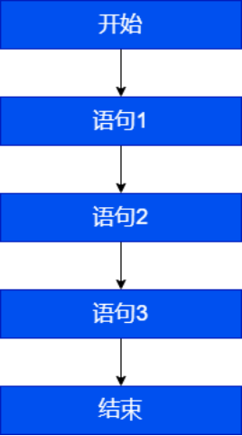
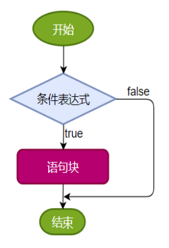
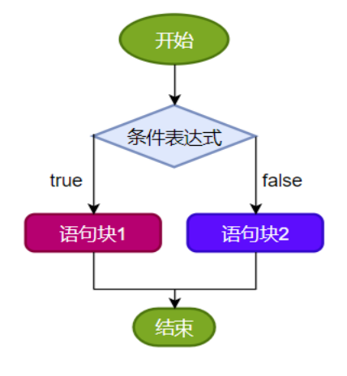
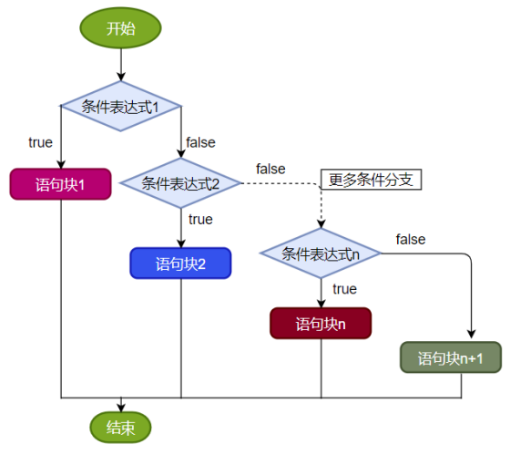
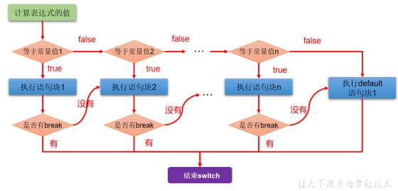
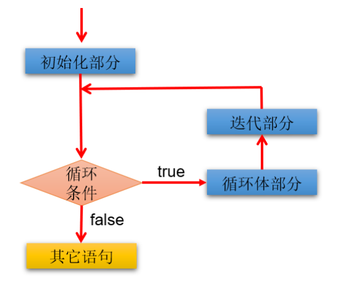
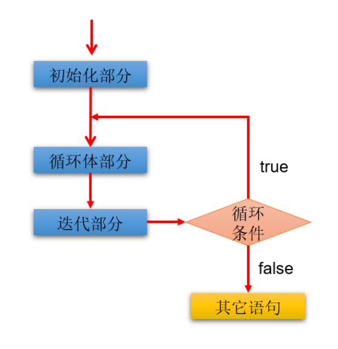

## 第03章 流程控制语句      

流程控制语句是用来控制程序中各语句执行顺序的语句，可以把语句组合成能完成一定功能的小逻辑模块。     

*流程控制的三种结构*         
程序设计中规定的三种流程结构：     
- 顺序结构
    - 程序从上到下逐行执行，中间没有任何判断和挑战
    - 
- 分支结构
    - 根据条件，选择性的执行某段代码
    - 有`if-else`和`switch-case`两种分支语句
    - 
    - `switch-case`
        - 
- 循环结构
    - 根据循环条件，重复性的执行某段代码
    - 有`for`、`while`、`do-while`三种循环语句
        - 
    - *JDK5.0提供了`foreach`循环，方便对集合、数组元素进行遍历*
    - 循环结构的几大要素
        - 初始化部分
        - 循环条件部分
        - 循环体部分
        - 迭代部分

---

### 1. 分支结构`if-else`的使用       

**`if-else`三种格式**     
- 单分支条件判断`if`    
    表达式必须是布尔表达式（关系表达式或逻辑表达式）或布尔变量    
    ```java
    if(条件表达式)｛
        语句块;
    ｝
    ```
    
- 双分支条件判断`if else`    
    首先判断条件表达式结果是`true`或`false`，是`true`执行`语句块1`，是`false`执行`语句块2`
    ```java
    if(条件表达式) { 
        语句块1;
    }else {
        语句块2;
    }
    ```
  
- 多分支条件判断`if else ... if else`    
    一旦条件表达式为true，则执行对应的语句块，执行完对应的语句块后就跳出当前结构。    
    ```java
    if (条件表达式1) {
        语句块1;
    } else if (条件表达式2) {
        语句块2;
    }
    ...
    }else if (条件表达式n) {
        语句块n;
    } else {
        语句块n+1;
    }if (条件表达式1) {
        语句块1;
    } else if (条件表达式2) {
        语句块2;
    }
    ...
    }else if (条件表达式n) {
        语句块n;
    } else {
        语句块n+1;
    }
    ```
    *如果没有任何关系表达式为`true`，就执行语句块`n+1`，然后结束当前多分支*    
    

**注意：**       
- *当条件表达式之间是‘互斥’关系时（彼此没有交集），条件判断语句及执行语句间顺序无所谓*
- *当条件表达式之间是‘包含’关系时，“小上大下 / 子上父下”，否则范围小的条件表达式将不可能被执行*    

**`if-else`结构嵌套**    
在if的语句块中，或在else的语句块中，又包含了另外一个条件判断（可以是单分支、双分支、多分支），就构成了嵌套结构。     

### 2. `Scanner`的使用       
通过`Scanner`类从键盘获取不同类型（基本数据类型、`String`类型）的变量。        

使用      
- 导包：`import java.util.Scanner`
- 创建`Scanner`类型的对象：`Scanner scan = new Scanner(System.in)`;
- *调用`Scanner`类的相关方法（`next()/nextXxx()`），获取指定类型的变量*
- *释放资源：`scan.close()`*
- 样例代码：
    ```java
    import java.util.Scanner;
    
    public class ScannerTest1 {
    
        public static void main(String[] args) {
            // 创建Scanner的对象
            Scanner scanner = new Scanner(System.in);//System.in默认代表键盘输入
            
            // 调用Scanner的方法，获取不同类型的变量
            System.out.println("欢迎光临你好我好交友网站！");
            System.out.print("请输入你的网名：");
            String name = scanner.next();
    
            System.out.print("请输入你的年龄：");
            int age = scanner.nextInt();
    
            System.out.print("请输入你的体重：");
            double weight = scanner.nextDouble();
    
            System.out.print("你是否单身（true/false)：");
            boolean isSingle = scanner.nextBoolean();
    
            System.out.print("请输入你的性别：");
            //先按照字符串接收，然后再取字符串的第一个字符（下标为0）
            char gender = scanner.next().charAt(0);
    
            System.out.println("你的基本情况如下：");
            System.out.println("网名：" + name + "\n年龄：" + age + "\n体重：" + weight + 
                               "\n单身：" + isSingle + "\n性别：" + gender);
            
            // 关闭资源
            scanner.close();
        }
    }
    ```

**补充（获取一个随机数）**     
如何产生一个指定范围的随机整数？        
- `Math`类的`random()`方法，会返回一个`[0, 1)`范围的double型数值
- 获取`[a, b]`范围内的随机整数
    ```java
    (int)(Math.random() * (b - a + 1)) + a
    ```
- 样例代码
    ```java
    class MathRandomTest {
        public static void main(String[] args) {
            double value = Math.random();
            System.out.println(value);
    
            //[1,6]
            int number = (int)(Math.random() * 6) + 1;//
            System.out.println(number);
        }
    }
    ```

### 3. 分支结构`switch-case`的使用       
**使用格式**      
```java
switch(表达式){
    case 常量值1:
        语句块1;
        //break;
    case 常量值2:
        语句块2;
        //break; 
    // ...
   [default:
        语句块n+1;
        break;
   ]
}switch(表达式){
    case 常量值1:
        语句块1;
        //break;
    case 常量值2:
        语句块2;
        //break; 
    // ...
   [default:
        语句块n+1;
        break;
   ]
}
```
*执行流程图*     

- 根据switch中表达式的值，依次匹配各个`case`，若表达式的值等于某个`case`中的`常量值`，则执行对应`case`中的执行语句
- 执行完`case`的执行语句之后
    - 如果遇到`break`，则执行`break`并`跳出`当前的`switch-case`结构
    - 如果`没有`遇到`break`，则会继续执行当前`case`之后的其他`case`中的执行语句（**case穿透**），直到遇到`break`或执行完所有的`case`及`default`的执行语句，跳出当前的`switch-case`    

*使用注意点*         
- `switch(表达式)`中表达式的值必须是以下几种类型之一：`byte`、`short`、`char`、`int`、`枚举`（JDK5）、`String`（JDK7）
- `case`子句中的值必须是常量，不能是变量名或不确定的表达式值或范围
- 同一个`switch`语句，所有的`case`子句中的常量值互不相同
- `break`语句用来在执行完一个`case`分支后是程序跳出`switch`语句块，若没有`break`，程序会顺序执行到`switch`结尾
- `default`子句是`可选`的，位置也是`灵活`的，当没有匹配的`case`时，执行`default`语句     

*case穿透*      

在`switch`语句中，如果`case`的后面不写`break`，将出现穿透现象，就是说，一旦匹配成功，不会再判断下一个`case`的值，直接向后运行，直到遇到`break`或者整个`switch`语句结束，执行终止。      

*案例：编写程序：从键盘上输入2023年的“month”和“day”，要求通过程序输出输入的日期为2023年的第几天。*        
```java
import java.util.Scanner;

class SwitchCaseTest4 {
	public static void main(String[] args) {
		
		Scanner scan = new Scanner(System.in);

		System.out.println("请输入2023年的month:");
		int month = scan.nextInt();

		System.out.println("请输入2023年的day:");
		int day = scan.nextInt();
        
		int sumDays = 0;//记录总天数
        
		//写法2：推荐
		switch(month){
			case 12:
				sumDays += 30;//这个30是代表11月份的满月天数
			case 11:
				sumDays += 31;//这个31是代表10月份的满月天数
			case 10:
				sumDays += 30;//这个30是代表9月份的满月天数
			case 9:
				sumDays += 31;//这个31是代表8月份的满月天数
			case 8:
				sumDays += 31;//这个31是代表7月份的满月天数
			case 7:
				sumDays += 30;//这个30是代表6月份的满月天数
			case 6:
				sumDays += 31;//这个31是代表5月份的满月天数
			case 5:
				sumDays += 30;//这个30是代表4月份的满月天数
			case 4:
				sumDays += 31;//这个31是代表3月份的满月天数
			case 3:
				sumDays += 28;//这个28是代表2月份的满月天数
			case 2:
				sumDays += 31;//这个31是代表1月份的满月天数
			case 1:
				sumDays += day;//这个day是代表当月的第几天
		}
		
		System.out.println(month + "月" + day + "日是2023年的第" + sumDays + "天");
        //关闭资源
		scan.close();
	}
}
```

*错误实现（注意下面的case中的位运算可以执行！）*         
```java
switch(month){
    //3|4|5 用了位运算符，11 | 100 | 101结果是 111是7
    case 3|4|5:
        System.out.println("春季");
        break;
    //6|7|8用了位运算符，110 | 111 | 1000结果是1111是15
    case 6|7|8:
        System.out.println("夏季");
        break;
    //9|10|11用了位运算符，1001 | 1010 | 1011结果是1011是11
    case 9|10|11:
        System.out.println("秋季");
        break;
    //12|1|2 用了位运算符，1100 | 1 | 10 结果是1111，是15
    case 12|1|2:
        System.out.println("冬季");
        break;
    default:
        System.out.println("输入有误");
}
```


*`if-else`语句与`switch-case`语句比较*         
- 凡是使用`switch-case`的结构都可以转换为`if-else`结构，反之不行
- 如果即可使用`switch-case`，又可使用`if-else`，建议使用`switch-case`，因为效率稍高
- `if-else`语句优势
    - `if`语句条件是布尔值类型，使用范围更广
    - `switch`语句的条件是一个常量值，只能判断某个变量或表达式的结果是否等于某个常量值，使用场景较窄
- `switch`语句优势
    - 当条件是判断某个变量或表达式是否等于某个固定的常量值时，使用`switch`的效率稍微高一些。如果条件是范围区间的判断时，只能使用`if`
    - 使用`switch`可以利用穿透性同时执行多个分支，而`if-else`没有穿透性


### 4. 循环结构`for`      
**格式要求**      
*语法格式*      
```java
for (1 初始化部分; 2 循环条件部分; 4 迭代部分)｛
         	3 循环体部分;
｝
``` 

执行过程：`1 2 3 4 | 2 3 4 | 2 3 4 ... 2`      



*说明*  
- `for(;;)`中的两个分号不可省略
- `1` 初始化部分可以声明多个变量，但必须是同一个类型，用逗号分隔
- `2` 循环条件部分为`boolean`类型表达式，当值为false时，退出循环
- `4` 可以有多个变量更新，用逗号分隔

*案例（注意 1 初始化部分，4 迭代部分）*        
```java
public class ForTest2 {
	public static void main(String[] args) {
        int num = 1;
        for(System.out.print("a");num < 3;System.out.print("c"),num++){
            System.out.print("b");

        }
    }
}
```

### 5. 循环结构`while`        
**格式要求**
```java
1 初始化部分
while(2 循环条件部分)｛
    3 循环体部分;
    4 迭代部分;
}
```

执行过程：`1 2 3 4 | 2 3 4 | 2 3 4 | ... 2`


*说明*        
- `while(循环条件)`中`循环条件`必须是`boolean`类型
- 不要忘记 `4 迭代部分`， 否则容易造成死循环
- `for` 与 `while`区别：`初始化条件部分`的作用域不同

### 6. 循环结构`do-while`     
**格式要求**        
```java
1 初始化部分;
do{
	3 循环体部分
	4 迭代部分
}while(2 循环条件部分); 
```

执行过程： `1 3 4 2 | 3 4 2 | 3 4 ... 2`     



*说明*        
- `do{} while();` 最后有个分号`;`
- `do-while`结构的循环体语句是`至少会执行一次`，这和`for`或`while`是不一样的

### 7. 无限循环     
**格式特点**        
```java
// 1. while
while(true) {}

// 2. for
for(;;) {}
```

*适用场景*      
- 不确定需要循环多少次，需要根据循环体内部某些条件来控制循环的结束（使用break）
- 如果此循环结构不能终止，则构成死循环。

### 8. 嵌套循环     
循环体里面再套循环       
*例如，嵌套for循环：*       
```java
for(初始化语句1 ; 循环条件语句2 ; 迭代语句7 ) {
    for(初始化语句3 ; 循环条件语句4 ; 迭代语句6 ) {
      	循环体语句5 ;
    }
}
```


### 9. `break`与`continue`的使用        
**break、continue的使用场景、特点**      

在循环结构中使用：       
- 使用`break`，跳出本层循环
- 使用`continue`，跳出本次循环


**带标签的使用**  
break语句用于终止某个语句块的执行     

    {    ……	 
        break;
         ……
    }

break语句出现在多层嵌套的语句块中时，可以通过标签指明要终止的是哪一层语句块        

        label1: {   ……        
        label2:	     {   ……
        label3:			 {    ……
                                        break label2;
                                          ……
                         }
                     }
                }

- continue语句出现在多层嵌套的循环语句体中时，也可以通过标签指明要跳过的是哪一层循环。
- 标号语句必须紧接在循环的头部。标号语句不能用在非循环语句的前面。
```java
class BreakContinueTest2 {
	public static void main(String[] args) {
		l:for(int i = 1;i <= 4;i++){
		
			for(int j = 1;j <= 10;j++){
				if(j % 4 == 0){
					//break l;
					continue l;
				}
				System.out.print(j);
			}
			System.out.println();
		}
	}
}
```


