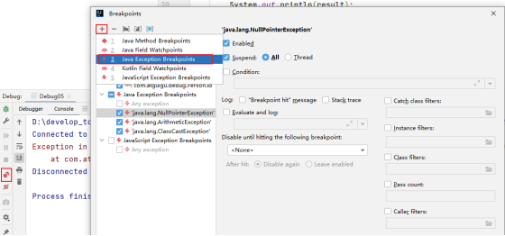

## 第04章 IDEA的安装与使用     

### 1. 安装      
安装细节 略      
Jetbrains公司官网       
[https://www.jetbrains.com/](https://www.jetbrains.com/)        

下载      

*项目的JDK设置*      
     

     

*编译输出目录设置*      
         

*详细设置*          
     

     

*设置菜单和窗口字体和大小*      
     

*自动导包设置*        
     

*项目文件编码设置*      
     

*控制台字符编码设置*     
     

*类头的文档注释信息*     
       

### 2. IDEA项目结构        
*层级关系*      
`project(工程) --> module(模块) --> package(包) --> class(类)`        
这些结构的划分主要是为了方便管理代码      

       

*具体*        
- 一个project中可以创建多个module
- 一个module中可以创建多个package
- 一个package中可以创建多个class

*创建module*      
       

*删除module*      
       

*导入module*      
       

*package命名*     
- 不要有中文
- 不要以数字开头
- 给包取名一般都是公司域名倒过来写
    - `site.weew12`

### **3. 代码模板的使用**            

查看Postfix Completion模板（后缀补全）        
       

**常用代码模板**      
- 非空判断
    - *变量.null  `if(变量 == null)`*
    - *变量.nn  `if(变量 != null)`*
    - *变量.notnull  `if(变量 != null)`*
    - *ifn  `if(xx == null)`*
    - *inn  `if(nn != null)`*
- 遍历数组和集合
    - *数组或集合变量.fori  `for循环`*
    - *数组或集合变量.for `增强for循环`*
    - *数组或集合变量.forr `反向for循环`*
    - *数组或集合变量.iter `增强for循环变量数组或集合`*
- 输出语句
    - *sout `相当于System.out.println`*
    - *soutm `打印当前方法的名称`*
    - *soutp `打印当前方法的形参及形参对应的实参值`*
    - *soutv `打印方法中声明的最近的变量的值`*
    - *变量.sout `打印当前变量的值`*
    - *变量.soutv `打印当前变量名及变量值`*
- 对象操作
    - 创建对象
        - *`XXX.new.var`  创建XXX类的对象，并给对应的变量赋值*
        - *`XXX.new.field`  将方法内刚创建的XXX对象抽取为一个属性* 
    - 强转
        - `对象.cast`  将对象进行强转
        - `对象.castvar`  将对象强转后赋值给一个变量
- 静态常量声明
    - *`psf`  **public static final***
    - *`psfi`  **public static final int***
    - *`psfs`  **public static final String***
    - *`prsf`  **private static final***

### **3. IDEA断点调试（Debug）**      
主要用于程序调试，查找和定位错误        

*Debug(调试)步骤*       

- 1 添加断点    
        
- 2 启动调试    
        

- 3 单步执行    
         
         
    -   Step Over(F8)     
        - 进入下一步，如果当前行断点是调用的一个方法，则`不会进入方法体内`    
    -   Step Into(F7)     
        - 进入下一步，如果当前行断点是调用的一个自定义的方法，则`进入方法体内`    
    -   Force Step Into(Alt + Shift + F7)    
        - 进入下一步，如果当前行断点是调用的一个`核心类库方法，则进入该方法体内`    
    -   Step Out(Shift + F8)    
        - `跳出当前方法体`    
    -   Run to Cursor(Alt + F9)    
        - `直接跳到光标处`继续调试     
    -   Resume Program(F9)     
        - `恢复程序执行，但是如果该断点下面的代码还有断点，则停在下一个断点上`     
    -   Stop(Ctrl + F2)    
        - `结束调试`     
    -   View BreakPoints(Ctrl + Shift + F8)    
        - `查看所有断点`     
    -   Mute BreakPoints     
        - `使得当前代码后面所有的断点失效`，一下执行到底

- 4 观察变量和执行流程，查找解决问题    

**注意：在Debug过程中，可以动态的打断点**     

#### 多种Debug情况

**1. 行断点**   
断点打在代码所在的行上。执行到此行时，会停下来。        

**2. 方法断点**     
断点设置在方法的签名上，默认当进入时，断点可以被唤醒。     
也可以设置在方法退出时，断点也被唤醒     
       

**3. 字段断点**        
在类的属性声明上打断点，默认对属性的修改操作进行监控     
       

**4. 条件断点**        
       

**5. 异常断点**       
对异常进行跟踪。如果程序出现指定异常，程序就会执行断点，自动停住。      
       

**6. 线程调试**        
       

**7. 强制结束**        
       

**8. 自定义数据视图**        
       
       

**使用Step Into时，会出现无法进入源码的情况?**      
       

