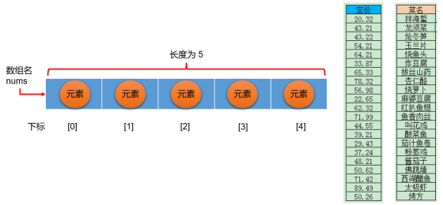
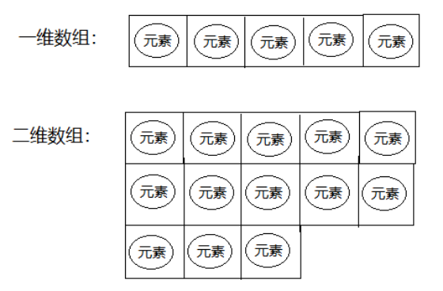
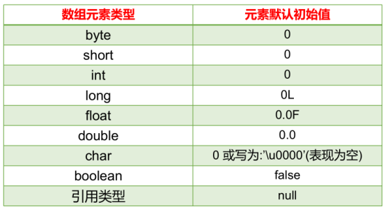
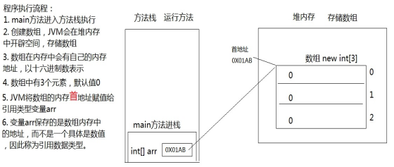
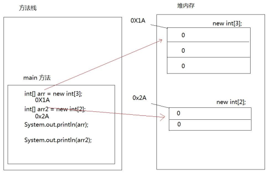
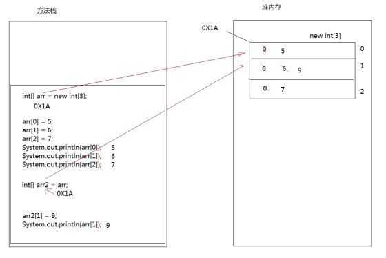
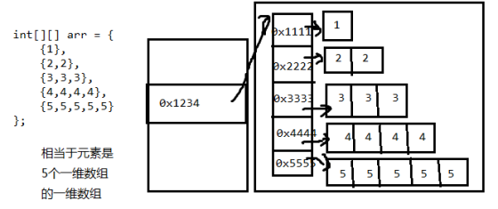
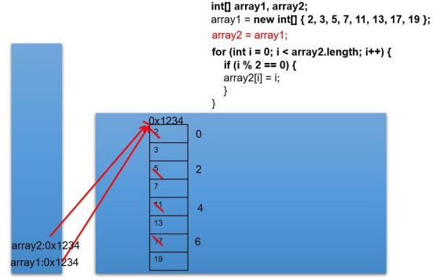
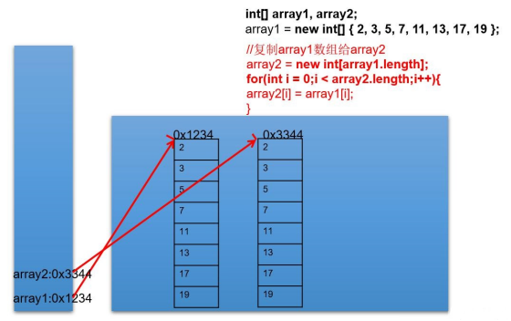

## 第05章 数组           

### 1.数组的概述         

#### 为什么需要数组
可以将所有的数据全部存储到一个*容器*中统一管理，并使用容器进行计算        
将多个数据存储到一起，没个数据称为该容器的*元素*

#### 数组中的基本概念、分类
**数组**      
数组是将多个*相同类型*数据按一定顺序排列的集合，并使用一个名字命名，并通过编号的方式对这些数据进行统一的管理。

**数据组中的基本概念**
- 数组名
- 下标（索引）
- 元素
- 数组的长度



**数组的特点**
- 数组本身是**引用数据类型**，而数组中的元素可以是基本数据类型和引用数据类型
- 创建数组对象会在内存中开辟一整块**连续**的空间，占据的空间大小取决于元素的类型和数组的长度
- 数组中的元素在内存是一次紧密排列、连续的
- 数组一旦初始化其长度就是固定的，一旦确定就不能修改
- 可以通过下标（索引）的方式调用指定位置的元素
- **数组名中引用的是这块连续空间的首地址**

**分类**      
*按照元素类型划分*
- 基本数据类型元素的数组
    - 每个元素位置存储基本数据类型的**值**
- 引用数据类型元素的数组
    - 每个元素位置存储对象（本质：存储**对象的首地址**）

*按照维度划分*
- 一维数组
    - 存储一组数据
- 二维数组
    - 存储多组数据，相当于二维表，每行代表一组数据，**二维表的每一行长度不要求一样**

     

### 2. 一维数组的基本使用        

#### 一维数组的声明        
- ```java
    元素的数据类型[] 一维数组的名称; //（推荐）
  ```
- ```java
    元素的数据类型 一维数组名[]; // 不推荐
  ```
- 例子：
    - ```java
        int[] arr;
        int arr1[];
        double[] arr2;
        //引用类型变量数组
        String[] arr3;  
      ```
**注意点**
- 数组的维度：Java中数组的符号为`[]`,`[]`表示一维，`[][]`表示二维
- 数组的元素类型：元素类型可以是任意的Java数据类型，`int`、`String`等
- 数组名：代表某个数组的标识符，数组名也是变量名，按照变量的命名规范（字符、数字、下划线、$），数组名是**引用数据类型**的变量。
- 数组声明：**Java中声明数组是不能指定其长度，例如：int a[5]; // 非法**

#### 一维数组的初始化       

**静态初始化**     
数组变量的初始化和数组元素的赋值操作同时进行，本质是用静态数据（编译时已知）为数组初始化，此时数组的长度由静态数据的个数决定。     

- 初始化格式1
  ```java
  数据类型[] 数组名 = new 数据类型[] {元素1, 元素2, 元素3, ...}
          
  或者
  
  数组类型[] 数组名;
  数组名 = new 数据类型[] {元素1, 元素2, 元素3, ...}
  ```       
  因为数组本身是引用数据类型，所以使用`new`创建数组实体。
- 初始化格式2
  ```java
  // 必须在一个语句中完成，不能分开两个语句写！！！
  数据类型[] 数组名 = {元素1, 元素2, 元素3, ...}
          
  // 正确写法
  int[] arr = {1,2,3,4,5,...}
  
  // 错误写法
  /*
   int[] arr;
   arr = {1,2,3,4,5,...}
   */
  ```

**动态初始化**       
**数组变量的初始化和数组元素的赋值操作分开进行**，动态初始化中，只确定了元素的个数（数组的长度），元素值此时只是默认值，还需要后续单独一个个赋值为期望的值。     
- 格式
  ```java
  数据类型[] 数组名;
  数组名 = new 数据类型[长度]
  
  或者
  
  数据类型[] 数组名 = new 数据类型[长度];
  ```

*错误写法*    
```java
// 错误写法，后面的{}已经指定了元素列表，就不需要在[]中指定元素个数了。
int[] arr = new int[5] {1,2,3,4,5}
```

#### 一维数组的使用          

**长度**       
数组元素的总个数，每个数组都有一个属性`length`指明它的长度，`arr.length`指明数组`arr`的长度。     

**调用数组元素**      
每一个存储到数组的元素都会自动拥有一个编号，从`0`开始，这个自动编号称为`数组索引（index）`或`下标`，可以通过索引/下标访问到数组中的元素。   
```java
数组名[索引/下标]
```
数组下标的范围：从`[0]`开始，下标的范围是`[0, 数组长度 - 1]`，即：`[0, 数组名.length - 1]`。   
**数组元素的下标可以是整型常量或整型表达式，如：a[3]、a[i]、a[6 * 1]**   

**遍历**      
遍历就是将数组中的每个元素分别获取出来。    

样例：   
```java
public class ArrayTest4 {
    public static void main(String[] args) {
        int[] arr = new int[]{1, 2, 3, 4, 5};
        //打印数组的属性，输出结果是5
        System.out.println("数组的长度：" + arr.length);

        //遍历输出数组中的元素
        System.out.println("数组的元素有：");
        for(int i = 0; i < arr.length; i++){
            System.out.println(arr[i]);
        }
    }
}
```

### 3. 数组元素默认初始化值、一维数组内存解析       
#### 数组元素的默认初始化值       
数组是引用数据类型，当使用动态初始化方式创建数组时，元素值只是默认值。   
- 对于`基本数据类型`而言，默认初始化值各有不同。
        
- 对于`引用数据类型`，默认初始化值为`null`（与0不同）    

#### 一维数组内存解析       
- 创建一个一维数组：   
  ```java
  public static void main(String[] args) {
      int[] arr = new int[3];
      System.out.println(arr);//[I@5f150435
  }
  ```
  对应的内存模型：    
      
- 创建两个独立的一维数组
  ```java
  public static void main(String[] args) {
      int[] arr = new int[3];
      int[] arr2 = new int[2];
      System.out.println(arr);
      System.out.println(arr2);
  }
  ```
  对应的内存模型：    
      
- 创建两个变量指向一个一维数组
  ```java
  public static void main(String[] args) {
      // 定义数组，存储3个元素
      int[] arr = new int[3];
      //数组索引进行赋值
      arr[0] = 5;
      arr[1] = 6;
      arr[2] = 7;
      //输出3个索引上的元素值
      System.out.println(arr[0]);
      System.out.println(arr[1]);
      System.out.println(arr[2]);
      //定义数组变量arr2，将arr的地址赋值给arr2
      int[] arr2 = arr;
      arr2[1] = 9;
      System.out.println(arr[1]);
  }
  ```
  对应的内存模型：    
      

### 4. 多维数组的使用    
Java语言提供了支持多维数组的语法，如果把一维数组当做是几何中的线性图形，那么二维数组就相当于是一个表格，像Excel中的表格、围棋棋盘一样。    
对于二维数组的理解：**可以看成是一维数组Array1又做为另一个一维数组Array2的元素而存在。**    

#### 声明（二维数组为例）   
```java
数据类型[][] 数组名; // 推荐
数据类型 数组名[][]; // 不推荐
数据类型[] 数组名[]; // 不推荐
```

*注意*    
```java
int[] x, y[];
```
*上面x是一维数组，y是二维数组！！！*    

#### 静态初始化    
格式：
```java
int[][] arr = new int[][]{{3,8,2},{2,7},{9,0,1,6}};
```
数组arr为二维数组，二维数组中有三个一维数组。      

初始化举例：    
```java
//声明与初始化必须在一句完成
int[][] arr = {{1,2,3},{4,5,6},{7,8,9,10}};

int[][] arr = new int[][]{{1,2,3},{4,5,6},{7,8,9,10}};

int[][] arr;
arr = new int[][]{{1,2,3},{4,5,6},{7,8,9,10}};

// 错误，静态初始化右边new 数据类型[][]中不能写数字
// arr = new int[3][3]{{1,2,3},{4,5,6},{7,8,9,10}};
```

#### 动态初始化（二维数组为例）    
如果二维数组的每一个数据，甚至是每一行的列数需要后期单独确定，则只能使用动态初始化方式。    
- 格式1：规则二维表，每一行的列数都是相同的
    - 确定行数和列数
        - ```java
          数据类型[][] 数组名 = new 数据类型[m][n];
          // 其中m表示行数，这个二维数组中有多少个一维数组
          // 其中n表示列数，这个二维数组的每一行有多少个元素
          // 此时创建完的二维数组的元素都是有默认值（同上述介绍的数组元素数据类型对应的默认值）
          ```
    - 为元素赋值
        - ```java
          数组名[行下标][列下表] = 元素值
          ```
    - 样例
        ```java
        int[][] arr = new int[3][2];
        // ...
        arr[0][1] = 78;
        ```
- 格式2：不规则，每一行的列数不一样
    - 确定总行数
        - ```java
          数据类型[][] 数组名 = new 数据类型[总行数][];
          // 此时只是确定了总行数，，每一行里面现在是null
          ```
    - 确定每一行的列数
        - ```java
          数组名[行下标] = new 数据类型[该行的总列数];
          // 此时已经new完的行的元素就有默认值了，没有new的行还是null
          ```
    - 为元素赋值
        - ```java
          数组名[行下标][列下标] = 元素值;
          ```

*注意*：`int[][] arr = new int[][3]; // 非法`      

#### 数组的长度、调用数组元素（二维数组为例）     

- 二维数组的长度/行数：`二维数组名.length`         
- 二维数组的某一行：`二维数组名[行下标]`，相当于获取其中一组数据，本质上是一维数组，行下标范围：`[0, 二维数组名.length - 1]`。       
- 二维数组某一行的列数：`二维数组名[行下标].length`
- 二维数组某一个元素：`二维数组名[行下标][列下标]`

#### 遍历（二维数组为例）         
```java
//二维数组对象.length
for(int i = 0; i < 二维数组名.length; i++){ 
    //二维数组行对象.length
    for(int j = 0; j < 二维数组名[i].length; j++){
        System.out.print(二维数组名[i][j]);
    }
    System.out.println();
}
```

### 5. 二维数组内存解析         
二维数组本质上是元素类型是一维数组的一维数组。       
```java
int[][] arr = {
    {1},
    {2,2},
    {3,3,3},
    {4,4,4,4},
    {5,5,5,5,5}
};
```
上述数组对于的内存模型：        
       


### 6. 数组元素的赋值与赋值       
直接赋值，两个数组变量引用同一个内存区域        
       

分别new两块内存区域，对应两个独立的数组       
       

### 7. Arrays工具类、数组的常见异常        

#### Arrays工具类的使用        
// TODO

#### 数组常见的异常        
- 空指针异常    
    访问数组元素时，下标指定超出[0, 数组名.length - 1]，就会报数组下标越界异常。    
    `ArrayIndexOutOfBoundsException`
- 角标越界异常      
    数组的某个元素还未分配到一个存储元素的空间，此时是null，若此时访问则会出现空指针异常。    
    `NullPointerException`


