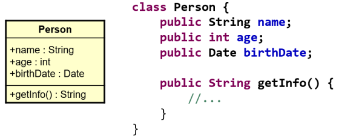
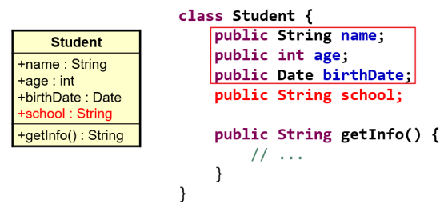
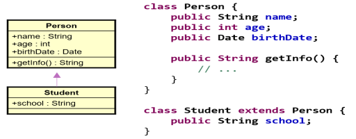
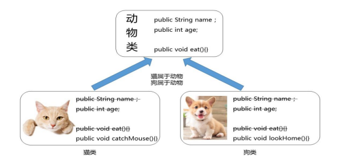
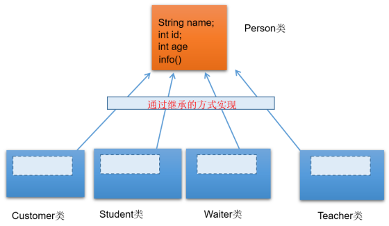
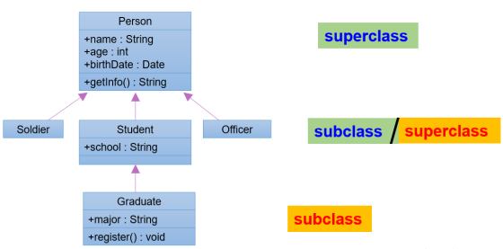
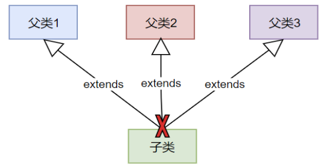
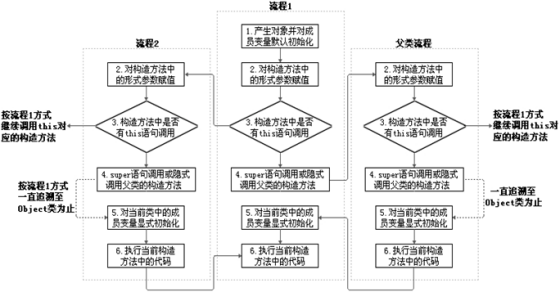
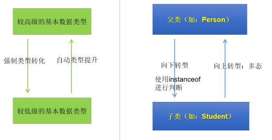
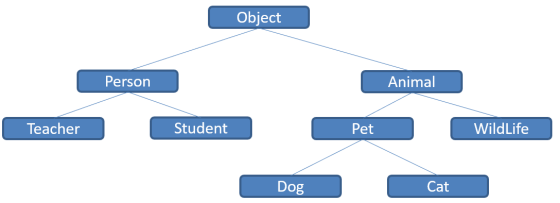

## 第07章 面向对象编程（进阶）

### 1. `this`关键字

#### `this`关键字是什么？

在Java中，`this`关键字的作用和其词义很接近：

- 在`实例方法`或`非static的方法`内部使用，表示调用该方法的对象
- 在`构造器`内部使用，表示该构造器正在初始化的对象
- `this`可以调用的结构：`成员变量`、`方法`、`构造器`

#### 什么时候使用`this`

- 实例方法或构造器中使用当前对象的成员
    - 在实例方法或构造器中，如果使用当前类的`成员变量`或`成员方法`可以在其前面添加`this`，增强程序的可读性，*通常习惯省略`this`*
    - 当`形参与成员变量同名时`，如果在方法内或构造器内需要使用成员变量，必须添加`this`来表明该变量是类的成员变量——即：**我们可以用this来区分成员变量和局部变量**
        - 
    - **使用this访问属性和方法时，如果在本类中未找到，会从父类中查找**
    - 样例代码：
        ```java
        // 定义Person类
        class Person {
            private String name;
            private int age;
        
            public Person(String name, int age) {
                this.name = name;
                this.age = age;
            }
        
            public void setName(String name) {
                this.name = name;
            }
        
            public void setAge(int age) {
                this.age = age;
            }
        
            public void getInfo() {
                System.out.println("姓名：" + name);
                this.speak();
            }
        
            public void speak() {
                System.out.println("年龄：" + this.age);
            }
        }
        ```        
- 同一个类中构造器互相调用
    - **`this`可以作为一个类中构造器相互调用的特殊格式**
    - **`this()`调用本类的无参构造器**
    - **`this(实参列表)`调用本类的有参构造器**
    - **注意**
      - 不能出现递归调用，比如构造器自己调自己。*如果一个类中声明了n个构造器，则最多有n-1个构造器中使用了“this(形参列表)”*。
      - `this()`和`this(实参列表)`只能声明在构造器首行。*在类的一个构造器中，最多只能声明一个“this(参数列表)”。*
    - 样例代码：
        ```java
        public class Student {
            private String name;
            private int age;
        
            // 无参构造
            public Student() {
        //        this("",18);//调用本类有参构造器
            }
        
            // 有参构造
            public Student(String name) {
                this();//调用本类无参构造器
                this.name = name;
            }
        
            // 有参构造
            public Student(String name, int age) {
                this(name);//调用本类中有一个String参数的构造器
                this.age = age;
            }
        
            public String getName() {
                return name;
            }
        
            public void setName(String name) {
                this.name = name;
            }
        
            public int getAge() {
                return age;
            }
        
            public void setAge(int age) {
                this.age = age;
            }
        
            public String getInfo() {
                return "姓名：" + name + "，年龄：" + age;
            }
        }
        ```        

### 2. 面向对象特征之二：继承性(Inheritance)                

**继承有延续**（下一代延续上一代的基因、财富）、**拓展**（下一代和上一代又有所不同）的意思。              

#### Java中的继承               

**角度一：从上而下**        
1. 为描述和处理个人信息，定义类`Person`        
        
2. 为描述和处理学生信息，定义类`Student`             
          
3. 通过继承，简化`Student`类的定义          
             

*Student类继承了父类Person的所有属性和方法，并增加了一个属性school，Person中的属性和方法，Student都可以使用。*                    

**角度二：从下而上**            
    
多个类中存在相同属性和行为时，将这些内容抽取到单独的一个类中，那么多个类中无需再定义这些属性和行为，只需要和抽取出来的类构成**继承关系**。              
     
    

#### 继承的好处              

- 继承的出现`减少了代码冗余`，`提高了代码的复用性`
- 继承的出现，更`利于功能的拓展`
- 继承的出现让类与类之间产生了`is-a`关系，`为多态的使用提供了前提`。（父类更通用、更一般，子类更具体）
- **不要仅仅为了获取其他类的某个功能而去继承！**

#### 继承的语法格式              

通过`extends`关键字，可以声明一个类B继承另外一个类A，定义格式如下：                 
```java
[修饰符] class 类A {
	...
}

[修饰符] class 类B extends 类A {
	...
}
```           

*继承中的基本概念*            
- 类B，称为子类、派生类(derived class)、`SubClass`
- 类A，称为父类、超类、基类(base class)、`SuperClass`

**代码举例：**               
- 父类
    ```java
    /*
     * 定义动物类Animal，做为父类
     */
    public class Animal {
        // 定义name属性
        String name;
        // 定义age属性
        int age;
    
        // 定义动物的吃东西方法
        public void eat() {
            System.out.println(age + "岁的"
                    + name + "在吃东西");
        }
    }
    ```             
- 子类
    ```java
    /*
     * 定义猫类Cat 继承 动物类Animal
     */
    public class Cat extends Animal {
        int count;//记录每只猫抓的老鼠数量
    
        // 定义一个猫抓老鼠的方法catchMouse
        public void catchMouse() {
            count++;
            System.out.println("抓老鼠，已经抓了"
                    + count + "只老鼠");
        }
    }
    ```            
- 测试类
    ```java
    public class TestCat {
        public static void main(String[] args) {
            // 创建一个猫类对象
            Cat cat = new Cat();
            // 为该猫类对象的name属性进行赋值
            cat.name = "Tom";
            // 为该猫类对象的age属性进行赋值
            cat.age = 2;
            // 调用该猫继承来的eat()方法
            cat.eat();
            // 调用该猫的catchMouse()方法
            cat.catchMouse();
            cat.catchMouse();
            cat.catchMouse();
        }
    }
    ```          

#### 继承性的细节说明               

- 子类会继承父类所有的实例变量和实例方法
  - 类是一类具有相同特性的事物的抽象描述，父类是所有子类共同特征的抽象描述；实例变量和实例方法就是事物的特征，父类中声明的实例变量和实例方法代表子类事物也有这个特征。
    - 当子类对象创建时，在堆中给对象申请内存时，就要看子类和父类都声明了什么实例变量，这些实例变量都要分配内促。
    - 当子类对象调用方法时，编译器会先在子类模板中看该类是否有这个方法，如果没有找到，会看它的父类甚至父类的父类是否声明了这个方法，遵循从下往上找的顺序，找到了就停止，如果一直到根父类（Object）都没有找到，就会报编译错误
    - 继承意味着子类的对象除了看子类的类模板还要看父类的类模板
- 子类不能直接访问父类中私有的（private）的成员变量和方法
  - 子类虽然会继承父类私有（private）的成员变量，但子类不能对继承的私有成员变量直接进行访问，可以通过继承的get/set方法进行访问
- 在Java中，继承的关键字使用“extends”，即子类不是父类的子集，而是对父类的“拓展”
  - 子类在继承父类之后，还可以定义自己特有的方法，这就可以看做是对父类功能上的拓展
- Java支持多层继承（继承体系）
  - 顶层父类是Object类，所有的类默认继承Object，作为父类
  -     
- 一个父类可以同时拥有多个子类
- Java只支持单继承，不支持多继承
  -     

### 3. 方法的重写（override/overwrite）                

#### 概念                         

子类可以对从父类中继承来的方法进行改造，称为方法的`重写（override、overwrite）`，也称为方法的`重置、覆盖`。在程序执行时，子类的方法将覆盖父类的方法。               

**代码样例：**
```java
public class Phone {
    public void sendMessage(){
        System.out.println("发短信");
    }
    public void call(){
        System.out.println("打电话");
    }
    public void showNum(){
        System.out.println("来电显示号码");
    }
}

//SmartPhone：智能手机
public class SmartPhone extends Phone{
    //重写父类的来电显示功能的方法
	@Override
    public void showNum(){
        //来电显示姓名和图片功能
        System.out.println("显示来电姓名");
        System.out.println("显示头像");
    }
    //重写父类的通话功能的方法
    @Override
    public void call() {
        System.out.println("语音通话 或 视频通话");
    }
}
```    

**@Override说明**             
写在方法上面，用来检测是不是满足重写方法的要求。                
这个注解就算不写，只要满足要求，也是正确的方法覆盖重写。                
建议保留，这样编译器可以帮助我们检查格式，也可以让源代码结构更为清晰。        

#### 方法重写的要求                

- 子类重写的方法必须和父类被重写的方法**具有相同的方法名称、参数列表**
- 子类重写的方法的**返回值类型不能大于父类被重写的方法的返回值类型**
  - **如果返回值类型是基本数据类型和void，那么必须相同**
- **子类重写的方法使用的访问权限不能小于父类被重写的方法的访问权限（public > protected > 缺省 > private）**
  - *父类私有方法不能重写*
  - *跨包的父类缺省的方法也不能重写*
- 子类方法抛出的异常不能大于父类被重写方法的异常

*注意*        
子类与父类中同名同参数的方法必须同时声明为非static方法，**因为static方法是属于类的，子类无法覆盖父类的。**                   

#### 方法的重载与重写的比较                

**方法的重载**               
方法名相同，形参列表不同，不看返回值类型。               

**方法的重写**               
见上小结内容              

**代码样例：**               
- 同一个类中
    ```java
    public class TestOverload {
        public int max(int a, int b){
            return a > b ? a : b;
        }
        public double max(double a, double b){
            return a > b ? a : b;
        }
        public int max(int a, int b,int c){
            return max(max(a,b),c);
        }
    }
    ```    
- 父子类中
    ```java
    class Father{
        public void method(int i){
            System.out.println("Father.method");
        }
    }
    
    class Son extends Father{
        //重写
        public void method(int i){
            System.out.println("Son.method");
        }
    }
    
    class Daughter extends Father{
        //重载
        public void method(int i,int j){
            System.out.println("Daughter.method");
        }
    }
    ```

### 4. 封装性中的4种权限修饰              

权限修饰符：public、protected、缺省、private               

|修饰符|	本类|	本包|	其他包子类|	其他包非子类|
|:---:|:---:|:---:|:---:|:-----:|
|private|	√|	×|	×|	×|
|缺省|	√|	√（本包子类非子类都可见）|	×|	×|
|protected|	√|	√（本包子类非子类都可见）|	√（其他包仅限于子类中可见）|	×|
|public|	√|	√|	√|	√|

**使用**              
外部类：public、缺省               
成员变量、成员方法等：public、protected、缺省、private                          

- **外部类要跨包使用必须是public，否则仅限于本包使用**
  - 外部类的权限修饰符如果缺省，本包使用没问题
  - 外部类的权限修饰符如果缺省，跨包使用有问题
- 成员的权限修饰符问题
  - 本包下使用：成员的权限修饰符可以是public、protected、缺省
  - 跨包下使用：严格按照规则
  - **跨包使用时，如果类的权限修饰符缺省，成员权限修饰符 > 类的权限修饰符也没有意义**
  -     

### 5. super关键字                 

#### super的理解               

在Java类中使用super来调用父类中的指定操作：              
- super可以用于**访问父类中定义的属性**
- super可以用于**调用父类中定义的成员方法**
- super可以用于**在子类构造器中调用父类的构造器**

**注意**              
- 当父子类出现同名成员时，可以用super表明调用的是父类中的成员
- super的追溯不仅限于直接父类
- super和this的用法相像，this代表本类对象的引用，super代表父类的内存空间的标识

#### super的使用场景             

- 子类中调用父类被重写的方法 
  - 如果子类没有重写父类的方法，只要权限修饰符允许，在子类中完全可以直接调用父类的方法
  - 如果子类重写了父类的方法，在子类中需要通过`super.`才能调用父类被重写的方法，否则默认调用的子类重写的方法
  - 总结
    - **方法前面没有`super.`和`this.`**，*先从子类找匹配方法，如果没有，再从直接父类找，再没有，继续往上追溯*
    - **方法前面有`this.`**，*先从子类找匹配方法，如果没有，再从直接父类找，再没有，继续往上追溯*
    - **方法前面有`super.`**，从当前子类的直接父类找，如果没有，继续往上追溯
  - **代码举例：**
    ```java
    public class Phone {
        public void sendMessage(){
            System.out.println("发短信");
        }
        public void call(){
            System.out.println("打电话");
        }
        public void showNum(){
            System.out.println("来电显示号码");
        }
    }
    
    //smartphone：智能手机
    public class SmartPhone extends Phone{
        //重写父类的来电显示功能的方法
        public void showNum(){
            //来电显示姓名和图片功能
            System.out.println("显示来电姓名");
            System.out.println("显示头像");
    
            //保留父类来电显示号码的功能
            super.showNum();//此处必须加super.，否则就是无限递归，那么就会栈内存溢出
        }
    }
    ```    
- 子类中调用父类中同名的成员变量 
  - **如果实例变量与局部变量重名，可以在实例变量前面加上`this.`进行区别。**
  - **如果子类实例变量和父类实例变量重名，并且父类的该实例变量在子类仍然可见，在子类中要访问父类声明的实例变量需要在父类实例变量前加上`super.`，否则默认访问的是子类自己声明的实例变量。**
  - **如果父子类实例变量没有重名，只要权限修饰符允许，在子类中完全可以直接访问父类中声明的实例变量，也可以用`this.`实例访问，也可以用`super.`实例变量访问。**
  - 总结
    - **变量前面没有`super.`和`this.`**
      - 在构造器、代码块、方法中如果出现使用某个变量，先查看是否是当前块声明的局部变量
      - 如果不是局部变量，先从当前执行代码的本类去找成员变量
      - 如果从当前执行代码的本类中没有找到，会往上找父类声明的成员变量（权限修饰符允许子类中访问的）
    - **变量前面有`this.`**
      - 通过`this`找成员变量时，先从当前执行代码的*本类*去找成员变量
      - 如果从当前执行代码的本类中没有找到，会往上找*父类声明的成员变量*（权限修饰符允许在子类中访问的）
    - **变量前面有`super.`**
      - 通过`super`找成员变量，直接从当前执行代码的直接父类去找成员变量（权限修饰符允许在子类中访问的）
      - 如果直接父类没有，就去父类的父类中找（权限修饰符允许在子类中访问的）
  - **应该避免子类声明和父类重名的成员变量！！！**
  - **代码举例：**
    ```java
    class Father{
        int a = 10;
        int b = 11;
    }
    
    class Son extends Father{
        int a = 20; 
        
        public void test(){
            //子类与父类的属性同名，子类对象中就有两个a
            System.out.println("子类的a：" + a);//20  先找局部变量找，没有再从本类成员变量找
            System.out.println("子类的a：" + this.a);//20   先从本类成员变量找
            System.out.println("父类的a：" + super.a);//10    直接从父类成员变量找
            
            //子类与父类的属性不同名，是同一个b
            System.out.println("b = " + b);//11  先找局部变量找，没有再从本类成员变量找，没有再从父类找
            System.out.println("b = " + this.b);//11   先从本类成员变量找，没有再从父类找
            System.out.println("b = " + super.b);//11  直接从父类局部变量找
        }
        
        public void method(int a, int b){
            //子类与父类的属性同名，子类对象中就有两个成员变量a，此时方法中还有一个局部变量a		
            System.out.println("局部变量的a：" + a);//30  先找局部变量
            System.out.println("子类的a：" + this.a);//20  先从本类成员变量找
            System.out.println("父类的a：" + super.a);//10  直接从父类成员变量找
        
            System.out.println("b = " + b);//13  先找局部变量
            System.out.println("b = " + this.b);//11  先从本类成员变量找
            System.out.println("b = " + super.b);//11  直接从父类局部变量找
        }
    }
    ```    
- 子类构造器中调用父类构造器
  - **子类继承父类时，不会继承父类的构造器，只能通过`super(形参列表)`的方式调用父类指定的构造器。**
  - **`super(形参列表)`必须声明在构造器的首行**
  - 在构造器的首行可以使用`this(形参列表)`，调用本类中重载的构造器。**在构造器的首行，`this(形参列表)`和`super(形参列表)`只能二选一**
  - **如果子类构造器的首行既没有显示调用`this(形参列表)`，也没有显示调用`super(形参列表)`，则子类此构造器默认调用`super()`，即调用父类中的空参构造器。**
  - **子类的任何一个构造器中，要么会调用本类中重载的构造器，要么会调用父类的构造器，只能是这两种情况之一。**
  - **一个类中声明有n个构造器，最多有n-1个构造器中使用了`this(形参列表)`，则剩下的那一个一定使用`super(形参列表)`**
  - *如果子类构造器中既未显示调用父类或本类的构造器，且父类中又没有空参构造器，则编译出错。*

#### `this`与`super`                 

**this与super的意义**                           
- `this`，当前对象
  - 在构造器和非静态代码块中，表示正在`new`的对象
  - 在实例方法中，表示调用当前方法的对象
- `super`，引用父类声明的成员

**this和super的使用格式**             
- `this`
  - `this.成员变量`：表示当前对象的某个成员变量，而不是局部变量
  - `this.成员方法`：表示当前对象的某个成员方法，完全可以省略this
  - `this()`或`this(实参列表)`：调用另一个构造器协助当前对象的实例化，只能在构造器首行，**只会找本类的构造器**，找不到就报错
- `super`
  - `super.成员变量`：表示当前对象的某个成员变量，该成员变量在父类中声明的
  - `super.成员方法`：表示当前对象的某个成员方法，该成员方法在父类中声明的
  - `super()`或`super(实参列表)`：调用父类的构造器协助当前对象的实例化，只能在构造器首行，**只会找直接父类的对应构造器**，找不到就报错

### 6. 子类对象实例化的全过程              

// TODO             
    


### 7. 面向对象特征之三：多态性                 

#### 对象的多态性             

**多态性**是面向对象中最重要的概念，在Java中对象的多态性：**父类的引用指向子类的对象**            

**对象的多态：** 在Java中，子类的对象可以替代父类的对象使用。所以，一个引用类型变量可能指向（引用）多种不同类型的对象。                

**格式**              
- ```java
    父类类型 变量名 = 子类对象
  ```
- 父类类型：指子类继承的父类类型或者实现的接口类型

**代码举例：**               
```java
Person p = new Student();
//Object类型的变量o，指向Person类型的对象
Object o = new Person();
//Object类型的变量o，指向Student类型的对象
o = new Student(); 
```    

#### 多态的理解              

**Java引用变量有两个类型：*编译时类型*和*运行时类型*。**
- *编译时类型*由声明该变量时使用的类型决定
- *运行时类型*由实际赋给该变量的对象决定
- **编译时，看左边；运行时，看右边。**
  - **若编译时类型和运行时类型不一致，就出现了对象的多态性（Polymorphism）**
  - **多态情况下，“*看左边*”：看的是父类的引用（父类不具备子类特有的方法）；“*看右边*”：看的是子类的对象（实际运行的是子类重写父类的方法）**

**多态的使用前提：1. 类的继承关系 2. 方法的重写**                  

**代码样例：**
```java
public class Pet {
    private String nickname; //昵称

    public String getNickname() {
        return nickname;
    }

    public void setNickname(String nickname) {
        this.nickname = nickname;
    }

    public void eat(){
        System.out.println(nickname + "吃东西");
    }
}

public class Cat extends Pet {
    //子类重写父类的方法
    @Override
    public void eat() {
        System.out.println("猫咪" + getNickname() + "吃鱼仔");
    }

    //子类扩展的方法
    public void catchMouse() {
        System.out.println("抓老鼠");
    }
}

public class Dog extends Pet {
    //子类重写父类的方法
    @Override
    public void eat() {
        System.out.println("狗子" + getNickname() + "啃骨头");
    }

    //子类扩展的方法
    public void watchHouse() {
        System.out.println("看家");
    }
}
```

- 方法内局部变量的赋值体现多态
    ```java
    public class TestPet {
        public static void main(String[] args) {
            //多态引用
            Pet pet = new Dog();
            pet.setNickname("小白");
    
            //多态的表现形式
            /*
            编译时看父类：只能调用父类声明的方法，不能调用子类扩展的方法；
            运行时，看“子类”，如果子类重写了方法，一定是执行子类重写的方法体；
             */
            pet.eat();//运行时执行子类Dog重写的方法
    //      pet.watchHouse();//不能调用Dog子类扩展的方法
    
            pet = new Cat();
            pet.setNickname("雪球");
            pet.eat();//运行时执行子类Cat重写的方法
        }
    }
    ```
- 方法的形参声明体现多态
    ```java
    public class Person{
        private Pet pet;
        public void adopt(Pet pet) {//形参是父类类型，实参是子类对象
            this.pet = pet;
        }
        public void feed(){
            pet.eat();//pet实际引用的对象类型不同，执行的eat方法也不同
        }
    }
    
    public class TestPerson {
        public static void main(String[] args) {
            Person person = new Person();
    
            Dog dog = new Dog();
            dog.setNickname("小白");
            person.adopt(dog);//实参是dog子类对象，形参是父类Pet类型
            person.feed();
    
            Cat cat = new Cat();
            cat.setNickname("雪球");
            person.adopt(cat);//实参是cat子类对象，形参是父类Pet类型
            person.feed();
        }
    }
    ```
- 方法返回值类型体现多态
    ```java
    public class PetShop {
        //返回值类型是父类类型，实际返回的是子类对象
        public Pet sale(String type){
            switch (type){
                case "Dog":
                    return new Dog();
                case "Cat":
                    return new Cat();
            }
            return null;
        }
    }
    
    public class TestPetShop {
        public static void main(String[] args) {
            PetShop shop = new PetShop();
    
            Pet dog = shop.sale("Dog");
            dog.setNickname("小白");
            dog.eat();
    
            Pet cat = shop.sale("Cat");
            cat.setNickname("雪球");
            cat.eat();
        }
    }
    ```
#### 为什么需要多态性（polymorphism）                     

开发中，有时我们在设计一个数组、或一个成员变量、或一个方法的形参、返回值类型时，无法确定它具体的类型，只能确定它是某个系列的类型。               

#### 多态的好处与弊端               

- **好处**
  - 变量引用的子类对象不同，执行的方法就不同，实现动态绑定。代码编写更灵活、功能更强大，可维护性和扩展性更好。
- **弊端**
  - 一个引用类型变量如果声明为父类的类型，但实际引用的是子类对象，那么该变量就不能再访问子类中添加的属性和方法。

```java
Student m = new Student();
//合法,Student类有school成员变量
m.school = "pku"; 	
Person e = new Student();
//非法,Person类没有school成员变量
e.school = "pku";	

// 属性是在编译时确定的，编译时e为Person类型，没有school成员变量，因而编译错误。
```

**开发中，使用父类做方法的形参，是多态使用最多的场合。即使增加了新的子类，方法也无需改变，提高了扩展性，符合开闭原则。**          

#### 虚方法调用（Virtual Method Invocation）               

在Java中虚方法是指在编译阶段不能确定方法的调用入口地址，在运行阶段才能确定的方法，即**可能被重写的方法**。               

```java
Person e = new Student();
e.getInfo();	//调用Student类的getInfo()方法
```

子类中定义了与父类同名同参的方法，在多态情况下，将此时父类的方法称为虚方法，父类根据赋给它的不同子类对象，动态调用属于子类的该方法，这样的方法调用在编译期是无法确定的。                

#### 成员变量没有多态性                      

- 若子类重写了父类方法，就意味着子类里定义的方法彻底覆盖了父类里的同名方法，系统将不可能把父类里的方法转移到子类中。
- **对于实例变量，即使子类里定义了与父类完全相同的实例变量，这个实例变量仍然不可能覆盖父类中定义的实例变量**

**代码样例：**               
```java
public class TestVariable {
    public static void main(String[] args) {
        Base b = new Sub();
        System.out.println(b.a); // 1
        System.out.println(((Sub)b).a); // 2

        Sub s = new Sub();
        System.out.println(s.a); // 2
        System.out.println(((Base)s).a); // 1
    }
}

class Base{
    int a = 1;
}

class Sub extends Base{
    int a = 2;
}
```

#### 向上转型与向下转型              

*一个对象在new的时候创建是哪个类型的对象，它从头到尾都不会变。即这个对象的运行时类型，本质的类型不会变。但是把这个对象赋值给不同的变量时，这些变量的编译时类型却不同。*              

**为什么要类型转换？**           
- 因为多态，就一定会有把子类对象赋值给父类变量的时候，这时，在编译期间，就会出现类型转换的现象。
- 使用父类变量接受了子类对象之后，我们就不能调用子类拥有，而父类没有的方法了，所以，想要调用子类特有的方法，必须做类型转换，使得编译通过。

               

**向上转型**        
当左边的变量的类型（父类）> 右边对象/变量的类型（子类），就称为向上转型。
- 此时，编译时按照左边变量的类型处理，就只能调用父类中有的变量和方法，不能调用子类特有的变量和方法了。
- **运行时，仍然是对象本身的类型**，所有执行的方法是子类重写的方法体，**此时，一定是安全的，而且也是自动完成的。**

**向下转型**                
当左边的变量的类型（子类）< 右边对象/变量的编译时类型（父类），就称为向下转型。
- 此时，编译时按照左边变量的类型处理，就可以调用子类特有的变量和方法了
- **运行时，仍然是对象本身的类型。**
- 不是所有通过编译的向下转型都是正确的，可能会发生ClassCastException，所以，为了安全，可以通过isInstanceof关键字进行判断。

**如何向上或向下转型？**              
- 向上转型（自动完成）
- 向下转型：(子类类型)父类变量
  - 代码样例
    ```java
    public class ClassCastTest {
        public static void main(String[] args) {
            //没有类型转换
            Dog dog = new Dog();//dog的编译时类型和运行时类型都是Dog
    
            //向上转型
            Pet pet = new Dog();//pet的编译时类型是Pet，运行时类型是Dog
            pet.setNickname("小白");
            pet.eat();//可以调用父类Pet有声明的方法eat，但执行的是子类重写的eat方法体
    //        pet.watchHouse();//不能调用父类没有的方法watchHouse
    
            Dog d = (Dog) pet;
            System.out.println("d.nickname = " + d.getNickname());
            d.eat();//可以调用eat方法
            d.watchHouse();//可以调用子类扩展的方法watchHouse
    
            Cat c = (Cat) pet;//编译通过，因为从语法检查来说，pet的编译时类型是Pet，Cat是Pet的子类，所以向下转型语法正确
            //这句代码运行报错ClassCastException，因为pet变量的运行时类型是Dog，Dog和Cat之间是没有继承关系的
        }
    }
    ```

#### instanceof关键字              

为了避免出现ClassCastException的发生，Java提供了`instanceof`关键字，给引用变量做类型的校验。             

**格式：**             
```java
// 检验对象a是否是数据类型A的对象，返回值为boolean
对象a.instanceof 数据类型A
```

**说明：**             
- *只要用instanceof判断返回true的，那么强转为该类型就一定是安全的，不会报ClassCastException异常。*
- *如果对象a属于类A的子类B，a instanceof A值也为true。*
- *要求对象a所属的类与A必须是子类和父类的关系，否则编译报错。*

**代码样例：**               
```java
public class TestInstanceof {
    public static void main(String[] args) {
        Pet[] pets = new Pet[2];
        pets[0] = new Dog();//多态引用
        pets[0].setNickname("小白");
        pets[1] = new Cat();//多态引用
        pets[1].setNickname("雪球");

        for (int i = 0; i < pets.length; i++) {
            pets[i].eat();

            if(pets[i] instanceof Dog){
                Dog dog = (Dog) pets[i];
                dog.watchHouse();
            }else if(pets[i] instanceof Cat){
                Cat cat = (Cat) pets[i];
                cat.catchMouse();
            }
        }
    }
}
```

### 8. Object类的使用               

#### 根父类                    

**类java.lang.Object是类层次结构的根类，所有其他类的父类。每个类都使用Object作为超类。**               

               

- Object类型的变量与除Object以外的任意引用数据类型的对象都存在多态引用。
    ```java
     method(Object obj){…} //可以接收任何类作为其参数
     
     Person o = new Person();  
     method(o);
    ```
- 所有对象（包括数组）都实现这个类的方法。
- 如果一个类没有特别指定父类，那么默认继承自Object类。
    ```java
     public class Person {
        ...
     }
  
     //等价于：
     public class Person extends Object {
        ...
     }
    ```

#### Object类的方法（重点关注的几个方法）              

**equals()**        
- `==`
  - **基本类型比较值，只要两个变量的值相等，即为true。**
  - **引用类型比较引用（是否指向同一个对象）**，只有指向同有一个对象，`==`才返回true。
  - **用`==`进行比较时，符号两边的数据类型必须兼容（可自动转换的基本数据类型除外），否则编译出错。**
- `equals()`
  - 所有类都继承了Object，也就获得了equals()方法，也**可以对其进行重写**。
  - 只能比较引用数据类型，Object类源码中的equals()的作用与‘==’相同，比较是否指向同一个对象。
  - 格式：`obj1.equals(obj2)`
  - **当使用`equals()`方法进行比较时，对File、String、Date以及包装类（Wrapper Class）来说，是比较类型及内容而不考虑引用的是否是同一个对象**，*因为这些类中重写了equals()方法*。
  - 重写`equals()`方法的规则
    - 对称性：如果`x.equals(y)`返回`true`，那么`y.equals(x)`也应该返回`true`。
    - 自反性：`x.equals(x)`必须`true`。
    - 传递性：如果`x.equals(y)`返回`true`，而且`y.equals(z)`返回`true`，那么`z.equals(x)`也应该返回`true`。
    - 一致性：如果`x.equals(y)`返回`true`，只要`x`和`y`内容一直不变，不论执行多少次`x.equals(y)`都应该返回`true`。
    - 任何情况下，`x.equals(null)`都是返回`false`。
    - `x.equals(和x不同类型的对象)`永远返回`false`。
  - **`==`和`equals()`的区别**
    - **`==`既可以比较基本类型也可以比较引用类型，对于基本类型就是比较值，对于引用类型就是比较内存地址。**
    - **`equals()`是属于`java.lang.Object`类中的方法，如果该方法没有被重写过，默认也是`==`，`String`等类的`equals()`方法是被重写过的。**
    - *具体要看自定义类里有没有重写Object的equals方法来判断。*
    - 通常情况下，重写equals方法，会比较类中的相应属性是否都相等。


**toString()**          
- 方法签名：`public String toString()`
- **默认情况下，toString()返回的是“对象的运行时类型@对象的hashCode值的16进制形式。”**
- **在进行String与其他类型数据的连接操作时，自动调用toString()方法。**
  ```java
  Date now=new Date();
  System.out.println("now="+now);  //相当于
  System.out.println("now="+now.toString()); 
  ```
- **如果直接调用System.out.println(对象)，默认会自动调用这个对象的toString()**
  - 因为Java的引用数据类型的变量中存储的实际上是对象的内存地址，但是Java对程序员隐藏内存地址信息，所以不能直接将内存地址显示出来，所有当打印对象时，`JVM调用了对象的toString()`。
- **可以根据需要在用户自定义类型中重写`toString()`方法，例如：String类重写了toString()方法，返回字符串的值。**

**clone()**       
- //TODO 详细描述
- 样例代码
  ```java
  //Object类的clone()的使用
  public class CloneTest {
      public static void main(String[] args) {
          Animal a1 = new Animal("花花");
          try {
              Animal a2 = (Animal) a1.clone();
              System.out.println("原始对象：" + a1);
              a2.setName("毛毛");
              System.out.println("clone之后的对象：" + a2);
          } catch (CloneNotSupportedException e) {
              e.printStackTrace();
          }
      }
  }
  
  class Animal implements Cloneable{
      private String name;
  
      public Animal() {
          super();
      }
  
      public Animal(String name) {
          super();
          this.name = name;
      }
  
      public String getName() {
          return name;
      }
  
      public void setName(String name) {
          this.name = name;
      }
  
      @Override
      public String toString() {
          return "Animal [name=" + name + "]";
      }
      
      @Override
      protected Object clone() throws CloneNotSupportedException {
          // TODO Auto-generated method stub
          return super.clone();
      }
      
  }
  ```

**finalize()**          
- **当对象被回收时，系统自动调用改对象的`finalize()`方法。（不是垃圾回收器调用的，是本类对象调用的）**
  - **永远不要主动调用某个对象的`finalize()`方法，应该交给垃圾回收机制调用。**
- **当某个对象没有任何引用时，JVM就认为这个对象是垃圾对象，就会在之后不确定的时间使用垃圾回收机制来销毁该对象，在销毁该对象前，会先调用`finalize()`方法。**
- **子类可以重写该方法，目的是在对象被清理之前执行必要的清理操作**
- *该方法在JDK9中被标记为过时的方法。*

**getClass()**        
- `public final Class<?> getClass()`：获取对象的运行时类型。
  - Java有多态现象，所以一个引用数据类型的变量的编译时类型与运行时类型可能不一致，**如果需要查看这个变量实际指向的对象的类型，需要用`getClass()`方法。**
- 样例代码
    ```java
    public static void main(String[] args) {
        Object obj = new Person();
        System.out.println(obj.getClass());//运行时类型
    }
    
    结果：
    class com.atguigu.java.Person
    ```

**hashCode()**        
- `public int hashCode()`：返回每个对象的hash值
- 代码样例
  ```java
  public static void main(String[] args) {
      System.out.println("AA".hashCode());//2080
      System.out.println("BB".hashCode());//2112
  }
  ```

### 9. native关键字的理解         

**使用`native`关键字说明这个方法是原生函数，也就是这个方法是用C/C++等非Java语言实现的，并且被编译成了*DLL*，由Java去调用。**

- native方法（本地方法）是有方法体的，用c语言编写，由于本地方法的方法体源码没有对我们开源，所以我们看不到方法体。
- 在Java中定义一个native方法时，并不提供方法体。

#### 为什么要用native方法？                     

Java使用起来非常方便，但是有些底层的任务用Java实现起来不容易，或者为了提升程序的效率，于是Java提供了native方法。（例如：Java需要与一些底层操作系统或某些硬件交互信息时。）        
native方法提供了一个非常简洁的接口，而且我们无需去了解Java应用之外的繁琐的细节。           

#### native声明的方法，对于调用者，可以当做和其他Java方法一样使用            

native method 的存在并不会对其他类调用这些本地方法产生任何影响，实际上调用这些方法的其他类甚至不知道它所调用的是一个本地方法，JVM将控制调用本地方法的所有细节。          


