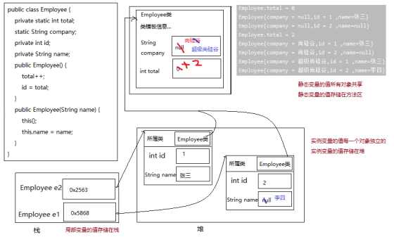
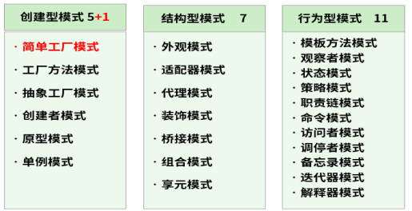
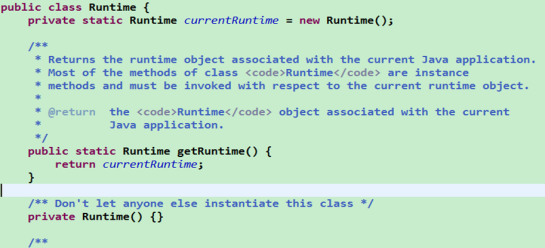
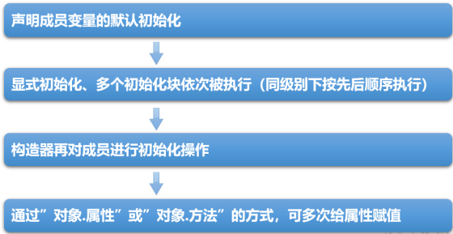
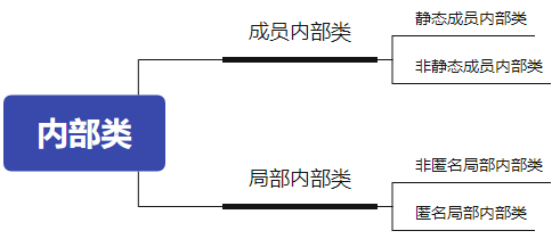
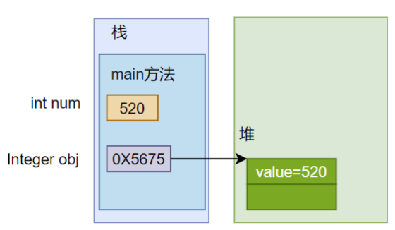
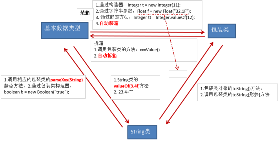

## 第08章 面向对象编程（高级）          

### 1. 关键字：static         

**如果想让一个成员变量被类的所有实例所共享，就用`static`修饰即可，称为`类变量`或`类属性`。**        

#### 类属性、类方法的设计思想           

我们有时候希望无论是否产生了对象或无论产生了多少对象的情况下，**某些特定的数据在内存空间里只有一份**。           
         

在类中声明的实例方法，在类的外面必须要先创建对象，才能调用。**但是有些方法的调用者与当前类的对象无关，这样的方法被声明为`类方法`，由于不需要创建对象就可以调用类方法，从而简化了方法的调用。**          

上述提到的类变量、类方法，只需要**使用static修饰即可**，所以也称为`静态变量`、`静态方法`。        

#### static关键字          

- 使用范围：
  - 在Java类中，可以用`static`修饰：**属性、方法、代码块、内部类**
- 被修饰后的成员具备以下特点：
  - **随着类的加载而加载**
  - **优先于对象存在**
  - **修饰的成员被所有对象共享**
  - **访问权限允许时，可以不创建对象直接被类调用**

#### 静态变量         

使用`static`修饰的成员变量就是静态变量（或类变量、类属性）         

**语法格式：**         
```java
[修饰符] class 类{
	[其他修饰符] static 数据类型 变量名;
}
```

**静态变量的特点：**          

- **静态变量的默认值规则与实例变量相同**
- **静态变量值是所有对象共享**
- **静态变量在本类中，可以在任意方法、代码块、构造器中直接使用**
- **如果权限修饰符允许，在其他类中可以通过`类名.静态变量`直接访问，可以通过`对象.静态变量`的方式访问（不推荐）**
- **静态变量的get/set方法也是静态的，当局部变量与静态变量重名时，使用`类名.静态变量`进行区分**

**内存解析：**         
         

#### 静态方法         

用`static`修饰的成员方法就是静态方法。       

**语法格式：**         
```java
[修饰符] class 类{
	[其他修饰符] static 返回值类型 方法名(形参列表){
        方法体
    }
}
```

**静态方法的特点：**        

- 静态方法在本类的任意方法、代码块、构造器中都可以直接被调用
- 只要权限修饰符允许，静态方法在其他类中可以通过`类名.静态方法`的方式调用，也可以通过`对象.静态方法`的方式调用（不推荐）。
- **在static方法内部，只能访问类的static修饰的属性或方法，不能访问类的非static的结构**
- **静态方法可以被子类继承，但不能被子类重写**
- **静态方法的调用都只看编译时类型**
- **static方法内部不能有this和super，如果有重名问题，使用`类名.静态方法`进行区别**

**代码样例：**         
```java
public class Father {
    public static void method(){
        System.out.println("Father.method");
    }

    public static void fun(){
        System.out.println("Father.fun");
    }
}

public class Son extends Father{
//    @Override //尝试重写静态方法，加上@Override编译报错，去掉Override不报错，但是也不是重写
    public static void fun(){
        System.out.println("Son.fun");
    }
}

public class TestStaticMethod {
    public static void main(String[] args) {
        Father.method();
        Son.method();//继承静态方法

        Father f = new Son();
        f.method();//执行Father类中的method
    }
}
```

### 2. 单例设计模式（Singleton）            

**设计模式是在大量实践中总结和理论化之后优选的代码结构、编程风格、以及解决问题的思考方式。**            
**经典的设计模式共23种**，每个设计模式均是在特定环境下特定问题的处理方法。            

             

#### 何为单例模式？          

所谓类的单例设计模式，就是采取一定的方法保证在整个的软件系统中，**对某个类只能存在一个对象实例，并且该类只提供一个取得其对象实例的方法。**           

#### 实现思路         

如果要让类在一个虚拟机中只能产生一个对象，首先必须**将类的构造器的访问权限设置位private**，这样就不能用`new`操作符在类的外部产生类的对象了，但在类的内部仍然可以产生该类的对象。因为在类的外部开始还无法获取类的对象，**只能调用该类的某个静态方法以返回类内部创建的对象**，静态方法只能访问类中的静态成员变量，所以，指向类内部产生的该类对象的变量也必须定义成静态的。        

#### 单例模式的两种实现方式        

**饿汉式**       

```java
class Singleton {
    // 1.私有化构造器
    private Singleton() {
    }
    // 2.内部提供一个当前类的实例
    // 4.此实例也必须静态化
    private static Singleton single = new Singleton();

    // 3.提供公共的静态的方法，返回当前类的对象
    public static Singleton getInstance() {
        return single;
    }
}
```

**懒汉式**       

```java
class Singleton {
    // 1.私有化构造器
    private Singleton() {
    }
    // 2.内部提供一个当前类的实例
    // 4.此实例也必须静态化
    private static Singleton single;
    // 3.提供公共的静态的方法，返回当前类的对象
    public static Singleton getInstance() {
        if(single == null) {
            single = new Singleton();
        }
        return single;
    }
}
```

**饿汉式与懒汉式对比**       

- 饿汉式
  - 特点：立即加载，即在使用类的时候已经将对象创建完毕。
  - 优点：实现简单，没有多线程安全问题。
  - 缺点：当类被加载的时候，会初始化static的实例，静态变量被创建并分配内存空间，从这以后，这个static的实例便一直占着这块内存，直到类被卸载时，静态变量被摧毁，并释放所占有的内存，所以在某些特定条件下会耗费内存。
- 懒汉式
  - 特点：延迟加载，即在调用静态方法时实例才被创建。
  - 优点：实现简单，当类被加载的时候，static的实例未被创建并分配内存空间，当静态方法第一次被调用时，初始化实例变量并分配内存，因此在特定条件下会节约内存。
  - 缺点：**在多线程环境中，这种实现方法时完全错误的，线程不安全，根本不能保证单例的唯一性。**

#### 单例模式的优点及应用场景         

单例模式只生成一个实例，减少了系统性能开销，当一个对象的产生需要比较多的资源时，如：读取配置、产生其他依赖对象时，即可以通过在应用启动时直接产生一个单例对象，然后永久驻留内存的方式来解决。          
           

**应用场景**          

- 任务管理器
- 回收站
- 应用程序的日志应用
- 数据库连接池

### 3. 理解main方法的语法          

**由于JVM需要调用类的`main()`方法，所以该方法的`访问权限必须时public`，又因为JVM在执行main()方法时不必创建对象，所以该`方法必须时static的`，该方法`接受一个String类型的数组参数，该数组中保存执行Java命令时传递给所运行的类的参数`。**           

**又因为main()方法是静态的，我们不能直接访问该类中的非静态成员，必须创建该类的一个实例对象后，才能通过这个对象去访问类中的非静态成员。**       

**命令行参数用法举例：**        

```java
public class CommandPara {
    public static void main(String[] args) {
        for (int i = 0; i < args.length; i++) {
            System.out.println("args[" + i + "] = " + args[i]);
        }
    }
}

//运行程序CommandPara.java
java CommandPara "Tom" "Jerry" "Shkstart"
        
//输出结果
args[0] = Tom
args[1] = Jerry
args[2] = Shkstart
```

             

**笔试题：**          

```java
//此处，Something类的文件名叫OtherThing.java
class Something {
    public static void main(String[] something_to_do) {        
        System.out.println("Do something ...");
    }
}

//上述程序是否可以正常编译、运行？ // OK 只要不是public类就不要和文件同名
```

### 4. 类的成员之四：代码块           

*如果成员变量想要初始化的值不是一个硬编码的常量值，而是通过复杂的计算或读取文件、读取运行环境信息等方式才能获取的一些值*，此时可以考虑`代码块`（或初始化块）。         

**代码块（或初始化块）的作用：**          
- 对Java类或对象进行初始化
- 代码块（或初始化块）的分类：
  - **一个类中代码块若有修饰符，则只能被static修饰，称为静态代码块（static block）**
  - 没有使用static修饰的，为非静态代码块

#### 静态代码块          

若想要为静态变量初始化，可以直接在静态变量的声明后面直接赋值，也可以使用静态代码块。        

**语法格式：**         
在代码块的前面加static，就是静态代码块。         
```java
【修饰符】 class 类{
    static{
        静态代码块
    }
}
```

**静态代码块的特点：**         

- 可以有输出语句
- 可以对类的属性、类的声明进行初始化操作
- **不可以对非静态的属性初始化。即：不可以调用非静态的属性和方法**
- **若有多个静态的代码块，那么按照从上到下的顺序依次执行**
- **静态代码块的执行要先于非静态代码块**
- **静态代码块随着类的加载而加载，且只执行一次**

#### 非静态代码块       

**语法格式：**         

```java
【修饰符】 class 类{
    {
        非静态代码块
    }
    
    【修饰符】 构造器名(){
    	// 实例初始化代码
    }
    
    【修饰符】 构造器名(参数列表){
        // 实例初始化代码
    }
}
```

**非静态代码块的作用：**          

**和构造器一样，也用于实例变量的初始化等操作。**          

**非静态代码块的意义：**          

**如果多个重载的构造器有公共代码，并且这些代码都是先于构造器其他代码执行的，那么可以将这部分代码抽取到非静态代码块中，减少冗余代码。**           

**非静态代码块的执行特点：**          

- 可以有输出语句
- 可以对类的属性、类的声明进行初始化操作
- 除了调用非静态的结构外，还可以调用静态的变量或方法
- 若有多个非静态的代码块，那么按照从上到下的循序依次执行
- **每次创建对象的时候，都会执行一次，且先于构造器执行**

### 5. 实例变量赋值位置与赋值顺序            

**实例变量赋值顺序**          
         

**个人总结：**         
首先不管main中是否new对象，整个是按照先后顺序或继承关系将所有类的字节码加载进来，会先分别按照顺序执行对应类的static变量初始化、static块内容，然后：如果main中new了对象，再根据构造函数的调用找到最开始的基类，然后是按顺序执行对应类的非static变量初始化、非static代码块，然后是构造函数，然后按照继承关系一直这样调用到子类，最后执行子类的构造函数；并且每new一次都会这么执行一遍！（总之就是static相关的按顺序先执行且只执行一遍，然后非static的就是new一次就按顺序执行一次【从变量到函数按先后顺序执行】）         

**几个案例！！！**         

*1.分析加载顺序*        
```java
class Root{
    static{
        System.out.println("Root的静态初始化块");
    }
    {
        System.out.println("Root的普通初始化块");
    }
    public Root(){
        System.out.println("Root的无参数的构造器");
    }
}

class Mid extends Root{
    static{
        System.out.println("Mid的静态初始化块");
    }
    {
        System.out.println("Mid的普通初始化块");
    }
    public Mid(){
        System.out.println("Mid的无参数的构造器");
    }
    public Mid(String msg){
        //通过this调用同一类中重载的构造器
        this();
        System.out.println("Mid的带参数构造器，其参数值："
            + msg);
    }
}

class Leaf extends Mid{
    static{
        System.out.println("Leaf的静态初始化块");
    }
    {
        System.out.println("Leaf的普通初始化块");
    }	
    public Leaf(){
        //通过super调用父类中有一个字符串参数的构造器
        super("尚硅谷");
        System.out.println("Leaf的构造器");
    }
}

public class LeafTest{
    public static void main(String[] args){
        new Leaf(); 
        //new Leaf();
    }
}

//Root的静态初始化块
//Mid的静态初始化块
//Leaf的静态初始化块
//Root的普通初始化块
//Root的无参数的构造器
//Mid的普通初始化块
//Mid的无参数的构造器
//Mid的带参数构造器，其参数值：尚硅谷
//Leaf的普通初始化块
//Leaf的构造器
```

*2.分析加载顺序*          
```java
class Father {
  static {
      System.out.println("11111111111");
  }
  {
      System.out.println("22222222222");
  }
  
  public Father() {
      System.out.println("33333333333");
  
  }

}

public class Son extends Father {
  static {
      System.out.println("44444444444");
  }
  {
      System.out.println("55555555555");
  }
  public Son() {
      System.out.println("66666666666");
  }


  public static void main(String[] args) { 
      System.out.println("77777777777");
      System.out.println("************************");
      new Son();
      System.out.println("************************");

      new Son();
      System.out.println("************************");
      new Father();
  }

}

//11111111111
//44444444444
//77777777777
//************************
//22222222222
//33333333333
//55555555555
//66666666666
//************************
//22222222222
//33333333333
//55555555555
//66666666666
//************************
//22222222222
//33333333333
```

*3.分析加载顺序*            
```java
public class Test04 {
    public static void main(String[] args) {
        Zi zi = new Zi();
    }
}

class Fu{
    private static int i = getNum("（1）i");
    private int j = getNum("（2）j");
    static{
        print("（3）父类静态代码块");
    }
    {
        print("（4）父类非静态代码块，又称为构造代码块");
    }
    Fu(){
        print("（5）父类构造器");
    }
    public static void print(String str){
        System.out.println(str + "->" + i);
    }
    public static int getNum(String str){
        print(str);
        return ++i;
    }
}

class Zi extends Fu{
    private static int k = getNum("（6）k");
    private int h = getNum("（7）h");
    static{
        print("（8）子类静态代码块");
    }
    {
        print("（9）子类非静态代码块，又称为构造代码块");
    }
    Zi(){
        print("（10）子类构造器");
    }
    public static void print(String str){
        System.out.println(str + "->" + k);
    }
    public static int getNum(String str){
        print(str);
        return ++k;
    }
}

（1）i->0
（3）父类静态代码块->1
（6）k->0
（8）子类静态代码块->1
（2）j->1
（4）父类非静态代码块，又称为构造代码块->2
（5）父类构造器->2
（7）h->1
（9）子类非静态代码块，又称为构造代码块->2
（10）子类构造器->2
```

### 6. final关键字           

#### final的意义         

最终的，不可更改的。          

#### final修饰类           

**表示这个类不能被继承，没有子类**，提高安全性，提高程序的可读性。       
例如：String类、System类、StringBuffer类          

```java
final class Eunuch{//太监类
	
}

class Son extends Eunuch{//错误
	
}
```

#### final修饰方法          

**表示这个方法不能被子类重写**       

```java
class Father{
    public final void method(){
        System.out.println("father");
    }
}

class Son extends Father{
    public void method(){//错误
        System.out.println("son");
    }
}
```

#### final修饰变量        

**final修饰某个变量（成员变量或局部变量），一旦赋值，它的值就不能被修改，即：常量，常量名建议使用大写字母。**             

如果某个成员变量使用final修饰后，没有set方法，并且必须初始化（可以显示赋值、或在初始化块赋值、实例变量还可以在构造器中赋值）。           

*修饰成员变量*        

````java
public final class Test {
    public static int totalNumber = 5;
    public final int ID;

    public Test() {
        // 可在构造器中给final修饰的“变量”赋值
        ID = ++totalNumber; 
    }
    public static void main(String[] args) {
        Test t = new Test();
        System.out.println(t.ID);
    }
}
````

*修饰局部变量*        

```java
public class TestFinal {
    public static void main(String[] args){
        final int MIN_SCORE ;
        MIN_SCORE = 0;
        final int MAX_SCORE = 100;
        MAX_SCORE = 200; //非法
    }
}
```

### 7. 抽象类与抽象方法（abstract关键字）          

#### 由来         

随着继承层次中一个个新子类的定义，类变得越来越具体，而父类则更一般，更通用。类的设计应该保证父类和子类能够共享特征。**有时将一个父类设计得非常抽象，以至于它没有具体的实例，这样的类叫做抽象类。**       

当声明一些类时，发现这些类都有共同特征，那么这些共同特征应该抽取到一个共同父类中。但是可能这些方法在父类中又*无法给出具体的实现*，而是因该交给子类各自具体实现，那么父类在声明这些方法时，就**只有方法签名，没有方法体，我们把没有方法体的方法称为：抽象方法。Java语法规定，包含抽象方法的类必须是抽象类。**       

#### 语法格式            

- **抽象类**：被`abstract`修饰的类
- **抽象方法**：被`abstract`修饰、没有方法体的方法。
- **抽象类的语法格式**
  ```java
  [权限修饰符] abstract class 类名{
  }
  
  [权限修饰符] abstract class 类名 extends 父类{    
  }
  ```
- **抽象方法的语法格式（注意：抽象方法没有方法体）**
  ```java
  [其他修饰符] abstract 返回值类型 方法名([形参列表]);
  ```

#### 代码样例：          

*此时的方法重写，是子类对父类抽象方法的完成实现，这种方法重写的操作也叫做**实现方法**。*         

```java
public abstract class Animal {
    public abstract void eat();
}

public class Cat extends Animal {
    public void eat (){
      	System.out.println("小猫吃鱼和猫粮"); 
    }
}

public class CatTest {
     public static void main(String[] args) {
        // 创建子类对象
        Cat c = new Cat(); 
       
        // 调用eat方法
        c.eat();
    }
}
```

#### 使用说明           

- **抽象类不能创建对象**，如果创建，编译无法通过而报错。只能创建其非抽象子类的对象。*假设创建了抽象类的对象，调用抽象方法，而抽象方法没有具体的方法体，没有意义。*
- **抽象类是用来继承的，抽象类的子类必须重写父类的抽象方法，并提供方法体。若没有重写全部的抽象方法，仍为抽象类。**
- **抽象类中，也有构造方法**，是提供子类创建对象时，初始化父类成员变量使用的。*子类的构造方法中，有默认的super()或手动的super(实参列表)，需要访问父类构造方法。*
- **抽象类中，不一定包含抽象方法**，但是有抽象方法的类必定是抽象类。*未包含抽象方法的抽象类，目的不是想让调用者创建该类对象，通常用于某些特殊的类结构设计。*
- **抽象类的子类，必须重写抽象父类中所有的抽象方法，否则，编译无法通过而报错，除非该子类也是抽象类。** *假设不重写所有抽象方法，则类中可能包含抽象方法，那么创建对象后，调用抽象方法，没有意义。*

#### 注意事项           

- 不能用`abstract`修饰变量、代码块、构造器
- **不能用`abstract`修饰：私有方法、静态方法、final的方法、final的类**

#### 应用举例：模板方法设计模式（TemplateMethod）        

抽象类体现的就是一种模板模式的设计，**抽象类作为多个子类的通用模板**，子类在抽象类的基础上进行拓展、改造，但子类总体上会保留抽象类的行为方式。           

**解决的问题：**          

- **当功能内部一部分实现是确定的，另一部分实现是不确定的。这时可以把不确定的部分暴露出去，让子类去实现。**
- 在软件开发中实现一个算法时，**整体步骤很固定、通用**，这些步骤已经在父类中写好了。但是某些部分易变，易变的部分可以抽象出来，供不同子类实现，这就是一种模板模式。

### 8. 接口（interface）            

**接口就是规范，定义的是一组规则**，体现了现实世界中“如果你是/要...则必须能...”的思想。**继承是一个“是不是”的`is-a`关系，而接口实现则是“能不能”的`has-a`关系。**           

接口：本质是契约、标准、规范，就像是我们的法律一样，实现类需要遵循接口的规范。       

Java的软件系统会有很多模块组成，那么各个模块之间也应当采用这种**面向接口的低耦合，为系统提供更好的可拓展性和可维护性。**        

#### 定义格式           

接口的定义与类的定义方式类似，但是使用`interface`关键字，**它也会被编译成.class文件，但它并不是类，而是另外一种引用数据类型。**            

**接口的声明格式**       
```java
[修饰符] interface 接口名{
    //接口的成员列表：
    // 公共的静态常量
    // 公共的抽象方法
    
    // 公共的默认方法（JDK1.8以上）
    // 公共的静态方法（JDK1.8以上）
    // 私有方法（JDK1.9以上）
}
```

**示例代码：**       
```java
public interface USB3{
    //静态常量
    long MAX_SPEED = 500*1024*1024;//500MB/s

    //抽象方法
    void in();
    void out();

    //默认方法
    default void start(){
        System.out.println("开始");
    }
    
    default void stop(){
        System.out.println("结束");
    }

    //静态方法
    static void show(){
        System.out.println("USB 3.0可以同步全速地进行读写操作");
    }
}
```

#### 接口的成员说明           

**接口中没有构造器，没有初始化块，因为接口中没有成员变量需要动态初始化。**         

- **JDK8.0之前**，接口中只允许出现：
  - **公共的静态常量**，`public static final`可省略
  - **公共的抽象方法**，`public abstract`可省略
  - 接口是从多个相似的类中抽象出来的规范，不需要提供具体实现。
- **JDK8.0时**，接口中允许声明*默认方法*和*静态方法*：
  - **公共的默认方法**，`public`可省略（不建议），`default`**不能省略**
  - **公共的静态方法**，`public`可省略（不建议），`static`**不能省略**
- **JDK9.0时**，接口增加了：
  - **私有方法**

#### 接口的使用规则          

- **1. 类实现接口（implements）**            
  - **接口不能创建对象，但是可以被类实现（implements，类似于被继承）**。
  - 类与接口的关系为实现关系，即：**类实现接口**，该类可以称为接口的实现类。实现的动作类似继承，使用`implements`关键字。
  - **格式**
    ```java
      【修饰符】 class 实现类  implements 接口{
          // 重写接口中抽象方法【必须】，当然如果实现类是抽象类，那么可以不重写
          // 重写接口中默认方法【可选】
      }
      
      【修饰符】 class 实现类 extends 父类 implements 接口{
          // 重写接口中抽象方法【必须】，当然如果实现类是抽象类，那么可以不重写
          // 重写接口中默认方法【可选】
      }
    ```
  - **注意事项**
    - **如果接口的实现类是非抽象类，那么必须重写接口中所有抽象方法**
    - **默认方法可以选择保留，也可以重写**
    - **重写时，`default`单词就不再写了，它只用于接口中表示默认方法，在类中就没有默认方法的概念了**
    - **接口中的静态方法不能被继承也不能被重写**

- **2. 接口的多实现（implements）**                 
  - **在继承体系中，一个类只能继承一个父类。对于接口而言，一个类是可以实现多个接口的，这叫做接口的多实现。并且，一个类能继承一个父类，同时实现多个接口。**
  - **实现格式：**
    ````java
    1.【修饰符】 class 实现类  implements 接口1，接口2，接口3。。。{
        // 重写接口中所有抽象方法【必须】，当然如果实现类是抽象类，那么可以不重写
        // 重写接口中默认方法【可选】
    }
    
    2.【修饰符】 class 实现类 extends 父类 implements 接口1，接口2，接口3。。。{
        // 重写接口中所有抽象方法【必须】，当然如果实现类是抽象类，那么可以不重写
        // 重写接口中默认方法【可选】
    }
    ````
  - **接口中，有多个抽象方法时，实现类必须重写所有抽象方法。如果抽象方法有重名的，只需要重写一次。**
  - **样例代码：**
    ```java
    public interface A {
        void showA();
    }
    
    public interface B {
        void showB();
    }
    
    public class C implements A,B {
        @Override
        public void showA() {
            System.out.println("showA");
        }
    
        @Override
        public void showB() {
            System.out.println("showB");
        }
    }
    ```
- **3. 接口的多继承（extends）**                
  - **一个接口能继承另一个或者多个接口，接口的继承也使用`extends`关键字，子接口继承父接口的方法。**
  - **方法签名相同的抽象方法只需实现一次。**
  - **样例代码：**
    ```java
    // 定义父接口
    public interface Chargeable {
        void charge();
        void in();
        void out();
    }
    
    // 定义子接口
    public interface UsbC extends Chargeable,USB3 {
        void reverse();
    }
    
    // 定义子接口的实现类
    public class TypeCConverter implements UsbC {
        @Override
        public void reverse() {
            System.out.println("正反面都支持");
        }
    
        @Override
        public void charge() {
            System.out.println("可充电");
        }
    
        @Override
        public void in() {
            System.out.println("接收数据");
        }
    
        @Override
        public void out() {
            System.out.println("输出数据");
        }
    }
    ```
- **4. 接口与实现类对象构成多态引用**                   
  - 实现类实现接口，类似于子类继承父类。因此，接口类型的变量与实现类的对象之间，也可以构成多态引用。通过接口类型的变量调用方法，最终执行的是`new`的实现类对象实现的方法体。
  - **样例代码：**
    ```java
    public class Mouse implements USB3 {
        @Override
        public void out() {
            System.out.println("发送脉冲信号");
        }
    
        @Override
        public void in() {
            System.out.println("不接收信号");
        }
    }
    
    public class KeyBoard implements USB3{
        @Override
        public void in() {
            System.out.println("不接收信号");
        }
    
        @Override
        public void out() {
            System.out.println("发送按键信号");
        }
    }
    
    // 测试类
    public class TestComputer {
        public static void main(String[] args) {
            Computer computer = new Computer();
            USB3 usb = new Mouse();
            computer.setUsb(usb);
            usb.start();
            usb.out();
            usb.in();
            usb.stop();
            System.out.println("--------------------------");
    
            usb = new KeyBoard();
            computer.setUsb(usb);
            usb.start();
            usb.out();
            usb.in();
            usb.stop();
            System.out.println("--------------------------");
    
            usb = new MobileHDD();
            computer.setUsb(usb);
            usb.start();
            usb.out();
            usb.in();
            usb.stop();
        }
    }
    ```
- **5. 使用接口的静态成员**                 
  - 接口不能创建对象，但是可以通过接口名直接调用接口的静态方法和静态常量
- **6. 使用接口的非静态方法**          
  - 对于接口的静态方法，直接使用“`接口名.`”进行调用即可。
    - **只能使用“接口名.”进行调用，不能通过实现类的对象进行调用。**
  - **对于接口的抽象方法、默认方法，只能通过实现类的对象才可以调用。**
    - 接口不能直接创建对象，只能创建实现类的对象。

#### JDK8中相关冲突问题            

**默认方法冲突问题**              
*（1）类优先原则*              
**当一个类，继承一个父类，又实现若干个接口时，父类中的成员方法与接口中的默认方法重名，子类就近选择执行父类的成员方法。**          
```java
// 定义接口
public interface Friend {
    default void date(){//约会
        System.out.println("吃喝玩乐");
    }
}

// 定义父类
public class Father {
    public void date(){//约会
        System.out.println("爸爸约吃饭");
    }
}

// 定义子类
public class Son extends Father implements Friend {
    @Override
    public void date() {
        //(1)不重写默认保留父类的
        //(2)调用父类被重写的
//        super.date();
        //(3)保留父接口的
//        Friend.super.date();
        //(4)完全重写
        System.out.println("跟康师傅学Java");
    }
}

// 定义测试类
public class TestSon {
    public static void main(String[] args) {
        Son s = new Son();
        s.date();
    }
}
```

*（2）接口冲突*               
**当一个类同时实现了多个父接口，而多个父接口中包含方法签名相同的默认方法时，怎么选择的呢？**            

1. 声明接口                
```java
public interface Friend {
    default void date(){//约会
        System.out.println("吃喝玩乐");
    }
}

public interface BoyFriend {
    default void date(){//约会
        System.out.println("神秘约会");
    }
}
```
2. **选择保留其中一个，通过“接口名.super.方法名”选择保留哪个接口的默认方法。**                                 
```java
public class Girl implements Friend,BoyFriend{

    @Override
    public void date() {
        //(1)保留其中一个父接口的
//        Friend.super.date();
//        BoyFriend.super.date();
        //(2)完全重写
        System.out.println("跟康师傅学Java");
    }

}
```

**当一个子接口同时继承了多个接口，而多个父接口中包含方法签名相同的默认方法时，怎么选择呢？**            

1. 父接口
```java
public interface USB3{
    //静态常量
    long MAX_SPEED = 500*1024*1024;//500MB/s

    //抽象方法
    void in();
    void out();

    //默认方法
    default void start(){
        System.out.println("开始");
    }
    
    default void stop(){
        System.out.println("结束");
    }

    //静态方法
    static void show(){
        System.out.println("USB 3.0可以同步全速地进行读写操作");
    }
}

public interface USB2 {
    //静态常量
    long MAX_SPEED = 60*1024*1024;//60MB/s

    //抽象方法
    void in();
    void out();

    //默认方法
    public default void start(){
        System.out.println("开始");
    }
    public default void stop(){
        System.out.println("结束");
    }

    //静态方法
    public static void show(){
        System.out.println("USB 2.0可以高速地进行读写操作");
    }
}
```

2. 子接口
```java
public interface USB extends USB2,USB3 {
    @Override
    default void start() {
        System.out.println("Usb.start");
    }

    @Override
    default void stop() {
        System.out.println("Usb.stop");
    }
}
```

---
**子接口重写默认方法时，default关键字可以保留。**          
**子类重写默认方法时，default关键字不可以保留。**
---

**常量冲突问题**              
- 当子类继承父类又实现父接口，**而父类中存在与父接口常量同名的成员变量，并且该成员变量名在子类中仍然可见。**
- **当子类同时实现多个接口，而多个接口存在相同同名常量。**

出现上述情况时，在子类中想要引用父类或父接口的同名的常量或成员变量时，就会有冲突问题。           

---         

#### 接口的总结         

- 接口本身不能创建对象，只能创建接口的实现类对象，接口类型的变量可以与实现类对象构成多态引用。
- 声明接口用`interface`，接口的成员声明有限制：
  - 公共的静态常量
  - 公共的抽象方法
  - 公共的默认方法（JDK8及以上）
  - 公共的静态方法（JDK8及以上）
  - 私有方法（JDK9及以上）
- 类可以实现接口，关键字是`implements`，而且支持多实现。如果实现类不是抽象类，就必须实现接口中所有的抽象方法。**如果实现类既要继承父类又要实现父接口，那么继承（extends）在前，实现（implements）在后。**
- **接口可以继承接口，关键字是extends，而且支持多继承。**
- **接口的默认方法可以选择重写或不重写。如果有冲突问题，另行处理。子类重写父接口的默认方法，要去掉`default`，子接口重写父接口的默认方法，不要去掉`default`。**
- **接口的静态方法不能被继承，也不能被重写。接口的静态方法只能通过“接口名.静态方法名”进行调用。**

---         

#### 接口与抽象类之间的对比            

             

### 9. 内部类（InnerClass）            

#### 概述         

**什么是内部类？**           
将一个类A定义在另一个类B里面，里面的那个类A就称为**内部类（InnerClass）**，类B则称为**外部类（OuterClass）**。           

**为何要声明内部类？**           
当一个事物A的内部，还有一个部分需要一个完整的结构B进行描述，而这个内部的完整的结构B又只为外部事物A提供服务，不在其他地方单独使用，那么整个内部的完整结构B最好使用内部类。（遵循高内聚、低耦合的面向对象开发原则）               

**内部类的分类：**         

                 

#### 成员内部类          

**如果成员内部类中不使用外部类的非静态成员，那么通常将内部类声明为静态内部类，否则声明为非静态内部类。**          

**语法格式：**           
```java
[修饰符] class 外部类{
    [其他修饰符] [static] class 内部类{
    }
}
```

**成员内部类的使用特征：**         
- **作为类的成员**
  - **和外部类不同，`InnerClass`还可以声明为`private`和`protected`**
  - **InnerClass可以声明为static的**
  - **可以调用外部类的成员**（静态内部类中不能使用外部类的非静态成员）
- **作为类**
  - 可以在内部定义属性、方法、构造器等结构
  - 可以继承自己想要继承的父类，实现自己想要实现的父接口，和外部类的父类和父接口无关
  - 可以声明为`abstract`类，因此可以被其他的内部类继承
  - 可以声明为`final`的，表示不能被继承
  - **编译后生成`OuterClass$InnerClass.class`字节码文件（适用于局部内部类）**

**注意点：**          
- 外部类访问成员内部类的成员，需要“`内部类.成员`”或“`内部类对象.成员`”的方式
- **成员内部类可以直接使用外部类的所有成员，包括：私有的数据**
- **当想要在外部类的静态成员部分使用内部类时，可以考虑内部类声明为静态的**

**创建成员内部类对象**             
- 实例化静态内部类
  - `外部类名.静态内部类名 变量名 = new 外部类名.静态内部类名()`
- 实例化非静态内部类
  - `外部类名 变量1 = new 外部类(); 外部类名.非静态内部类名 变量2 = 变量1.new 非静态内部类名();`

**代码样例：**         
```java
public class TestMemberInnerClass {
    public static void main(String[] args) {
        //创建静态内部类实例，并调用方法
        Outer.StaticInner inner = new Outer.StaticInner();
        inner.inFun();
        //调用静态内部类静态方法
        Outer.StaticInner.inMethod();

        System.out.println("*****************************");
        
        //创建非静态内部类实例（方式1），并调用方法
        Outer outer = new Outer();
        Outer.NoStaticInner inner1 = outer.new NoStaticInner();
        inner1.inFun();

        //创建非静态内部类实例（方式2）
        Outer.NoStaticInner inner2 = outer.getNoStaticInner();
        inner1.inFun();
    }
}
class Outer{
    private static String a = "外部类的静态a";
    private static String b  = "外部类的静态b";
    private String c = "外部类对象的非静态c";
    private String d = "外部类对象的非静态d";

    static class StaticInner{
        private static String a ="静态内部类的静态a";
        private String c = "静态内部类对象的非静态c";
        public static void inMethod(){
            System.out.println("Inner.a = " + a);
            System.out.println("Outer.a = " + Outer.a);
            System.out.println("b = " + b);
        }
        public void inFun(){
            System.out.println("Inner.inFun");
            System.out.println("Outer.a = " + Outer.a);
            System.out.println("Inner.a = " + a);
            System.out.println("b = " + b);
            System.out.println("c = " + c);
//            System.out.println("d = " + d);//不能访问外部类的非静态成员
        }
    }

    class NoStaticInner{
        private String a = "非静态内部类对象的非静态a";
        private String c = "非静态内部类对象的非静态c";

        public void inFun(){
            System.out.println("NoStaticInner.inFun");
            System.out.println("Outer.a = " + Outer.a);
            System.out.println("a = " + a);
            System.out.println("b = " + b);
            System.out.println("Outer.c = " + Outer.this.c);
            System.out.println("c = " + c);
            System.out.println("d = " + d);
        }
    }

    public NoStaticInner getNoStaticInner(){
        return new NoStaticInner();
    }
}
```

#### 局部内部类              

**非匿名局部内部类**            

**语法格式：**         
```java
[修饰符] class 外部类{
    [修饰符] 返回值类型  方法名(形参列表){
            [final/abstract] class 内部类{
    	}
    }    
}
```

- **编译后有自己的独立的字节码文件，只不过在内部类名前面冠以外部类名、$符号、编号。**
  - **这里有编号是因为同一个外部类中，不同的方法中存在相同名称的局部内部类**
- **和成员内部类不同的是，它前面不能有权限修饰符等**
- **局部内部类如同局部变量一样，有作用域**
- **局部内部类中是否能访问外部类的非静态的成员，取决于所在的方法。**

**代码样例：**           
```java
public class TestLocalInner {
    public static void main(String[] args) {
        Outer.outMethod();
        System.out.println("-------------------");

        Outer out = new Outer();
        out.outTest();
        System.out.println("-------------------");

        Runner runner = Outer.getRunner();
        runner.run();

    }
}

class Outer{
    public static void outMethod(){
        System.out.println("Outer.outMethod");
        final String c = "局部变量c";
        class Inner{
            public void inMethod(){
                System.out.println("Inner.inMethod");
                System.out.println(c);
            }
        }
        Inner in = new Inner();
        in.inMethod();
    }

    public void outTest(){
        class Inner{
            public void inMethod1(){
                System.out.println("Inner.inMethod1");
            }
        }
        Inner in = new Inner();
        in.inMethod1();
    }

    public static Runner getRunner(){
        class LocalRunner implements Runner{
            @Override
            public void run() {
                System.out.println("LocalRunner.run");
            }
        }
        return new LocalRunner();
    }
}

interface Runner{
    void run();
}
```

**匿名内部类**           

**当子类或实现类是一次性的，完全可以使用匿名内部类的方式来实现，避免给类命名的问题。**             

```java
new 父类([实参列表]){
    重写方法...
}

new 父接口(){
    重写方法...
}
```

**使用匿名内部类的对象直接调用方法：**           
```java
interface A{
    void a(); 
}

public class Test{
    public static void main(String[] args){
    	new A(){
            @Override
            public void a() {
                System.out.println("aaaa");
            }
    	}.a();
    }
}
```

**通过父类或父接口的变量多态引用匿名内部类的对象：**            
```java
interface A{
    void a();
}

public class Test{
    public static void main(String[] args){
    	A obj = new A(){
            @Override
            public void a() {
                System.out.println("aaaa");
            }
    	};
    	obj.a();
    }
}
```

**匿名内部类的对象作为实参：**           
```java
interface A{
    void method();
}

public class Test{
    public static void test(A a){
    	a.method();
    }
    
    public static void main(String[] args){
    	test(new A(){

            @Override
            public void method() {
                System.out.println("aaaa");
            }
    	});
    }   
}
```

### 10. 枚举类             

#### 概述             

- **枚举类型本质上也是一种类，只不过是这个类的对象是有限的、固定的几个，不能让用户随意创建。**          
- **若枚举只有一个对象，则可以作为一种单例模式的实现方式。**

#### 定义枚举类（JDK5.0之前）          

- **私有化类的构造器**，保证不能在类的外部创建其对象
- **在类的内部创建枚举类的实例。声明为：`public static final`，对外暴露这些常量对象。**
- 对象如果有*实例变量*，应该声明为private final（不是必须），并在构造器中初始化。

**代码样例：**             
```java
class Season{
    private final String SEASONNAME;//季节的名称
    private final String SEASONDESC;//季节的描述
  
    private Season(String seasonName,String seasonDesc){
        this.SEASONNAME = seasonName;
        this.SEASONDESC = seasonDesc;
    }
    
    public static final Season SPRING = new Season("春天", "春暖花开");
    public static final Season SUMMER = new Season("夏天", "夏日炎炎");
    public static final Season AUTUMN = new Season("秋天", "秋高气爽");
    public static final Season WINTER = new Season("冬天", "白雪皑皑");

    @Override
    public String toString() {
        return "Season{" +
                "SEASONNAME='" + SEASONNAME + '\'' +
                ", SEASONDESC='" + SEASONDESC + '\'' +
                '}';
    }
}

class SeasonTest{
    public static void main(String[] args) {
        System.out.println(Season.AUTUMN);
    }
}
```

#### 定义枚举类（JDK5.0之后）              

**`enum`关键字声明枚举**             

```java
【修饰符】 enum 枚举类名{
    常量对象列表
}

【修饰符】 enum 枚举类名{
    常量对象列表;
    
    对象的实例变量列表;
}
```

**代码示例：**           
```java
public enum Week {
    MONDAY,TUESDAY,WEDNESDAY,THURSDAY,FRIDAY,SATURDAY,SUNDAY;
}

public class TestEnum {
	public static void main(String[] args) {
		Season spring = Season.SPRING;
		System.out.println(spring);
	}
}
```

**enum方式定义的要求和特点：**             
- **枚举类的常量对象列表必须在枚举类的首行，建议大写。**
- **列出的实例，系统会自动添加：`public static final`修饰。**
- 如果常量对象列表后面没有其他代码，那么“`;`”可以省略，否则不可以省略。
- **编译器给枚举类默认提供的是`private`的无参构造，如果枚举类需要的是无参构造就不需要声明，写常量对象列表时也不用加参数。**
- **如果枚举类需要的是有参构造，需要手动定义，有参构造的private可以省略，调用有参构造的方式就是在常量对象名后面加(实参列表)就可以。**
- 枚举类默认继承的是`java.lang.Enum`类，因此不能再继承其他的类型。
- JDK5.0之后switch，提供支持枚举类型，case后面可以写枚举常量名，无需添加枚举类作为限定。

**代码样例：**             
```java
public enum SeasonEnum {
    SPRING("春天","春风又绿江南岸"),
    SUMMER("夏天","映日荷花别样红"),
    AUTUMN("秋天","秋水共长天一色"),
    WINTER("冬天","窗含西岭千秋雪");

    private final String seasonName;
    private final String seasonDesc;
    
    private SeasonEnum(String seasonName, String seasonDesc) {
        this.seasonName = seasonName;
        this.seasonDesc = seasonDesc;
    }
    public String getSeasonName() {
        return seasonName;
    }
    public String getSeasonDesc() {
        return seasonDesc;
    }
}
```

**开发中，当需要定义一组常量时，强烈建议使用枚举类！！！**             

#### enum中常用方法            

- `String toString()：默认返回的是常量名`，可以继续手动重写该方法。
- `static 枚举类型[] values()：返回枚举类型的对象数组`。该方法可以很方便地遍历所有的枚举值，是一个静态方法。
- `static 枚举类型 valueOf(String name)：可以把一个字符串转为对应的枚举类对象。要求字符串必须是枚举类对象的“名字”。`若不是，会有运行时异常：IllegalArgumentException。
- `String name()：得到当前枚举类常量的名称。`可以优先使用toString()。
- `int ordinal()：返回当前枚举常量的次序号。`默认从0开始。

#### 实现接口的枚举类           

- **和普通Java类一样，枚举类可以实现一个或多个接口**
- **若每个枚举值在调用实现的接口方法呈现相同的行为方式，则只要统一实现该方法即可。**
- **若需要每个枚举值在调用实现的接口方法呈现出不同的行为方式，则可以让每个枚举值分别来实现该方法。**

**语法：**             
```java
//1、枚举类可以像普通的类一样，实现接口，并且可以多个，但要求必须实现里面所有的抽象方法！
enum A implements 接口1，接口2{
	//抽象方法的实现
}

//2、如果枚举类的常量可以继续重写抽象方法!
enum A implements 接口1，接口2{
    常量名1(参数){
        //抽象方法的实现或重写
    },
    常量名2(参数){
        //抽象方法的实现或重写
    },
    //...
}
```

**样例代码：**           
```java
interface Info{
	void show();
}

//使用enum关键字定义枚举类
enum Season1 implements Info{
	//1. 创建枚举类中的对象,声明在enum枚举类的首位
	SPRING("春天","春暖花开"){
		public void show(){
			System.out.println("春天在哪里？");
		}
	},
	SUMMER("夏天","夏日炎炎"){
		public void show(){
			System.out.println("宁静的夏天");
		}
	},
	AUTUMN("秋天","秋高气爽"){
		public void show(){
			System.out.println("秋天是用来分手的季节");
		}
	},
	WINTER("冬天","白雪皑皑"){
		public void show(){
			System.out.println("2002年的第一场雪");
		}
	};
	
	//2. 声明每个对象拥有的属性:private final修饰
	private final String SEASON_NAME;
	private final String SEASON_DESC;
	
	//3. 私有化类的构造器
	private Season1(String seasonName,String seasonDesc){
		this.SEASON_NAME = seasonName;
		this.SEASON_DESC = seasonDesc;
	}
	
	public String getSEASON_NAME() {
		return SEASON_NAME;
	}

	public String getSEASON_DESC() {
		return SEASON_DESC;
	}
}
```

### 11. 注解(Annotation)            

#### 注解概述             

**什么是注解？**              
注解（Annotation）是从**JDK5.0开始引入**，以`@注解名`在代码中存在，例如：@Override、@Deprecated、@SuppressWarnings。              

Annotation可以像修饰符一样被使用，**可以用于修饰包、类、构造器、方法、成员变量、参数、局部变量的声明，还可以添加一些参数值**，这些信息被保存在Annotation的“name = value”对中。            

**注解可以在类编译、运行时进行加载，体现不同的功能。**             

**注解与注释**           
注解也可以看做是一种注释，**通过使用Annotation，程序员可以在不改变原有逻辑的情况下，在源文件中嵌入一些补充信息。** 但是，注解不同于单行注释和多行注释。
- 单行注释和多行注释是给程序员看的
- **而注解是可以被编译器或其他程序读取的，程序还可以根据注解的不同，做出对应的处理。**

#### 常见的Annotation作用            

- 生成文档相关的注解
  - `@author` 表明开发该类模块的作者，多个作者之间使用`,`分割
  - `@version` 标明该类模块的版本
  - `@see` 参考转向，即相关主题
  - `@since` 从哪个版本开始增加的
  - `@param` 对方法中某参数的说明，如果没有参数就不能写
  - `@return` 对方法返回值的说明，如果方法的返回值是void就不能写
  - `@exception` 对方法可能抛出的异常进行说明，如果方法没有用`throws`显示抛出的异常就不能写
- 在编译时进行格式检查（JDK内置的三个基本注解）
  - `@Override` 限定重写父类方法，该注解只能用于方法
  - `@Deprecated` 用于表示所修饰的元素（类、方法等）已过时，通常是因为所修饰的结构危险或存在更好的选择。
  - `@SuppressWarnings` 抑制编译器警告
- 跟踪代码依赖性，实现替代配置文件功能
  - Servlet3.0提供的注解：`@WebServlet("xxxx")`，使得不再需要在`web.xml`文件中进行servlet的部署。

#### 三个最基本的注解           

**@Override**         
- 用于检测被标记的方法为有效的重写方法，如果不是，编译器报错
- 只能标记在方法上
- 它会被编译器程序读取

**@Deprecated**           
- 用于表示被标记的数据已经过时，不推荐使用
- 可以用于修饰：属性、方法、构造、类、包、局部变量、参数
- 它会被编译器读取

**@SuppressWarnings**           
- **抑制编译警告，当我们不希望看到警告信息的时候，可以使用SuppressWarnings注解来抑制警告信息。**
- 可以用于修饰：类、属性、方法、构造、局部变量、参数
- 它会被编译器读取
- 可以指定的警告类型（了解）
  - all 抑制所有警告
  - unchecked 抑制与未检查的作业相关的警告
  - unused 抑制与未使用的代码及停用的代码相关的警告
  - deprecation 抑制与淘汰相关的警告
  - null 抑制与空值分析相关的警告
  - ...

#### 元注解          

JDK1.5在`java.lang.annotation`包定义了4个标准的`meta-annotation`类型，**它们被用来提供对其它annotation类型作说明。**            

- **`@Target`：用于描述注解的使用范围**
  - 可以通过枚举类型`ElementType`的10个常量对象来指定
  - `TYPE、METHOD、CONSTRUCTOR、PACKAGE...`
- **`@Retention`：用于描述注解的生命周期**
  - 可以通过枚举类型`RetentionPolicy`的三个常量对象来指定
  - `SOURCE` 源代码、`CLASS` 字节码、`RUNTIME` 运行时
  - **唯有RUNTIME阶段才能被反射读取到**
- **`@Documented`：表明这个注解应该被`javadoc`工具记录**
- **`@Inherited`：允许子类继承父类中的注解**

**代码样例：**           
```java
import java.lang.annotation.*;

@Target(ElementType.METHOD)
@Retention(RetentionPolicy.SOURCE)
public @interface Override {
}

import java.lang.annotation.*;
import static java.lang.annotation.ElementType.*;

@Target({TYPE, FIELD, METHOD, PARAMETER, CONSTRUCTOR, LOCAL_VARIABLE})
@Retention(RetentionPolicy.SOURCE)
public @interface SuppressWarnings {
    String[] value();
}

import java.lang.annotation.*;
import static java.lang.annotation.ElementType.*;

@Documented
@Retention(RetentionPolicy.RUNTIME)
@Target(value={CONSTRUCTOR, FIELD, LOCAL_VARIABLE, METHOD, PACKAGE, PARAMETER, TYPE})
public @interface Deprecated {
}
```

#### 自定义注解的使用           

一个完整的注解应当包含三个部分：（1）声明 （2）使用 （3）读取           

**声明自定义注解**         
```java
【元注解】
【修饰符】 @interface 注解名{
    【成员列表】
}
```

- 自定义注解可以通过四个元注解`@Retention`，`@Target`，`@Inherited`，`@Documented`分别说明它的生命周期，使用位置，是否被继承，是否被生成到API文档中。
- **Annotation的成员在Annotation的定义中以无参数有返回值的抽象方法的形式来声明，又称为配置参数。返回值类型只能是`八种基本数据类型`、`String类型`、`Class类型`、`enum类型`、`Annotation类型`、`以上所有类型的数组`**
- **可以使用`default`关键字为抽象方法指定默认的返回值**
- **如果定义的注解含有抽象方法，那么使用时必须指定返回值，除非它有默认值。格式：`“方法名 = 返回值”`，如果只有一个抽象方法需要赋值，且方法名为`value`，可以省略`“value = ”`，所以如果注解只有一个抽象方法成员，建议使用方法名`value`。**

**代码样例：**             
```java
import java.lang.annotation.*;

@Inherited
@Target(ElementType.TYPE)
@Retention(RetentionPolicy.RUNTIME)
public @interface Table {
    String value();
}

@Inherited
@Target(ElementType.FIELD)
@Retention(RetentionPolicy.RUNTIME)
public @interface Column {
    String columnName();
    String columnType();
}

@Table("t_stu")
public class Student {
    @Column(columnName = "sid",columnType = "int")
    private int id;
    @Column(columnName = "sname",columnType = "varchar(20)")
    private String name;

    public int getId() {
        return id;
    }

    public void setId(int id) {
        this.id = id;
    }

    public String getName() {
        return name;
    }

    public void setName(String name) {
        this.name = name;
    }

    @Override
    public String toString() {
        return "Student{" +
                "id=" + id +
                ", name='" + name + '\'' +
                '}';
    }
}
```

**读取和处理自定义注解**          
自定义的注解必须配上注解的信息处理流才有意义，自己定义的注解，只能使用`反射`的代码读取，所以自定义注解的声明周期必须是`RetentionPolicy.RUNTIME`。

#### JUnit单元测试          
// TODO         

### 12. 包装类             

#### 为什么需要包装类？            

**Java提供了两个类型系统，*基本数据类型*与*引用数据类型*。使用基本数据类型在于效率，然而当要使用只针对对象设计的API或新特性（例如：泛型），就需要包装类了。**            

```java
//情况1：方法形参
Object类的equals(Object obj)

//情况2：方法形参
ArrayList类的add(Object obj)
//没有如下的方法：
add(int number)
add(double d)
add(boolean b)

//情况3：泛型
Set<T>
List<T>
Collection<T>
Map<K,V>
```

#### 有哪些包装类？            

**Java针对八种基本数据类型定义了相应的引用类型：包装类（封装类）。有了类的特点，就可以调用类中的方法，Java才是真正的面向对象。**            

             

封装后，内存结构：           
```java
public static void main(String[] args){
	int num = 520;
	Integer obj = new Integer(520);
}
```
             

#### 包装类与基本数据类型间的转换           

**装箱**：把基本数据类型转为包装类对象           
转为包装类对象，是为了使用专门为对象设计的API和特性           

```java
Integer obj1 = new Integer(4);//使用构造函数函数
Float f = new Float(“4.56”);
Long l = new Long(“asdf”);  //NumberFormatException

Integer obj2 = Integer.valueOf(4);//使用包装类中的valueOf方法
```

**拆箱**：把包装类对象拆为基本数据类型           
转为基本数据类型，一般是因为需要运算，Java中的大多数运算符是为基本数据类型设计的（比较、算数等）。           

```java
Integer obj = new Integer(4);
int num1 = obj.intValue();
```

**自动装箱与拆箱**：            
**由于我们经常要做基本类型与包装类型之间的转换，从JDK5.0开始，基本类型与包装类的装箱、拆箱动作可以自动完成。**            
```java
Integer i = 4;//自动装箱。相当于Integer i = Integer.valueOf(4);
i = i + 5;//等号右边：将i对象转成基本数值(自动拆箱) i.intValue() + 5;
//加法运算完成后，再次装箱，把基本数值转成对象。
```

**只能与自己对应的类型之间才能实现自动装箱和拆箱。**            
```java
Integer i = 1;
Double d = 1;//错误的，1是int类型
```

#### 基本数据类型、包装类与字符串间的转换           

- **基本数据类型转为字符串**
  - 1. 调用字符串重载的`valueOf()`方法
    ```java
    int a = 10;
    //String str = a;//错误的
    
    String str = String.valueOf(a);
    ```
  - 2. 直接和`""`拼接
    ```java
    int a = 10;
    
    String str = a + "";
    ```
- **字符串转为基本数据类型**
  - 1. **除了`Character`类之外，其他所有包装类都具有`parseXxx`静态方法可以将字符串参数转换为对应的基本类型**
    - `public static int parseInt(String s)`：将字符串参数转换为对应的int基本类型。
    - `public static long parseLong(String s)`：将字符串参数转换为对应的long基本类型。
    - `public static double parseDouble(String s)`：将字符串参数转换为对应的double基本类型。
  - 2. **字符串转为包装类，然后可以自动拆箱为基本数据类型**
    - `public static Integer valueOf(String s)`：将字符串参数转换为对应的Integer包装类，然后可以自动拆箱为int基本类型
    - `public static Long valueOf(String s)`：将字符串参数转换为对应的Long包装类，然后可以自动拆箱为long基本类型
    - `public static Double valueOf(String s)`：将字符串参数转换为对应的Double包装类，然后可以自动拆箱为double基本类型
    - 注意:如果字符串参数的内容无法正确转换为对应的基本类型，则会抛出java.lang.NumberFormatException异常。
  - 3. **通过包装类的构造器实现**
    ```java
        int a = Integer.parseInt("整数的字符串");
        double d = Double.parseDouble("小数的字符串");
        boolean b = Boolean.parseBoolean("true或false");
        
        int a = Integer.valueOf("整数的字符串");
        double d = Double.valueOf("小数的字符串");
        boolean b = Boolean.valueOf("true或false");
        
        int i = new Integer("12");
    ```
  - 4. 其他方式
    - 

#### 包装类的其它API          

**数据类型的最大最小值**        
- `Integer.MAX_VALUE和Integer.MIN_VALUE`
- `Long.MAX_VALUE和Long.MIN_VALUE`
- `Double.MAX_VALUE和Double.MIN_VALUE`

**字符转大小写**          
- `Character.toUpperCase('x');`
- `Character.toLowerCase('X');`

**整数转进制**         
- `Integer.toBinaryString(int i)`
- `Integer.toHexString(int i)`
- `Integer.toOctalString(int i)`

**比较的方法**       
- `Double.compare(double d1, double d2)`
- `Integer.compare(int x, int y)` 

#### 包装类对象的特点           

**包装类缓存对象**       

|包装类|	缓存对象|
|:---:|:---:|
|Byte|	-128~127|
|Short|	-128~127|
|Integer|	-128~127|
|Long|	-128~127|
|Float|	没有|
|Double|	没有|
|Character|	0~127|
|Boolean|	true和false|


```java
Integer a = 1;
Integer b = 1;
System.out.println(a == b);//true

Integer i = 128;
Integer j = 128;
System.out.println(i == j);//false

Integer m = new Integer(1);//新new的在堆中
Integer n = 1;//这个用的是缓冲的常量对象，在方法区
System.out.println(m == n);//false

Integer x = new Integer(1);//新new的在堆中
Integer y = new Integer(1);//另一个新new的在堆中
System.out.println(x == y);//false
Double d1 = 1.0;
Double d2 = 1.0;
System.out.println(d1==d2);//false 比较地址，没有缓存对象，每一个都是新new的
```

**类型转换问题**          

```java
Integer i = 1000;
double j = 1000;
System.out.println(i==j);//true  会先将i自动拆箱为int，然后根据基本数据类型“自动类型转换”规则，转为double比较
Integer i = 1000;
int j = 1000;
System.out.println(i==j);//true 会自动拆箱，按照基本数据类型进行比较
Integer i = 1;
Double d = 1.0
System.out.println(i==d);//编译报错
```

**包装类对象不可变**        
```java
public class TestExam {
    public static void main(String[] args) {
  
        int i = 1;
        Integer j = new Integer(2);
        Circle c = new Circle();
        change(i,j,c);
        System.out.println("i = " + i);//1
        System.out.println("j = " + j);//2
        System.out.println("c.radius = " + c.radius);//10.0
  
    }
    
    /*
     * 方法的参数传递机制：
     * （1）基本数据类型：形参的修改完全不影响实参
     * （2）引用数据类型：通过形参修改对象的属性值，会影响实参的属性值
     * 这类Integer等包装类对象是“不可变”对象，即一旦修改，就是新对象，和实参就无关了
     */
    public static void change(int a ,Integer b,Circle c ){
        a += 10;
  //		b += 10;//等价于  b = new Integer(b+10);
        c.radius += 10;
        /*c = new Circle();
        c.radius+=10;*/
    }
  }

class Circle{
	double radius;
}
```


