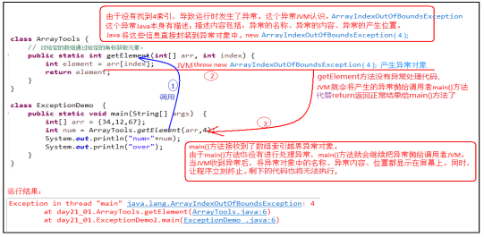
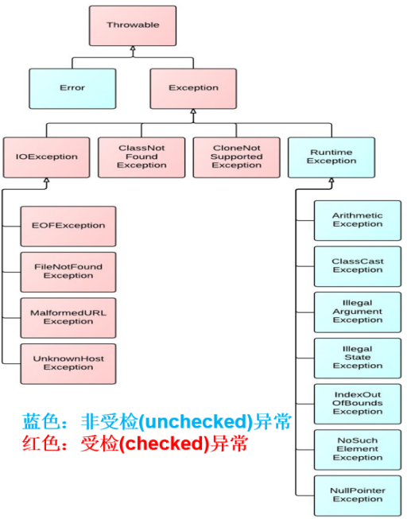
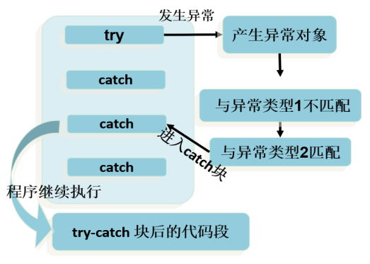
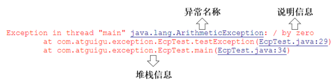
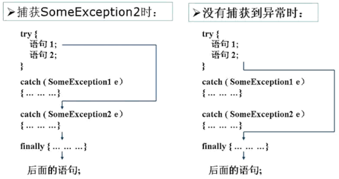
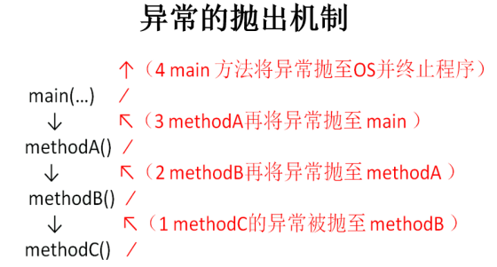
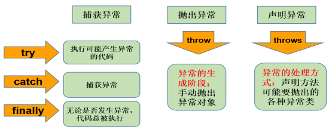

## 第09章 异常处理            

### 1. 异常概述                     

#### 什么是生活的异常？              

出现意外，即为异常情况，我们通常会做相应的处理。                       

#### 什么是程序的异常？                          

使用计算机语言开发项目的过程中，即使把代码尽量写的完美，在系统的运行过程中仍然会遇到一些问题，因为很多问题不是光靠代码就能避免的，例如：*客户的输入数据存在格式问题、读取文件是否存在、网络是否畅通*等等。                      

**异常：指的是程序的执行过程中，出现非正常的情况，如果不处理最终会导致JVM的非正常停止。**                        

**异常指的并不是语法错误和逻辑错误。** 语法错了，程序编译不会通过，不会产生字节码文件，根本不能运行。逻辑错误，只是没有得到想要的结果。                  

#### 异常的抛出机制                

**Java中把不同的异常用不同的类表示，一旦发生某种异常，就创建该异常类型的对象，并且抛出（`throw`）。然后程序员可以捕获（`catch`）到这个异常对象，并处理；如果没有捕获（`catch`）这个异常对象，那么这个异常对象将会导致程序终止。**                     

**代码样例（程序会产生一个数组越界异常`ArrayIndexOfBoundException`）**                 
```java
public class ArrayTools {
    // 对给定的数组通过给定的角标获取元素。
    public static int getElement(int[] arr, int index) {
        int element = arr[index];
        return element;
    }
}

public class ExceptionDemo {
    public static void main(String[] args) {
        int[] arr = { 34, 12, 67 };
        intnum = ArrayTools.getElement(arr, 4)
        System.out.println("num=" + num);
        System.out.println("over");
    }
}
```

上述程序执行过程图解：                 
                         

#### 如何对待异常                    

对于程序出现的异常，一般有两种方法：                  
- **遇到错误就终止程序的运行。**
- **程序员在编写程序时，就充分考虑到各种可能发生的异常和错误，极力预防和避免。实在无法避免的，要编写相应的代码进行异常的检测以及异常的处理，保证代码的健壮性。**

### 2. Java异常体系                

#### Throwable                  

- `public void printStackTrace()`：打印异常的详细信息。包含了异常的类型、异常的原因、异常出现的位置、在开发和调试阶段都得使用`printStackTrace`。
- `public String getMessage()`：获取发生异常的原因。

#### Error和Exception                

**`Throwable`可分为两类：`Error`和`Exception`**。分别对应着`java.lang.Error`和`java.lang.Exception`。              

**Error**：java虚拟机无法解决的严重问题。如：JVM系统内部错误、资源耗尽等严重情况，一般不编写针对性的代码进行处理。
- 例如：`StackOverflowError`（栈内存溢出）和`OutOfMemoryError`（堆内存溢出，简称OOM）。

**Exception**：其他因为编程错误或偶然的外在因素导致的一般性问题，需要使用针对性代码进行处理，使程序继续运行。否则一旦发生异常，程序也会挂掉。例如：                    
- 空指针异常
- 视图读取不存在的文件
- 网络连接中断
- 数组角标越界

#### 编译时异常和运行时异常                            

**根据异常可能出现的阶段，可以将异常划分为：编译时期异常、运行时期异常。**                 

- **编译时期异常（即checked异常、受检异常）**
  - 在代码编译阶段，编译器就能明确警示当前代码可能发生（不一定发生）xx异常，并明确督促程序员提前编写处理它的代码。如果程序员没有编写对应的异常处理代码，则编译器就会直接判定编译失败，从而不能生成字节码文件。通常，这类异常的发生不是由程序员的代码引起的，或者不是靠简单加判断就可以避免的，例如：`FileNotFoundException`（文件找不到异常）。
- **运行时期异常（即runtime异常、unchecked异常、非首检异常）**
  - 在代码编译阶段，编译器完全不做任何检查，无论该异常是否发生，编译器都不会给出任何提示。只有等代码运行起来并确实发生了xx异常，它才能被发现。通常这类异常是程序员的代码编写不当引起的，只要稍加判断，或者细心检查就可以避免。
  - `java.lang.RuntimeException`类以及它的子类都是运行时异常。比如：`ArrayIndexOutOfBoundsException`：数组下标越界异常，`ClassCastException`类型转换异常等。

                         

### 3. 常见的错误和异常                         

#### Error                

最常见的就是`VirtualMachineError`，它有两个经典的子类：`StackOverflowError`和`OutOfMemoryError`。

```java
// Test1 栈溢出
public class TestStackOverflowError {
    @Test
    public void test01(){
        //StackOverflowError
        recursion();
    }

    public void recursion(){ //递归方法
        recursion(); 
    }
}

// Test2 堆内存溢出
public class TestOutOfMemoryError {
    @Test
    public void test02(){
        //OutOfMemoryError
        //方式一：
        int[] arr = new int[Integer.MAX_VALUE];
    }
    @Test
    public void test03(){
        //OutOfMemoryError
        //方式二：
        StringBuilder s = new StringBuilder();
        while(true){
            s.append("atguigu");
        }
    }
}
```

#### 运行时异常              

```java
import org.junit.Test;

import java.util.Scanner;

public class TestRuntimeException {
    @Test
    public void test01(){
        //NullPointerException
        int[][] arr = new int[3][];
        System.out.println(arr[0].length);
    }

    @Test
    public void test02(){
        //ClassCastException
        Object obj = 15;
        String str = (String) obj;
    }

    @Test
    public void test03(){
        //ArrayIndexOutOfBoundsException
        int[] arr = new int[5];
        for (int i = 1; i <= 5; i++) {
            System.out.println(arr[i]);
        }
    }

    @Test
    public void test04(){
        //InputMismatchException
        Scanner input = new Scanner(System.in);
        System.out.print("请输入一个整数：");//输入非整数
        int num = input.nextInt();
        input.close();
    }

    @Test
    public void test05(){
        int a = 1;
        int b = 0;
        //ArithmeticException
        System.out.println(a/b);
    }
}
```

#### 编译时异常                      

```java
import org.junit.Test;
import java.io.FileInputStream;
import java.io.FileNotFoundException;
import java.sql.Connection;
import java.sql.DriverManager;
import java.sql.SQLException;

public class TestCheckedException {
    @Test
    public void test06() {
        Thread.sleep(1000);//休眠1秒  InterruptedException
    }
    @Test
    public void test07(){
        Class c = Class.forName("java.lang.String");//ClassNotFoundException
    }
    @Test
    public void test08() {
        Connection conn = DriverManager.getConnection("....");  //SQLException
    }
    @Test
    public void test09()  {
        FileInputStream fis = new FileInputStream("尚硅谷Java秘籍.txt"); //FileNotFoundException
    }
    @Test
    public void test10() {
        File file = new File("尚硅谷Java秘籍.txt");
		FileInputStream fis = new FileInputStream(file);//FileNotFoundException
		int b = fis.read();//IOException
		while(b != -1){
			System.out.print((char)b);
			b = fis.read();//IOException
		}
		
		fis.close();//IOException
    }
}
```

### 4. 异常的处理                

#### 异常处理概述                     

Java采用的异常处理机制，是**将异常处理的程序代码集中在一起**，与正常的程序代码分开，使得程序简介、优雅、易于维护。                       

**Java异常处理的方式：**                        
- 方式一：`try-catch-finally`
- 方式二：`throws` + 异常类型

#### 方式1：捕获异常（try-catch-finally）            

**Java提供了异常处理的抓抛模型**

- **Java程序的执行过程中如出现异常，会生成一个异常类对象，该异常对象将被提交给Java运行时系统，这个过程称为：抛出（throw）异常。**
- **如果一个方法内抛出异常，该异常对象会被抛给调用者方法中处理。如果异常没有在调用者方法中处理，它继续被抛给这个调用方法的上层方法。这个过程将一直继续下去，知道异常被处理。这个过程称为：捕获（catch）异常。**
- **如果一个异常回到main()方法，并且main()也不处理，则程序运行终止。**

**`try-catch-finally`基本格式**               

捕获异常语法如下：               
```java
try{
	......	//可能产生异常的代码
}
catch( 异常类型1 e ){
	......	//当产生异常类型1型异常时的处置措施
}
catch( 异常类型2 e ){
	...... 	//当产生异常类型2型异常时的处置措施
}  
finally{
	...... //无论是否发生异常，都无条件执行的语句
} 
```

*1.整体执行过程：*                 

当某段代码可能发生异常，不管这个异常是编译时异常（受检异常）还是运行时异常（非受检异常），我们都可以使用try块将它括起来，并在try块下面编写catch分支尝试捕获对应的异常对象。                   

- 如果程序运行时，try块中的代码没有发生异常，那么catch所有的分支都不执行。
- 如果程序运行时，try块中的代码发生了异常，根据异常对象的类型，**将从上到下选择第一个匹配的catch分支执行。此时try中发生异常的语句下面的代码将不执行，而整个try...catch之后的代码可以继续运行。**
- 如果程序运行时，try块中的代码发生了异常，但是**所有的catch分支都无法匹配（捕获）这个异常，那么JVM将会终止当前方法的执行，并把异常对象“抛”给调用者。如果调用者不做处理，程序就挂了。**



*2.try*             

捕获异常的第一步是用`try{...}`语句块选定捕获异常的范围，将可能出现异常的业务逻辑代码放到try语句块中。             

*3.catch(ExceptionType e)*              

- catch分支，分为两个部分，**`catch()`中编写异常类型和异常参数名，`{}`中编写如果发生了这个异常，要做什么处理的代码。**
- 如果明确知道产生的是何种异常，可以用该异常类作为catch的参数；也可以用其父类作为catch的参数。
  - 例如：可以用`ArithmeticException`类作为参数的地方，就可以用`RuntimeException`类作为参数，或者用所有异常的父类`Exception`类作为参数。**但不能是与`ArithmeticException`类无关的异常，例如：`NullPointerException`（catch中的语句将不会执行）。**
- **每个try语句块可以伴随一个或多个catch语句，用于处理可能产生的不同类型的异常对象。**
- **如果有多个catch分支，并且多个异常类型有父子关系，必须保证小的子异常类型在上，大的父异常类型在下。否则会报错。**
- catch中常用异常处理的方式：
  - `public String getMessage()`：获取异常的描述信息，返回字符串。
  - `public void printStackTrace()`：打印异常的跟踪栈信息并输出到控制台。包含了异常的类型、异常的原因、异常出现的位置，在开发和调试阶段，都得使用**printStackTrace()**。
  - 

**代码样例：**             

```java
@Test
public void test1(){
    try{
        String str1 = "atguigu.com";
        str1 = null;
        System.out.println(str1.charAt(0));
    }catch(NullPointerException e){
        //异常的处理方式1
        System.out.println("不好意思，亲~出现了小问题，正在加紧解决...");	
    }catch(ClassCastException e){
        //异常的处理方式2
        System.out.println("出现了类型转换的异常");
    }catch(RuntimeException e){
        //异常的处理方式3
        System.out.println("出现了运行时异常");
    }
    //此处的代码，在异常被处理了以后，是可以正常执行的
    System.out.println("hello");
}
```

**finally的使用**              

*使用格式：*

```java
 try{
    ...
 }finally{
    ...
 } 
```

                 

- 因为异常会引发程序跳转，从而会导致有些语句执行不到。**而程序中有一些特定的代码无论异常是否发生，都需要执行。例如：数据库连接、输入流输出流、Socket连接、Lock锁的关闭等，这样的代码通常会放到finally块中。所以，我们通常将一定要被执行的代码声明在finally中。**
  - **唯一例外，使用`System.exit(0)`来终止当前正在运行的java虚拟机。这个方法会立即结束程序的执行，不会有机会执行finally块中的代码。**
- **不论在try代码块中是否发生了异常事件，catch语句是否执行，catch语句是否有异常，catch语句中是否有return，finally块中的语句都会被执行。**
- **finally语句与catch语句是可选的，但finally不能单独使用。**

**代码样例（确保资源关闭）**                

```java
import java.util.InputMismatchException;
import java.util.Scanner;

public class TestFinally {
    public static void main(String[] args) {
        Scanner input = new Scanner(System.in);
        try {
            System.out.print("请输入第一个整数：");
            int a = input.nextInt();
            System.out.print("请输入第二个整数：");
            int b = input.nextInt();
            int result = a/b;
            System.out.println(a + "/" + b +"=" + result);
        } catch (InputMismatchException e) {
            System.out.println("数字格式不正确，请输入两个整数");
        }catch (ArithmeticException e){
            System.out.println("第二个整数不能为0");
        } finally {
            System.out.println("程序结束，释放资源");
            input.close();
        }
    }
    
    @Test
    public void test1(){
        FileInputStream fis = null;
        try{
            File file = new File("hello1.txt");
            fis = new FileInputStream(file);//FileNotFoundException
            int b = fis.read();//IOException
            while(b != -1){
                System.out.print((char)b);
                b = fis.read();//IOException
            }

        }catch(IOException e){
            e.printStackTrace();
        }finally{
            try {
                if(fis != null)
                    fis.close();//IOException
            } catch (IOException e) {
                e.printStackTrace();
            }	
        }
    }
}
```

**笔试题：**                
final、finally、finalize()有什么区别？                

- **final**：修饰类（类不可被继承）、修饰类方法（方法不可被重写）、修饰变量（常量）                   
- **finally**：用于释放资源或做一些执行完后必须执行的操作（与try{}catch{}结构结合使用，不可单独使用）。              
- **finalize()**：对象声明周期（被销毁前调用）

**异常处理的体会**                 

- 前面使用的异常都是 **`RuntimeException`类或者它的子类，这些类的异常的特点是：即使没有使用try和catch捕获，Java自己也能捕获，并且编译通过（但运行时会发生异常使得程序运行终止）。所以，对于这类异常，可以不作处理，因为这类异常很普遍，若全处理可能会对程序的可读性和运行效率产生影响。**
- **如果抛出的异常是`IOException`等类型的非运行时异常，则必须捕获，否则编译报错。就是说，我们必须处理编译时异常，将异常进行捕捉，转化为运行时异常。**

#### 方式2：声明抛出异常类型（throws）               

如果在编写方法体的代码时，某句代码可能发生某个*编译时异常*，不处理编译无法通过，但是在当前方法体中可能*不适合处理*或*无法给出合理的处理方式*，则此方法应**显示地声明抛出异常，表明该方法将不对这些异常进行处理，而由方法的调用者负责处理。**               

**具体方式：** 在方法声明中**用throws语句可以声明抛出异常的列表，throws后面的异常类型可以是方法中产生的异常类型，也可以是它的父类。**             

         

**throws基本格式**              

*声明异常格式：*                 
```java
修饰符 返回值类型 方法名(参数) throws 异常类型名1, 异常类型名2, ... {}
```
在`throws`后面可以写多个异常类型，用逗号隔开。             

```java
public void readFile(String file)  throws FileNotFoundException,IOException {
    ...
    // 读文件的操作可能产生FileNotFoundException或IOException类型的异常
    FileInputStream fis = new FileInputStream(file);
    //...
}
```

**throws使用举例**              
- **针对于编译时异常**
  ```java
  public class TestThrowsCheckedException {
      public static void main(String[] args) {
          System.out.println("上课.....");
          try {
              afterClass();//换到这里处理异常
          } catch (InterruptedException e) {
              e.printStackTrace();
              System.out.println("准备提前上课");
          }
          System.out.println("上课.....");
      }
  
      public static void afterClass() throws InterruptedException {
          for(int i=10; i>=1; i--){
              Thread.sleep(1000);//本来应该在这里处理异常
              System.out.println("距离上课还有：" + i + "分钟");
          }
      }
  }
  ```
- **针对于运行时异常**
  - **throws后面也可以写运行时异常类型，只是运行时异常类型，写或不写对于编译器和程序执行来说都没有任何区别，若写了，唯一的区别就是调用者调用该方法后，使用try{}catch{}结构时，IDEA可以获取更多的信息，需要添加哪种catch分支。**
  
    ```java
    import java.util.InputMismatchException;
    import java.util.Scanner;
    
    public class TestThrowsRuntimeException {
        public static void main(String[] args) {
            Scanner input = new Scanner(System.in);
            try {
                System.out.print("请输入第一个整数：");
                int a = input.nextInt();
                System.out.print("请输入第二个整数：");
                int b = input.nextInt();
                int result = divide(a,b);
                System.out.println(a + "/" + b +"=" + result);
            } catch (ArithmeticException | InputMismatchException e) {
                e.printStackTrace();
            } finally {
                input.close();
            }
        }
    
        public static int divide(int a, int b)throws ArithmeticException{
            return a/b;
        }
    }
    ```

**方法重写中throws的要求**              

方法重写时，对于方法签名是有严格要求的：            
- 1.方法名必须相同
- 2.形参列表必须相同
- 3.返回值类型
  - 基本数据类型和void：必须相同
  - 引用数据类型：<=
- 4.权限修饰符：>=，而且要求父类被重写方法在子类中是可见的
- 5.不能是static、final修饰的方法

*对于throws异常列表要求：*             

- **如果父类被重写方法的方法签名后面没有“throws 编译时异常类型”，那么重写方法时，方法签名后面也不能出现“throws 编译时异常类型”。**
- **如果父类被重写方法的方法签名后有“throws 编译时异常类型”，那么重写方法时，throws的编译时异常类型必须 <= 被重写方法throws的编译时异常类型，或者不throws编译时异常。**
- **方法重写，对于“throws 运行时异常类型”没有要求**

```java
import java.io.IOException;

class Father{
    public void method()throws Exception{
        System.out.println("Father.method");
    }
}
class Son extends Father{
    @Override
    public void method() throws IOException,ClassCastException {
        System.out.println("Son.method");
    }
}
```

#### 两种异常处理方式的选择                

对于异常，使用相应的处理方式，此时的异常主要指的是编译时异常。           

- 如果程序代码中， **涉及到资源的调用（流、数据库连接、网络连接等），则必须考虑使用`try-catch-finally`来处理，保证不出现内存泄露。**
- **如果父类被重写的方法没有throws异常类型，则子类重写的方法中如果出现异常，只能考虑使用`try-catch-finally`进行处理，不能throws。**
- **开发中，方法a中依次调用了方法b、c、d等方法，方法b、c、d之间是递进的关系。此时，如果b/c/d中有异常，我们通常选择使用`throws`，而方法a中通常选择使用`try-catch-finally`。**

### 5. 手动抛出异常对象：throw               

Java中异常对象的生成有两种方式：              
- 由虚拟机**自动生成**：程序运行过程中，虚拟机检测到程序发生了问题，那么针对当前代码，就会在后台创建一个对应异常类的实例对象并抛出。
- 有开发人员**手动创建**：**new 异常类型([实参列表]); 如果创建好的异常对象不抛出，对程序没有任何影响，和创建一个普通对象一样；但是一旦throw抛出，就会对程序运行产生影响了。**

#### 使用格式              

```java
throw new 异常类名(参数);
```

throw语句抛出的异常对象，和JVM自动创建并抛出的异常对象一样。            
- **如果是编译时异常类型的对象，同样需要使用throws或try...catch处理，否则编译不通过。**
- 如果是运行时异常类型的对象，编译器不提示。
- **可以抛出的异常必须是`Throwable`或者其子类的实例，** 下面的语句在编译时将会产生语法错误：
  - ```throw new String("want to throw...")```

#### 使用注意点                      

- 无论是编译时异常类型的对象，还是运行时异常类型的对象，如果没有被try...catch合理的处理，都会导致程序崩溃。
- **throw语句会导致程序执行流程被改变，throw语句是明确抛出一个异常对象，因此它*下面的代码将不会执行*。**
- **如果当前方法没有try...catch处理这个异常对象，throw语句会*代替return语句*提前终止之前方法的执行，并返回一个异常对象给调用者。**

```java
public class TestThrow {
    public static void main(String[] args) {
        try {
            System.out.println(max(4,2,31,1));
        } catch (Exception e) {
            e.printStackTrace();
        }
        try {
            System.out.println(max(4));
        } catch (Exception e) {
            e.printStackTrace();
        }
        try {
            System.out.println(max());
        } catch (Exception e) {
            e.printStackTrace();
        }
    }

    public static int max(int... nums){
        if(nums == null || nums.length==0){
            throw new IllegalArgumentException("没有传入任何整数，无法获取最大值");
        }
        int max = nums[0];
        for (int i = 1; i < nums.length; i++) {
            if(nums[i] > max){
                max = nums[i];
            }
        }
        return max;
    }
}
```

### 6. 自定义异常

#### 为什么需要自定义异常类？               

Java中不同的异常类，分别代表某一种具体的异常情况。那么在开发总总是有些异常情况是核心类库中没有定义好的，此时我们需要**根据自己业务的异常情况来定义异常类**。例如：年龄为负数、考试成绩为负数、要添加的员工已经存在等。           

#### 如何自定义异常类？          

- 1.要继承一个异常类型
  - 自定义一个编译时异常类型：自定义类继承`java.lang.Exception`
  - 自定义一个运行时异常类型：自定义类继承`java.lang.RuntimeException`
- **2.建议至少提供两个构造器，一个无参构造器，一个(String message)构造器。** 
- **3.自定义异常需要提供`serialVersionUID`。**

#### 注意点                

- **自定义的异常只能通过throw抛出**
- 自定义异常最重要的是**异常类的名字和message属性**。当异常出现时，可以根据名字判断异常类型。例如：`TeamException("成员已满，无法添加");`等。
- **自定义异常对象只能手动抛出，抛出后由try...catch处理，也可以throws给调用者处理。**

#### 举例           

```java
class MyException extends Exception {
    static final long serialVersionUID = 23423423435L;
    private int idnumber;

    public MyException(String message, int id) {
        super(message);
        this.idnumber = id;
    }

    public int getId() {
        return idnumber;
    }
}

public class MyExpTest {
    public void regist(int num) throws MyException {
        if (num < 0)
            throw new MyException("人数为负值，不合理", 3);
        else
            System.out.println("登记人数" + num);
    }
    public void manager() {
        try {
            regist(100);
        } catch (MyException e) {
            System.out.print("登记失败，出错种类" + e.getId());
        }
        System.out.print("本次登记操作结束");
    }
    public static void main(String args[]) {
        MyExpTest t = new MyExpTest();
        t.manager();
    }
}
```

### 7. 概括                    

               


