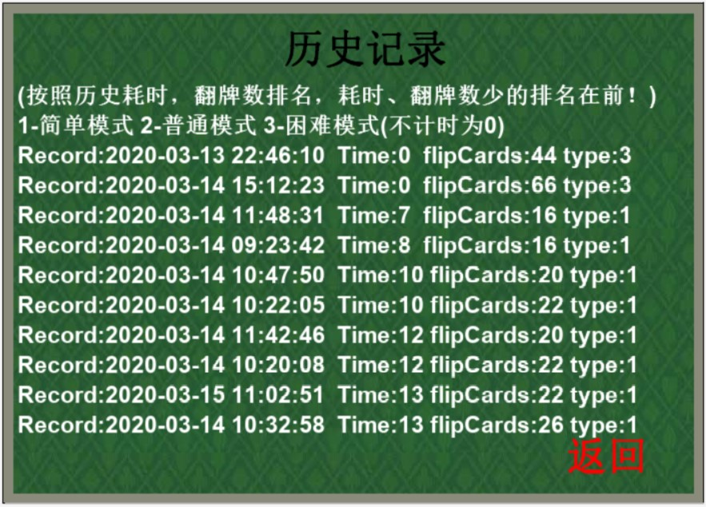
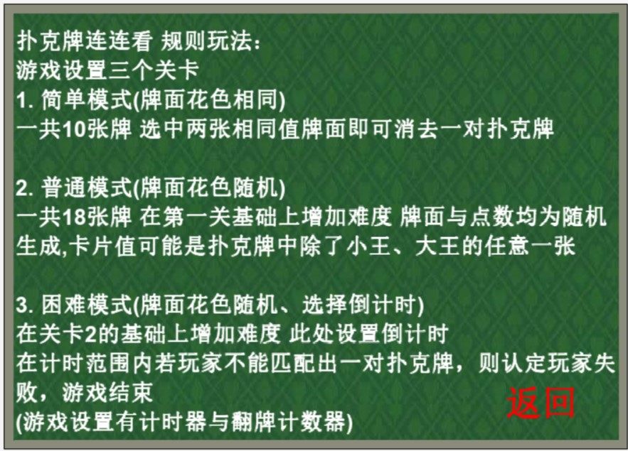
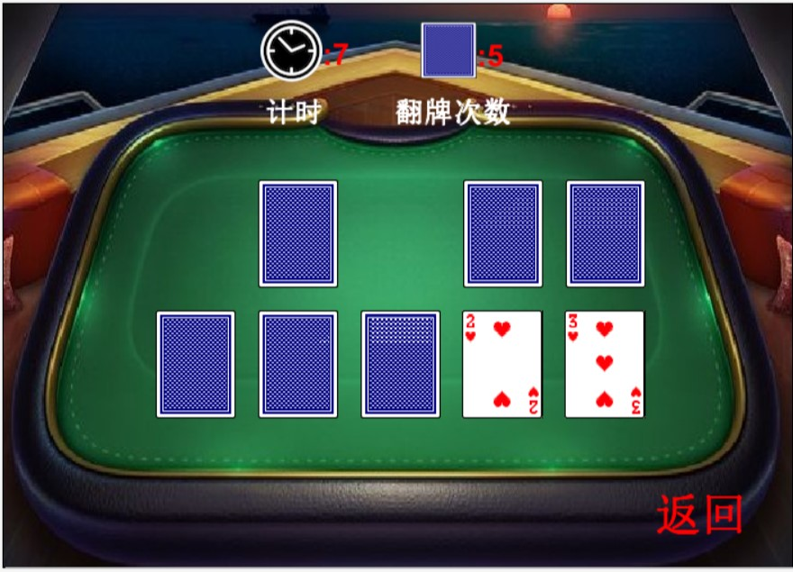
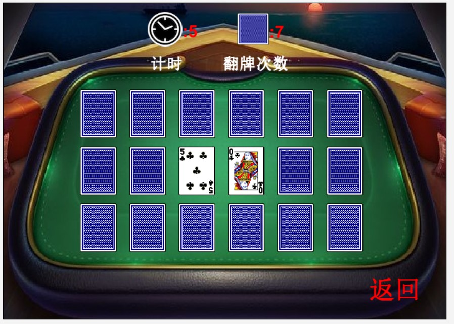
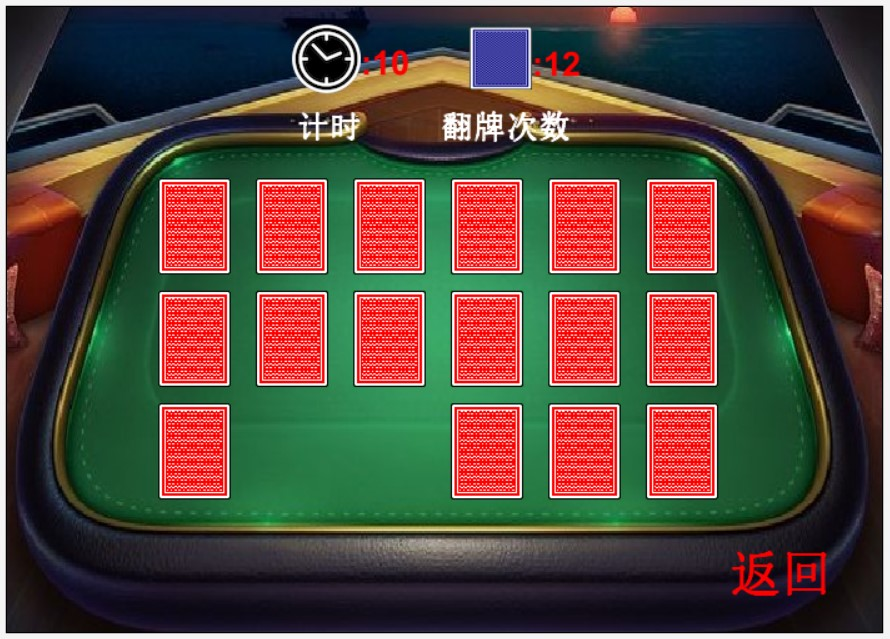

# 工程：扑克牌连连看

---

    版本或者日期:
        2020.03.14
    如何启动这个工程：
        使用Greenfoot软件
    作者：
        weew12
    使用指南：
        游戏设置三个关卡
        难度不一 第一关花色固定
        第二关花色点数均随机
        第三关加入配对倒计时 在规定时间配对未成功则超时失败
    规则：
        扑克牌连连看 规则玩法：
        -------------------------------------------------
       | 游戏设置三个关卡
       | 1. 简单模式(牌面花色相同)
       | 一共10张牌 选中两张相同值牌面即可消去一对扑克牌
       |-------------------------------------------------
       | 2. 普通模式(牌面花色随机)
       | 一共18张牌 在第一关基础上增加难度 牌面与点数均为随机
       | 生成,卡片值可能是扑克牌中除了小王、大王的任意一张
       |-------------------------------------------------
       | 3. 困难模式(牌面花色随机、选择倒计时)
       | 在关卡2的基础上增加难度 此处设置倒计时
       | 在计时范围内若玩家不能匹配出一对扑克牌，则认定玩家失
       | 败，游戏结束
       | (游戏设置有计时器与翻牌计数器)
        -------------------------------------------------

---

# 游戏截图

## 游戏主界面

## 历史记录

## 游戏规则

## 关卡选择

## 简单模式

## 普通模式

## 困难模式

