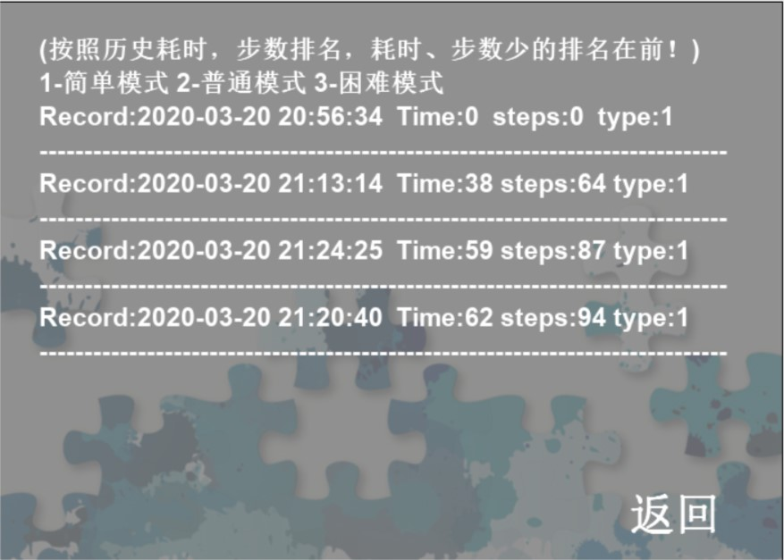
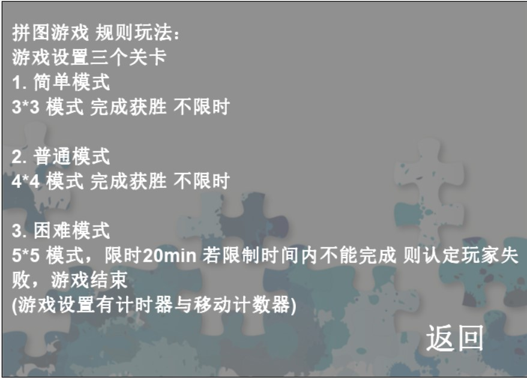
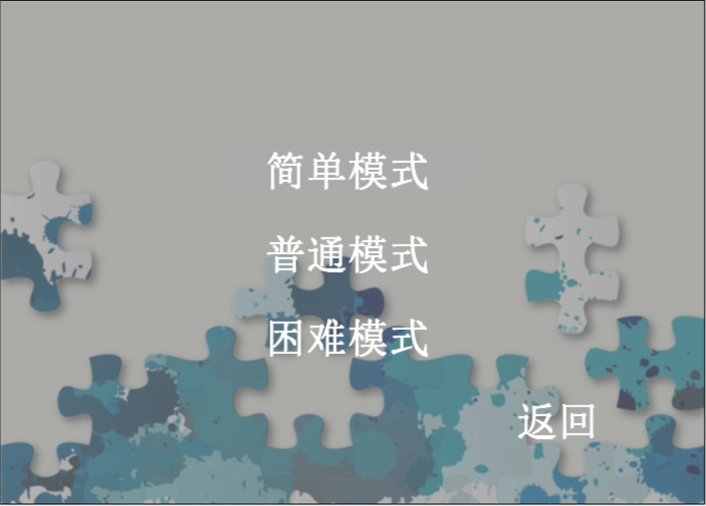
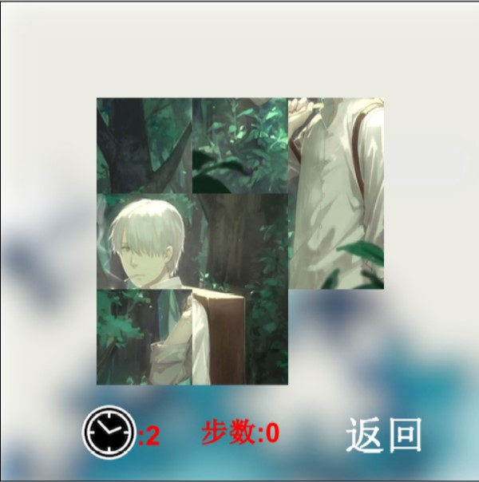
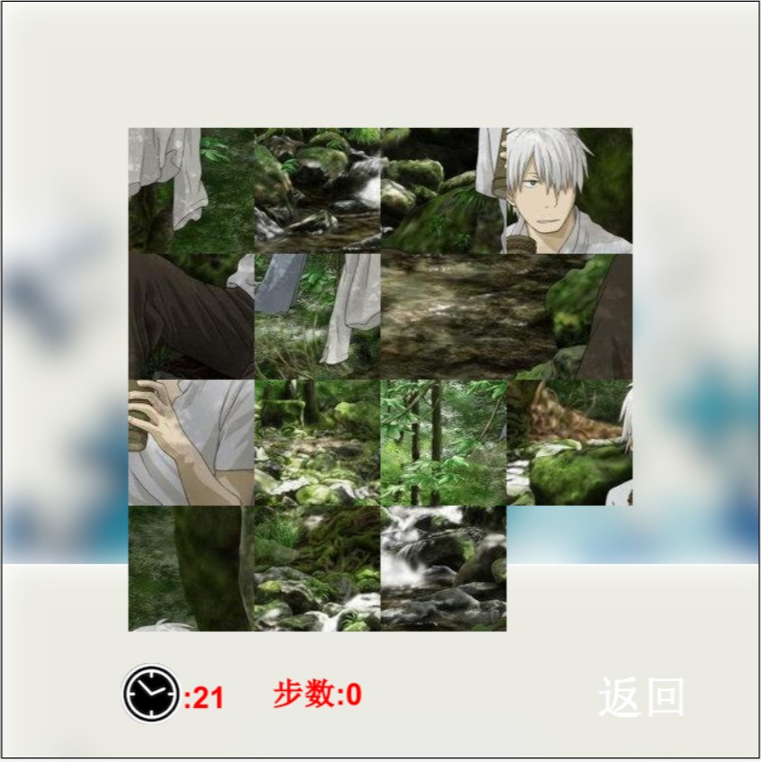

# 工程：拼图游戏

---

    版本或者日期:
        2020.03.20
    如何启动这个工程：
        使用Greenfoot软件
    作者：
        weew12
    使用指南：
        (与之前的扑克牌操作基本差不多， 可能主题没那么难看了。。。)
        游戏设置三个关卡 (拼图难度可能颇大 。。。 本人未做完全完成的操作 特别是5*5。。。)
        难度不一 第一关3*3
        第二关 4*4
        第三关 加入时间限制20min 未完成则超时失败
    规则：
         拼图游戏 规则玩法：
        -------------------------------------------------
        | 游戏设置三个关卡
        | 1. 简单模式
        | 3*3 模式 完成获胜 不限时
        |------------------------------------------------
        | 2. 普通模式
        | 4*4 模式 完成获胜 不限时
        | -----------------------------------------------
        | 3. 困难模式
        | 5*5 模式，限时20min 若限制时间内不能完成 则认定玩失
        | 败，游戏结束
        | (游戏设置有计时器与移动计数器)
        -------------------------------------------------

---

# 游戏截图

## 游戏主界面

## 历史记录

## 游戏规则

## 关卡选择

## 简单模式

## 普通模式

## 困难模式

